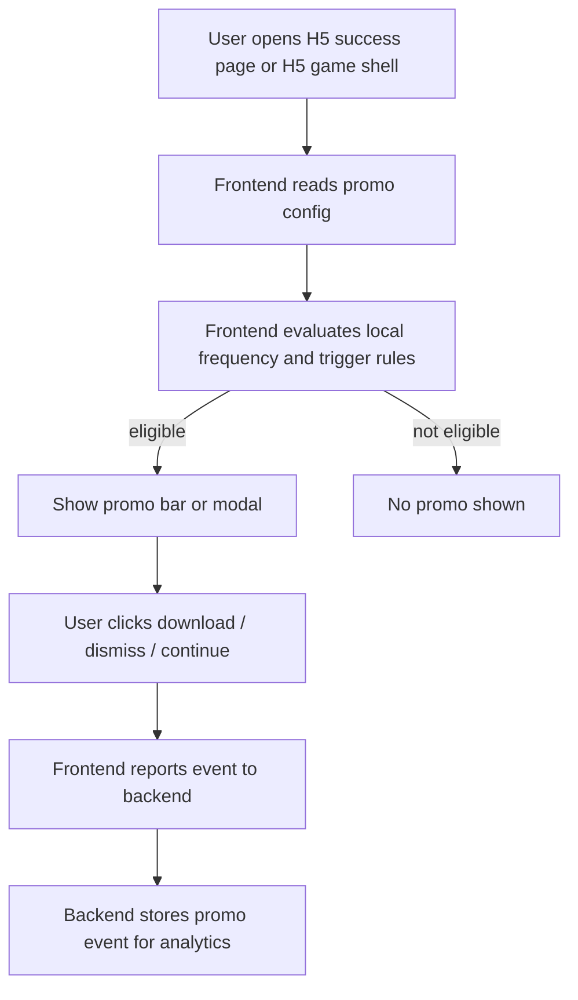

# H5 App Download Promo Plan

Date: 2026-04-03

## 1. Background

The current user-facing experience is primarily H5.

We now want to add a guided download prompt for the native app in two core scenarios:

- after a user successfully creates a game
- after a user has played H5 games several times and is ready for a deeper experience

The goal is not to block H5 usage, but to convert qualified users into app users at the right moment.

## 2. Goal

This plan aims to achieve four things:

- improve H5-to-App conversion
- avoid interrupting the core gameplay experience too early
- reuse the current backend and shell-page architecture as much as possible
- keep the first rollout low-risk, configurable, and easy to turn off

## 3. Current State

### 3.1 Existing H5 shell

There is already a unified H5 shell page in:

- `packages/game-service/src/game/game-shell.html`
- `packages/game-service/src/game/game-shell.controller.ts`

This shell page already provides:

- a top-level overlay layer
- author info
- like, bookmark, and comment actions
- an iframe that loads the actual generated game HTML

This makes the shell page the best place to host a download prompt without modifying each generated game.

### 3.2 Existing creation completion signal

`game-service` already emits generation-complete websocket events:

- `packages/game-service/src/websocket/websocket.gateway.ts`

This means the "create complete" promo can be triggered by the success page or success flow that already consumes generation completion.

### 3.3 Existing play statistics

`game-service` already increments game play count in:

- `packages/game-service/src/game/game.service.ts`
- `packages/game-service/src/stats/stats.service.ts`

Important limitation:

- current `playCount` is per game, global, and server-side
- it is not a reliable signal for "this user has played several times"

So the promo trigger for repeated gameplay must not depend only on `game.playCount`.

### 3.4 Existing config infrastructure

There is already a generic config table and admin config management:

- `prisma/schema.prisma` -> `SystemConfig`
- `packages/game-service/src/admin/admin.service.ts`
- `packages/game-service/src/admin/admin.controller.ts`

This is enough to host promo feature flags and app download links.

## 4. Product Strategy

## 4.1 Guiding principle

The app-download prompt should be shown only when the user has demonstrated intent.

Bad strategy:

- show a hard modal immediately on page load
- show the prompt every time a game opens
- interrupt the user in the first few seconds of gameplay

Recommended strategy:

- show after clear value moments
- use frequency control
- allow a clear dismiss path
- remember dismiss and click behavior

## 4.2 Two launch scenarios

### Scenario A: Create complete

Trigger condition:

- user successfully completes game creation

Recommended behavior:

- wait 2 to 3 seconds after the success state is stable
- show a modal or bottom sheet
- message focus: "continue editing, publishing, and managing your games in the app"

This is the highest-value scenario because the user has already shown creator intent.

### Scenario B: Repeated H5 play

Trigger condition:

- user has opened H5 gameplay multiple times
- or user has accumulated enough H5 play time

Recommended behavior:

- first show a lightweight bottom promo bar
- if the user interacts, expand to a full modal
- do not force-show a full modal in the middle of the first session

This scenario targets players who are engaged enough to consider upgrading to the app.

## 5. Recommended Trigger Rules

## 5.1 Create complete

Recommended initial rule:

- show once after successful creation
- delay 2 to 3 seconds
- only if the user is still on the page

Frequency control:

- max 1 impression per device every 7 days for this scene
- max 2 impressions per logged-in user every 14 days
- if user clicks download, suppress for 30 days
- if user dismisses twice, suppress for 14 days

## 5.2 Repeated play

Recommended initial rule:

- trigger after local H5 play sessions >= 3
- or total local H5 play duration >= 180 seconds

Frequency control:

- max 1 impression every 3 days on the same device
- max 3 impressions every 30 days
- do not show within the first 30 seconds of the current game session

Additional safety:

- do not show again on the same game page after dismissal
- do not show while the document is hidden
- do not show if the current session already has a blocking dialog open

## 5.3 Why local session tracking is required

The current backend `playCount` is game-level and global.

That means it answers:

- how many times this game was played by everyone

It does not answer:

- how many times this device or this user has played H5 games

So for the repeated-play scenario, the MVP should use client-side counters stored in local storage, optionally combined with server-side event logging.

## 6. UX Proposal

## 6.1 Modal style

Recommended UI form:

- mobile-first bottom sheet
- full-width primary button
- one clear secondary dismiss action
- concise value-based copy

Recommended elements:

- title
- short supporting copy
- download CTA
- continue-in-H5 CTA
- close icon

### Create-complete copy example

Title:

- Download the App for Creator Mode

Body:

- Continue editing, publishing, managing, and replaying your new game in the app.

Primary button:

- Download App

Secondary button:

- Keep Using H5

### Repeated-play copy example

Title:

- Better Experience in the App

Body:

- Play more smoothly, save favorites, and unlock a richer long-term experience in the app.

Primary button:

- Download App

Secondary button:

- Continue Playing

## 6.2 WeChat handling

If the user is inside WeChat, direct download is often a weaker path.

Recommended behavior:

- detect WeChat browser
- show a browser-open instruction layer or QR code guidance instead of only a raw app link

This should be configurable because platform policy may vary by release channel.

## 6.3 Do not inject into generated game HTML

Do not modify each generated game to host the popup.

Reasons:

- generated HTML is not structurally stable
- it adds QA risk to every game
- it couples growth logic to AI-generated output
- it creates regression risk in the generation pipeline

The correct integration point is the outer shell or container page.

## 7. Technical Architecture

## 7.1 Recommended architecture



## 7.2 Why this architecture

This plan intentionally keeps decision-making mostly in the frontend for MVP.

Benefits:

- no hard dependency on a new backend decision engine
- lower latency
- easier rollout
- easier emergency disable via config

Server-side decisioning can be added later if needed.

## 8. Backend Changes

## 8.1 Config keys

Use existing `system_configs`.

Recommended new keys under category `growth`:

- `growth.app_promo.enabled`
- `growth.app_promo.ios_url`
- `growth.app_promo.android_url`
- `growth.app_promo.universal_link`
- `growth.app_promo.qr_code_url`
- `growth.app_promo.scene_create_complete_enabled`
- `growth.app_promo.scene_play_nudge_enabled`
- `growth.app_promo.play_nudge_min_sessions`
- `growth.app_promo.play_nudge_min_seconds`
- `growth.app_promo.cooldown_hours`
- `growth.app_promo.max_impressions_30d`
- `growth.app_promo.wechat_mode`
- `growth.app_promo.copy_json`

Suggested `copy_json` shape:

```json
{
  "create_complete": {
    "title": "Download the App for Creator Mode",
    "body": "Continue editing, publishing, and managing your game in the app.",
    "primaryCta": "Download App",
    "secondaryCta": "Keep Using H5"
  },
  "play_nudge": {
    "title": "Better Experience in the App",
    "body": "Play more smoothly and unlock a deeper experience in the app.",
    "primaryCta": "Download App",
    "secondaryCta": "Continue Playing"
  },
  "wechat": {
    "title": "Open in Browser to Download",
    "body": "Open this page in your browser to continue downloading the app."
  }
}
```

## 8.2 New backend endpoints

Recommended new controller namespace:

- `GET /api/v1/growth/app-promo/config`
- `POST /api/v1/growth/app-promo/events`

### GET /api/v1/growth/app-promo/config

Purpose:

- returns the current promo config for frontend rendering and decision logic

Example response:

```json
{
  "code": 0,
  "message": "success",
  "data": {
    "enabled": true,
    "scenes": {
      "create_complete": {
        "enabled": true
      },
      "play_nudge": {
        "enabled": true,
        "minSessions": 3,
        "minSeconds": 180
      }
    },
    "links": {
      "iosUrl": "https://apps.apple.com/...",
      "androidUrl": "https://download.example.com/app.apk",
      "universalLink": "https://app.gamevallies.com/download",
      "qrCodeUrl": "https://cdn.example.com/app-download-qr.png"
    },
    "wechatMode": "guide_to_browser",
    "cooldownHours": 72,
    "maxImpressions30d": 3,
    "copy": {}
  }
}
```

### POST /api/v1/growth/app-promo/events

Purpose:

- collects exposure, dismiss, click, and continue events

Recommended request body:

```json
{
  "scene": "play_nudge",
  "eventType": "impression",
  "gameId": "uuid-or-null",
  "deviceId": "stable-anonymous-id",
  "platform": "ios",
  "channel": "h5_shell",
  "extra": {
    "playSessions": 3,
    "playSeconds": 215,
    "inWechat": false
  }
}
```

Allowed `eventType` values:

- `impression`
- `dismiss`
- `click_download`
- `click_open_app`
- `click_continue_h5`

## 8.3 New data model

Recommended new table:

- `growth_prompt_events`

Suggested fields:

- `id`
- `scene`
- `event_type`
- `user_id` nullable
- `game_id` nullable
- `device_id`
- `platform`
- `channel`
- `user_agent`
- `ip_hash` nullable
- `extra_json`
- `created_at`

This table supports:

- exposure counting
- click-through analysis
- download funnel analysis
- scene performance comparison

## 8.4 Optional second-phase backend endpoint

Optional future endpoint:

- `POST /api/v1/growth/app-promo/decision`

Purpose:

- lets backend decide whether a prompt should be shown

This is not required for MVP.

Use it only if:

- you need user-level frequency consistency across devices
- you want remote experimentation without frontend updates
- you want anti-spam logic to be server-owned

## 9. Frontend Changes

## 9.1 H5 gameplay shell

Primary implementation point:

- `packages/game-service/src/game/game-shell.html`

Add:

- promo config fetch
- local device ID generation
- local frequency and play-session tracking
- promo bar UI
- promo modal UI
- event reporting

Recommended local storage keys:

- `gv_device_id`
- `gv_app_promo_state`
- `gv_h5_play_sessions`
- `gv_h5_play_total_seconds`

Suggested `gv_app_promo_state` shape:

```json
{
  "create_complete": {
    "lastShownAt": 0,
    "dismissCount": 0,
    "lastClickAt": 0
  },
  "play_nudge": {
    "lastShownAt": 0,
    "dismissCount": 0,
    "lastClickAt": 0
  }
}
```

### H5 shell trigger logic

On shell page load:

1. fetch promo config
2. detect environment
3. increment local H5 session count
4. start session duration timer
5. evaluate `play_nudge`
6. if eligible, first show lightweight bar, then modal on interaction or delayed escalation

### Important note

The shell page currently loads the game inside an iframe.

That is useful because:

- the promo can sit outside the iframe
- no generated-game code changes are required
- dismissal and analytics stay under platform control

## 9.2 Create-complete page

The current backend repo exposes generation-complete websocket events, but the user-facing creation-complete page likely lives in the frontend repo.

That frontend page should:

- fetch promo config after success
- evaluate the `create_complete` scene
- show the promo modal after a short delay
- report impression and clicks

If the success flow is not currently centralized, then a shared promo component should be created in the frontend app and reused.

## 9.3 Platform routing

Link strategy:

- iOS Safari: prefer universal link or App Store
- Android Chrome: prefer universal link or direct download page
- WeChat: show browser guidance or QR route
- Desktop: show QR code and app store links

Recommended frontend helper:

- `resolvePromoDownloadTarget(env, config)`

This function should decide:

- target link
- whether to show QR code
- whether to show "open in browser" guidance

## 10. Frequency Control Design

## 10.1 MVP rule ownership

For MVP, frequency control should live primarily in the frontend.

Reason:

- faster rollout
- fewer backend dependencies
- easy local suppression

## 10.2 Suggested rules

### Create-complete

- one impression per 7 days per device
- one click suppresses for 30 days
- two dismisses suppress for 14 days

### Play-nudge

- show only after local sessions >= 3 or local play seconds >= 180
- do not show more than once every 72 hours
- do not exceed three impressions in 30 days

## 10.3 Future rule ownership

If conversion becomes important enough to justify cross-device control, move frequency governance into backend phase 2.

## 11. Analytics

## 11.1 Metrics to track

Core metrics:

- impression count
- dismiss count
- download click count
- continue-h5 count
- click-through rate
- download click rate by scene
- conversion by environment

Break down by:

- scene
- platform
- WeChat vs browser
- login vs anonymous
- game creator vs player

## 11.2 Success criteria

Suggested initial success criteria:

- create-complete prompt CTR >= 8%
- play-nudge prompt CTR >= 3%
- no measurable drop in H5 gameplay completion on first session
- no increase in error rate or shell-page load failure

## 12. Rollout Plan

## 12.1 Phase 1: Backend foundation

Implement:

- config keys in `system_configs`
- growth promo config endpoint
- growth promo event endpoint
- promo event table

No user-facing prompt yet.

## 12.2 Phase 2: H5 shell promo

Implement in `game-shell.html`:

- local counters
- promo UI
- promo events

Enable only `play_nudge` at low frequency for internal testing first.

## 12.3 Phase 3: Create-complete promo

Implement in the frontend success page:

- success-scene promo
- config fetch
- event reporting

Roll out behind config flags.

## 12.4 Phase 4: Experimentation

Add:

- copy testing
- QR vs direct-link comparison
- modal vs bottom-sheet comparison
- per-scene threshold tuning

## 13. Risks and Mitigations

## 13.1 Risk: prompt hurts H5 retention

Mitigation:

- do not show too early
- add cooldown
- use delayed and qualified triggers only

## 13.2 Risk: WeChat download path performs poorly

Mitigation:

- special WeChat mode
- browser guidance
- QR code fallback

## 13.3 Risk: shell page is not the only H5 entry

Mitigation:

- audit actual traffic entry paths
- if some paths bypass `game-shell.html`, add the same promo component to the main frontend H5 container

## 13.4 Risk: current H5 shell is old and not flexible enough

Mitigation:

- keep the first implementation UI-simple
- do not restructure the shell and game iframe relationship in phase 1

## 14. Recommended MVP Scope

Implement first:

- backend config endpoint
- backend event endpoint
- promo event table
- H5 shell repeated-play prompt
- frontend success-page create-complete prompt

Do not implement in MVP:

- server-side decision engine
- AB testing infrastructure
- deep personalized copy
- cross-device suppression logic

## 15. Estimated Work

Backend:

- 1 to 2 days

H5 shell implementation:

- 1 to 2 days

Frontend success-page integration:

- 1 day

QA and rollout:

- 1 to 2 days

Total recommended MVP:

- 4 to 7 working days

## 16. Final Recommendation

The best implementation path is:

1. use the existing shell page as the repeated-play promo host
2. use the existing generation-complete flow as the create-complete promo host
3. use `system_configs` to manage links, copy, and scene flags
4. use frontend-local frequency control first
5. add backend event logging immediately so optimization can start from day one

This approach keeps the change low-risk, avoids touching generated game code, and gives enough observability to improve conversion after launch.
