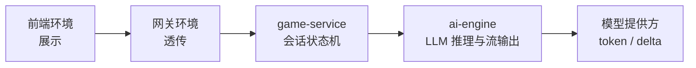
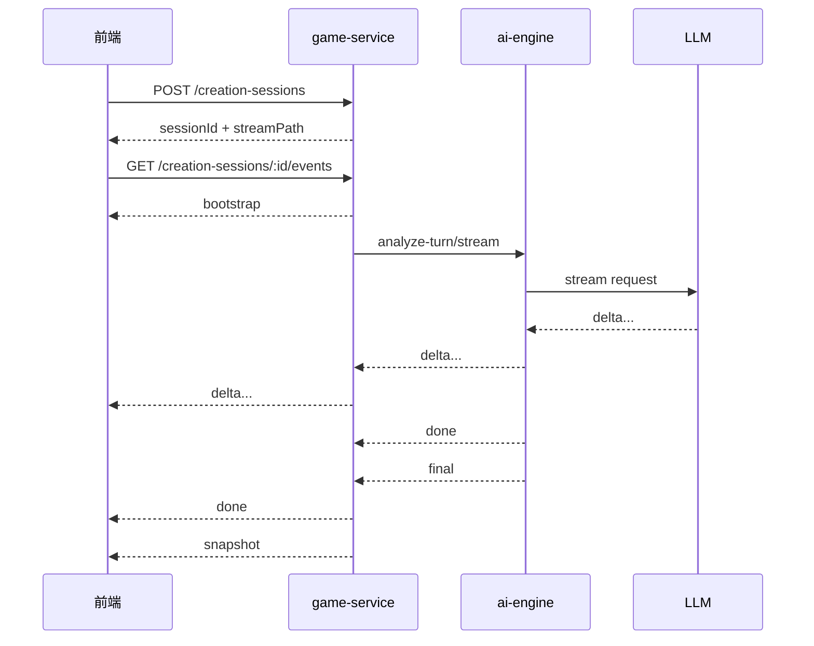

# Creation-Session 流式链路重构方案 V1

> 日期：2026-04-08  
> 状态：方案待评审  
> 适用范围：`creation-session` 首阶段多轮访谈流式链路  
> 不包含：`create / iterate / fork` 主生成链整体流式化、后台 Prompt 管理整改、`prompt.platform_standard` 清理任务

---

## 1. 背景

当前 `creation-session` 流式链路已经有实现，但职责边界不清，导致三个问题同时存在：

1. 前端看到的协议和内部协议没有明确分层。
2. `game-service` 既做会话状态机，又做事件总线，又做流式转译，职责过重。
3. 线上实际验证显示，公网入口下的 `creation-session` SSE 仍然不可作为稳定的实时能力使用。

当前链路大致是：

1. 前端请求 `game-service` 的 `/creation-sessions/:sessionId/events`
2. `game-service` 内部创建会话流
3. `game-service` 再请求 `ai-engine` 的 `/dialogue/analyze-turn/stream`
4. `ai-engine` 再从 LLM provider 获取 delta
5. `ai-engine` 把 delta 组织成 SSE
6. `game-service` 再解析一次 SSE
7. `game-service` 再转发成公网 SSE

这条路径层级过多，不利于实施、定位、验收和后续演进。

---

## 2. 重构目标

本方案只解决一件事：

把 `creation-session` 的流式链路收敛成一条 **职责清晰、协议最小、可逐层验收** 的实现。

目标如下：

1. 明确四套运行环境各自的职责边界。
2. 对外只保留一套公网 SSE 协议。
3. 对内只保留一套 `game-service ↔ ai-engine` 流协议。
4. `game-service` 退回“会话状态机”角色，不再承担多余的展示协议设计。
5. `ai-engine` 只承担推理与流输出，不承担前端展示语义。
6. 排障时可以明确判断问题属于前端、网关、`game-service`、`ai-engine` 中的哪一层。

---

## 3. 四套环境与职责

### 3.1 前端环境：展示

前端环境只负责用户可见体验。

应该做的事：

1. 发起 `create / answer / skip` 请求。
2. 建立和维护一条面向当前 `sessionId` 的 SSE 连接。
3. 渲染增量回复 `delta`。
4. 在收到 `done` 后固化当前回答气泡。
5. 在收到 `snapshot` 后更新当前问题、进度、`readyToGenerate` 等 UI 状态。
6. 在 SSE 不可用时保留轮询兜底。

不应该做的事：

1. 不解析内部分析字段。
2. 不依赖后端的内部阶段名，比如 `assistant.phase`。
3. 不推导业务真相，只消费后端给出的会话状态。
4. 不感知 Prompt、LLM 路由、结构化诊断等内部概念。

前端最终只应该认识 5 类事件：

1. `bootstrap`
2. `delta`
3. `done`
4. `snapshot`
5. `error`

### 3.2 网关环境：透传

网关环境只负责把长连接正确透传出去。

应该做的事：

1. 保持 `text/event-stream`。
2. 禁止缓冲。
3. 禁止压缩或聚合响应。
4. 放宽长连接超时。
5. 正确透传鉴权头和响应头。

不应该做的事：

1. 不拼装 SSE 事件。
2. 不缓存 SSE 响应。
3. 不修改 SSE 内容。
4. 不将流式响应攒成整包后一次性下发。

网关环境的唯一目标是：

**让字节尽快、持续地从后端流到客户端。**

### 3.3 业务后端环境 `game-service`：会话状态机

`game-service` 是 `creation-session` 的唯一业务 owner。

应该做的事：

1. 创建和持久化 `creation session`。
2. 管理 `revision / currentQuestion / readyToGenerate / slotFillPct / brief`。
3. 对外暴露唯一的公网 SSE 接口。
4. 调用 `ai-engine` 获取流式推理结果。
5. 把内部流事件转成对外统一协议。
6. 在关键节点落库，然后对外发 `snapshot`。

不应该做的事：

1. 不自己把完整回复再人工切 chunk。
2. 不维护一套复杂的“展示型事件总线”。
3. 不向前端暴露内部诊断协议。
4. 不承担 LLM Prompt 生成和语义流编排。

`game-service` 的本质应该是：

**会话状态机 + 对外协议适配层**

而不是：

**第二个流式引擎**

### 3.4 AI 环境 `ai-engine`：LLM 推理与流输出

`ai-engine` 负责理解、推理、生成与内部流式输出。

应该做的事：

1. 解析用户输入。
2. 做访谈策略和下一问决策。
3. 组织对话 Prompt。
4. 调用 LLM 流接口。
5. 输出最小内部流协议。

不应该做的事：

1. 不管理 `creation session` 的持久化状态。
2. 不关心前端展示层协议。
3. 不输出前端专用事件名。
4. 不承担公网 SSE 生命周期管理。

`ai-engine` 的输出应该保持为：

**内部推理流**

而不是：

**前端展示流**

---

## 4. 目标架构



核心原则：

1. 前端对外协议最小化。
2. 服务间协议最小化。
3. 每层只对下一层负责，不跳层定义展示语义。

---

## 5. 协议设计

### 5.1 公网 SSE 协议

前端只接收以下 5 类事件：

#### `bootstrap`

用途：

1. 连接建立后的首包。
2. 用于恢复当前会话状态。

字段建议：

```json
{
  "type": "bootstrap",
  "sessionId": "string",
  "revision": 2,
  "status": "collecting",
  "readyToGenerate": false,
  "slotFillPct": 0.66,
  "currentQuestion": {
    "slotKey": "theme",
    "prompt": "..."
  },
  "brief": "..."
}
```

#### `delta`

用途：

1. 增量回复文本。
2. 前端用于实时渲染打字效果。

字段建议：

```json
{
  "type": "delta",
  "sessionId": "string",
  "messageId": "string",
  "delta": "text",
  "accumulated": "full text so far"
}
```

#### `done`

用途：

1. 标记当前回复结束。
2. 前端将临时气泡转成正式消息。

字段建议：

```json
{
  "type": "done",
  "sessionId": "string",
  "messageId": "string",
  "message": "final text",
  "kind": "question"
}
```

#### `snapshot`

用途：

1. 表示会话状态已经更新。
2. 前端刷新 `currentQuestion / readyToGenerate / slotFillPct / brief`。

字段建议：

```json
{
  "type": "snapshot",
  "sessionId": "string",
  "session": {
    "revision": 3,
    "status": "collecting",
    "readyToGenerate": false,
    "slotFillPct": 0.8,
    "currentQuestion": {
      "slotKey": "difficulty",
      "prompt": "..."
    },
    "brief": "..."
  }
}
```

#### `error`

用途：

1. 表示当前流出错。
2. 前端据此降级轮询或提示用户重试。

字段建议：

```json
{
  "type": "error",
  "sessionId": "string",
  "code": "stream_failed",
  "message": "human readable",
  "retryable": true
}
```

### 5.2 服务间内部流协议

`game-service ↔ ai-engine` 只保留以下 4 类事件：

1. `delta`
2. `done`
3. `final`
4. `error`

其中：

- `delta`：文本增量
- `done`：文本结束
- `final`：结构化结果
- `error`：推理失败

`final` 结构建议：

```json
{
  "reply": "final reply",
  "currentQuestion": {
    "slotKey": "theme",
    "prompt": "..."
  },
  "readyToGenerate": false,
  "slotState": {},
  "missingRequired": ["theme"],
  "brief": "..."
}
```

### 5.3 明确删除的旧语义

以下语义不再作为长期协议保留：

1. `assistant.phase`
2. `assistant.reply.delta`
3. `assistant.reply.done`
4. `analysis.result`
5. 对外 `heartbeat` 作为业务事件

说明：

1. `heartbeat` 可以保留为底层连接维持机制，但不进入产品协议。
2. `phase` 是展示态，不应成为接口契约。
3. `analysis.result` 是内部诊断概念，不应暴露给前端。

---

## 6. 四套环境各自的实施工作

### 6.1 前端环境实施项

需要新增或整改的内容：

1. 建一个统一的 `CreationSessionStreamClient`。
2. 只处理 `bootstrap / delta / done / snapshot / error`。
3. 前端本地维护“当前是否正在生成”的 UI 状态。
4. phase 文案在前端本地推导，不从后端拿。
5. SSE 不可用时自动退回轮询。

前端工作产出：

1. 一套标准事件消费器。
2. 一套 SSE 与轮询共存的回退策略。
3. 不再渲染内部流程名。

### 6.2 网关环境实施项

需要确认或整改的内容：

1. 长连接是否被超时截断。
2. `text/event-stream` 是否被缓冲。
3. 是否返回了 `content-length`。
4. 是否启用了压缩或整包聚合。
5. 长时间 SSE 是否与函数服务的流式输出兼容。

网关环境工作产出：

1. 一份明确的 SSE 透传配置基线。
2. 一条生产验证脚本，验证：
   - 首包时间
   - 首事件时间
   - 是否增量到达
   - 第二轮追问是否仍然可流

### 6.3 `game-service` 实施项

需要整改的内容：

1. 将当前 `CreationSessionRealtimeService` 降级成薄 broker。
2. 去掉人工 `publishReply()` chunk 逻辑。
3. 去掉面向前端的复杂事件语义。
4. 统一从内部 `delta/done/final/error` 转成对外 `bootstrap/delta/done/snapshot/error`。
5. `snapshot` 只在会话状态真正更新后发出。

建议的服务角色：

1. `GameController`
   只负责 SSE HTTP 写帧。
2. `CreationSessionService`
   只负责会话状态推进与调用 `ai-engine`。
3. `CreationSessionStreamBrokerService`
   只负责按 `userId + sessionId` 管理订阅和转发。

### 6.4 `ai-engine` 实施项

需要整改的内容：

1. `analyze-turn/stream` 只输出内部 4 事件。
2. `DialogueEngine.analyze_turn_stream()` 不再吐前端语义事件。
3. `final` 事件只包含结构化结果。
4. LLM provider 流失败时，统一回退为 `done + final`，而不是混合外层语义。

AI 环境工作产出：

1. 一条稳定的内部推理流。
2. 一套可被 `game-service` 消费的最小协议。

---

## 7. 目标时序

### 7.1 初始化时序



### 7.2 回答问题时序

1. 前端发送 `POST /messages`。
2. `game-service` 校验 `revision`。
3. `game-service` 调 `ai-engine` 流式分析。
4. `game-service` 转发 `delta`。
5. `game-service` 收到 `final` 后落库。
6. `game-service` 向前端发 `done + snapshot`。

### 7.3 重连时序

1. 前端重新连接 `/events`。
2. `game-service` 立即返回当前 `bootstrap`。
3. 若当前轮还在进行中，则继续发后续 `delta / done / snapshot`。

---

## 8. 文件级改造范围

### 8.1 前端环境

预期涉及：

1. `gamevallies-frontend/src/services/game.js`
2. `gamevallies-frontend/src/services/api.js`
3. `gamevallies-frontend/src/store/gameStore.js`
4. `gamevallies-frontend/src/components/creation/CreationCreateWorkspace.jsx`

### 8.2 网关环境

预期涉及：

1. 函数服务入口配置
2. 网关超时配置
3. 网关缓冲与压缩策略
4. SSE 透传验证脚本

### 8.3 `game-service`

预期涉及：

1. `packages/game-service/src/game/game.controller.ts`
2. `packages/game-service/src/game/creation-session.service.ts`
3. `packages/game-service/src/game/creation-session-realtime.service.ts`
4. `packages/game-service/src/game/types/creation-session.types.ts`

### 8.4 `ai-engine`

预期涉及：

1. `packages/ai-engine/src/api/endpoints/generate.py`
2. `packages/ai-engine/src/engine/dialogue_engine.py`
3. `packages/ai-engine/src/services/llm_client.py`

---

## 9. 分阶段实施顺序

### Phase 1：协议收口

目标：

1. 定义公网 5 事件。
2. 定义内部 4 事件。
3. 删除旧的展示型事件依赖。

产出：

1. 新协议文档
2. 新类型定义
3. 旧事件的兼容或删除清单

### Phase 2：`ai-engine` 收口

目标：

1. `analyze-turn/stream` 只吐 `delta / done / final / error`
2. 清理 `analysis.result` 等旧语义

产出：

1. 精简后的内部流协议
2. 对应测试

### Phase 3：`game-service` 收口

目标：

1. 把 `CreationSessionRealtimeService` 改成薄 broker
2. 去掉人工 chunk
3. 只发统一公网协议

产出：

1. 公网 SSE 新实现
2. 会话状态与事件发射解耦

### Phase 4：网关透传验收

目标：

1. 验证不是应用层阻塞
2. 验证生产公网能实时透出

验收项：

1. `headersReceivedMs < 2000ms`
2. `firstChunkMs < 2000ms`
3. `firstEventMs < 2000ms`
4. `eventsArrivedIncrementally = true`

### Phase 5：前端接入

目标：

1. 前端改用统一 SSE 协议
2. 保留轮询兜底

产出：

1. 实时访谈体验
2. 可回退、不阻塞线上

---

## 10. 验收标准

### 10.1 协议层

1. 前端只消费 5 个事件。
2. `ai-engine` 只输出 4 个事件。
3. 不再出现内部协议名泄露到用户侧。

### 10.2 体验层

1. 首包在 2 秒内到达。
2. 第一段文字在 2 秒内出现。
3. 第二轮回答也能持续流出。
4. 前端聊天窗口不出现内部流程词。

### 10.3 质量层

1. 断线重连后能恢复会话。
2. 失败时能明确归因到四套环境中的某一层。
3. `creation-session` SSE 验证脚本可以作为上线验收步骤。

---

## 11. 风险与注意事项

1. 若网关环境不支持真正的流式透传，应用层改造不会自动解决公网实时性问题。
2. 若前端继续依赖旧事件名，切协议时会造成联调失败。
3. 若 `game-service` 不去掉人工 chunk，真实 delta 与伪 delta 会混在一起，协议仍会模糊。
4. 若 `ai-engine` 继续输出前端语义事件，职责边界仍然会回退。

---

## 12. 本期不做

本方案 V1 不包括：

1. `create / iterate / fork` 主生成链整体流式化
2. token 使用量上墙
3. Prompt 管理后台整改
4. 访谈策略本身的产品升级
5. WebSocket 替代 SSE 的讨论

---

## 13. 一句话总结

本方案的核心不是“修一条 SSE 接口”，而是：

**按四套环境重新切职责，把 `creation-session` 流式链路压缩成一条可实施、可验证、可排障的最小架构。**

---

## 14. 开发清单

本节用于把方案直接落成可执行开发任务。

### 14.1 总体开发原则

1. 先收协议，再收实现，不先做体验层优化。
2. 每一阶段都要保证前端仍可回退到轮询，不阻塞线上可用性。
3. 不允许同时改公网协议和所有消费方，必须保留短期兼容窗口。
4. 每一层只改自己的职责边界，不跨层塞逻辑。
5. 每一阶段完成后都要有独立验收脚本或回归手段。

### 14.2 前端环境开发清单

目标：

前端只做展示，不再理解内部流协议。

任务：

1. 新增统一流客户端 `CreationSessionStreamClient`
   文件建议：
   - `gamevallies-frontend/src/services/game.js`
   - `gamevallies-frontend/src/services/api.js`
2. 在 store 中统一接入流事件
   文件建议：
   - `gamevallies-frontend/src/store/gameStore.js`
3. 将当前 create 页改为只消费 5 类事件
   文件建议：
   - `gamevallies-frontend/src/components/creation/CreationCreateWorkspace.jsx`
   - `gamevallies-frontend/src/pages/create/index.jsx`
4. 删除或停用前端对旧事件名的依赖
   重点清理：
   - `assistant.phase`
   - `assistant.reply.delta`
   - `assistant.reply.done`
   - 直接渲染内部快照字段的逻辑
5. 增加轮询兜底逻辑
   规则：
   - SSE 建连失败
   - SSE 10 秒无首包
   - SSE 中途错误
   以上任一场景自动降级轮询

交付物：

1. 前端统一 SSE 客户端
2. 前端统一事件适配层
3. 可观测的降级策略

完成标准：

1. 只消费 `bootstrap / delta / done / snapshot / error`
2. UI 中不再出现内部事件名
3. SSE 不可用时用户仍能完成创建流程

### 14.3 网关环境开发清单

目标：

确保公网入口只做透传，不做缓冲和整包返回。

任务：

1. 核对当前生产入口是否支持真正的 SSE flush
2. 核对是否存在以下问题：
   - 响应被缓冲
   - 响应被压缩
   - 返回 `content-length`
   - 长连接被函数层或网关层超时截断
3. 固化 SSE 透传配置基线
4. 增加一条最小探针链路用于区分“业务问题”和“网关问题”
   现有参考：
   - `packages/game-service/src/game/game.controller.ts`
   - `scripts/verify_creation_session_sse.cjs`
5. 对“短 probe 正常、长 probe 超时”的现象单独出一份网关定位记录

交付物：

1. SSE 网关配置说明
2. 生产探针验证记录
3. 一套可重复执行的验收命令

完成标准：

1. 短 probe 增量到达
2. 长 probe 增量到达
3. `creation-session` 会话流首包与首事件满足时延指标

### 14.4 `game-service` 开发清单

目标：

把 `game-service` 收成“会话状态机 + 对外 SSE 适配层”。

任务 A：收敛对外协议

1. 将公网 SSE 事件统一为：
   - `bootstrap`
   - `delta`
   - `done`
   - `snapshot`
   - `error`
2. 删除对外事件中的内部命名暴露
3. 保证 `bootstrap` 在连接建立后立即可发

涉及文件：

1. `packages/game-service/src/game/game.controller.ts`
2. `packages/game-service/src/game/types/creation-session.types.ts`

任务 B：重构会话流 broker

1. 将 `CreationSessionRealtimeService` 降级为薄 broker
2. 去掉人工 `publishReply()` chunk 语义
3. 只保留以下能力：
   - 发布 `delta`
   - 发布 `done`
   - 发布 `snapshot`
   - 发布 `error`
4. `heartbeat` 若保留，只作为连接维持，不进入产品协议层

涉及文件：

1. `packages/game-service/src/game/creation-session-realtime.service.ts`

任务 C：收敛 session service

1. `CreationSessionService` 只做：
   - revision 校验
   - session 状态推进
   - 调用 `ai-engine`
   - 结构化结果落库
   - 触发 broker 发事件
2. 删除展示态 phase 依赖
3. 不再自己生产“伪 delta”

涉及文件：

1. `packages/game-service/src/game/creation-session.service.ts`

交付物：

1. 统一公网 SSE 协议实现
2. 精简后的 broker
3. 精简后的 session 状态推进逻辑

完成标准：

1. `game-service` 不再承担展示协议设计
2. `game-service` 不再人工切块
3. 断线重连仍能恢复当前会话快照

### 14.5 `ai-engine` 开发清单

目标：

把 `ai-engine` 收成“推理流引擎”，不再输出前端展示语义。

任务 A：收敛流式接口

1. `/dialogue/analyze-turn/stream` 只输出：
   - `delta`
   - `done`
   - `final`
   - `error`
2. 删除或停用：
   - `assistant.reply.delta`
   - `assistant.reply.done`
   - `analysis.result`

涉及文件：

1. `packages/ai-engine/src/api/endpoints/generate.py`
2. `packages/ai-engine/src/engine/dialogue_engine.py`

任务 B：收敛结构化结果

1. `final` 中只返回 `game-service` 真正需要的结构化字段
2. 不返回前端展示态信息
3. 保留 reply 文本和结构化追问结果

涉及文件：

1. `packages/ai-engine/src/api/models.py`
2. `packages/ai-engine/src/engine/dialogue_engine.py`

任务 C：保留 LLM 流能力

1. `LLMClient.stream_complete` 保持为底层真实 delta 能力
2. 不把上游 token 流语义污染成前端事件语义

涉及文件：

1. `packages/ai-engine/src/services/llm_client.py`

交付物：

1. 最小内部流协议
2. `final` 结构定义
3. 精简后的 ai-engine SSE 输出

完成标准：

1. `ai-engine` 不感知前端事件名
2. `ai-engine` 不感知 session bootstrap/snapshot
3. 上游 provider 流失败时可稳定回退

### 14.6 推荐实施顺序与 PR 切分

建议至少拆成 5 个 PR：

#### PR1：协议与类型定义

范围：

1. 文档
2. `game-service` 类型定义
3. `ai-engine` 流事件定义

目标：

1. 先把协议钉死
2. 不改业务逻辑

#### PR2：`ai-engine` 内部流收口

范围：

1. `generate.py`
2. `dialogue_engine.py`
3. `models.py`

目标：

1. 只吐内部 4 事件
2. 保留兼容窗口

#### PR3：`game-service` broker 与公网 SSE 收口

范围：

1. `game.controller.ts`
2. `creation-session-realtime.service.ts`
3. `creation-session.service.ts`

目标：

1. 对外只吐统一公网协议
2. 去掉人工 chunk

#### PR4：网关透传验收与探针固化

范围：

1. 部署配置
2. 运行脚本
3. 验收记录

目标：

1. 验证真实公网可流

#### PR5：前端接入与轮询兜底

范围：

1. 前端 SSE 客户端
2. store
3. create workspace

目标：

1. 接入统一协议
2. 保留回退能力

### 14.7 开发任务验收矩阵

#### 前端环境验收

1. 连接成功后能看到 `bootstrap`
2. 用户看到增量文字，而不是整包回显
3. SSE 断掉后自动轮询恢复

#### 网关环境验收

1. `verify_creation_session_sse.cjs` 首包通过
2. 长 probe 不再超时
3. `eventsArrivedIncrementally = true`

#### `game-service` 验收

1. 对外只剩 5 个事件
2. 断线重连仍能恢复快照
3. session 状态落库与事件发送顺序一致

#### `ai-engine` 验收

1. 对内只剩 4 个事件
2. `final` 包含 `reply + currentQuestion + readyToGenerate + slotState + brief`
3. provider 流失败时仍能回退为完整回答

### 14.8 联调与回归清单

联调顺序建议：

1. 本地 `ai-engine` 流事件验证
2. 本地 `game-service` SSE 写帧验证
3. 预发网关透传验证
4. 生产探针验证
5. 前端真机或 H5 页面验证

必跑验证项：

1. `creation-session` 首轮初始化流式
2. 第二轮回答继续流式
3. 跳过问题后的流式
4. 断线后重连恢复
5. SSE 失败后的轮询兜底

### 14.9 任务边界说明

本开发清单明确不包含：

1. `create / iterate / fork` 主生成链改成流式
2. Prompt 管理后台重构
3. 访谈策略优化
4. token 统计与可视化
5. WebSocket 替代方案
---

## 15. Phase 1 / PR1 实施版细化

本节把 `Phase 1：协议收口` 细化到可以直接开工的粒度。

### 15.1 PR1 目标

PR1 不改公网实际行为，不追求一次性把流式问题修好。

PR1 只完成三件事：

1. 把对外协议和对内协议正式定义下来。
2. 把现有代码中的旧事件语义标记为 legacy。
3. 给后续 PR2 / PR3 提供类型边界和兼容窗口。

PR1 的原则：

1. 尽量少改运行逻辑。
2. 优先补类型、注释、文档、测试。
3. 允许短期兼容旧事件名，但必须标记 deprecated。

### 15.2 PR1 范围

PR1 只涉及以下四类内容：

1. 文档
2. 类型定义
3. 事件常量与映射层
4. 最小测试

PR1 不应该做：

1. 不重写 `CreationSessionRealtimeService`
2. 不重写 `analyze-turn/stream`
3. 不改网关配置
4. 不改前端真实消费逻辑

### 15.3 PR1 交付物

必须交付：

1. 公网事件协议定义
2. 内部事件协议定义
3. legacy 事件映射表
4. 协议转换单元测试
5. 文档更新

建议交付：

1. 事件名枚举或常量定义
2. 最小 payload schema
3. 一份迁移说明

### 15.4 PR1 逐文件开发清单

#### A. `packages/game-service/src/game/types/creation-session.types.ts`

目标：

定义公网协议的类型边界。

需要新增：

1. `CreationSessionPublicEventType`
   - `bootstrap`
   - `delta`
   - `done`
   - `snapshot`
   - `error`
2. `CreationSessionPublicBootstrapEvent`
3. `CreationSessionPublicDeltaEvent`
4. `CreationSessionPublicDoneEvent`
5. `CreationSessionPublicSnapshotEvent`
6. `CreationSessionPublicErrorEvent`
7. `CreationSessionPublicEvent` 联合类型

需要明确：

1. `CreationSessionSnapshot` 中哪些字段允许对前端公开
2. 哪些字段只属于内部状态
3. `brief` 是否作为唯一对外的 intent 摘要

完成定义：

1. 任何 controller/service 不再直接手写字符串事件结构
2. 对外事件 payload 都能被该文件的类型覆盖

#### B. `packages/game-service/src/game/creation-session-realtime.service.ts`

目标：

在不大改运行逻辑的前提下，引入“公网事件”和“内部事件”的边界概念。

PR1 需要做的事：

1. 定义当前 broker 的内部 payload 类型为 `InternalCreationSessionStreamEvent`
2. 标记以下现有事件为 legacy：
   - `assistant.phase`
   - `assistant.reply.delta`
   - `assistant.reply.done`
3. 新增一个最小转换入口，例如：
   - `toPublicEvent(...)`
   - 或 `mapInternalToPublicEvent(...)`
4. 保证当前逻辑仍能运行，但后续 PR3 可以直接替换内部实现

PR1 暂时不做：

1. 不删 `publishPhase()`
2. 不删 `publishReply()`
3. 不删 heartbeat

完成定义：

1. 新旧事件关系在代码里可见
2. 后续 PR3 可以直接删 legacy 方法，而不需要重新设计类型

#### C. `packages/game-service/src/game/game.controller.ts`

目标：

把 controller 中“写帧”和“事件语义”解耦。

PR1 需要做的事：

1. 增加统一的公网事件写出函数入口，例如：
   - `writePublicSseEvent(...)`
2. 当前 `writeSseEvent(...)` 只保留底层写帧能力
3. 明确 `streamCreationSessionEvents()` 消费的是公网事件，而不是任意内部 payload
4. 为 `bootstrap` 事件单独建清晰的写出入口或 helper

PR1 暂时不做：

1. 不改变实际返回的 HTTP 头
2. 不改变当前写帧时机
3. 不调整长连接生命周期

完成定义：

1. controller 不再直接知道 legacy 事件名
2. controller 对外只面向 `CreationSessionPublicEvent`

#### D. `packages/ai-engine/src/api/models.py`

目标：

定义 `ai-engine` 内部流协议的结构化类型。

需要新增：

1. `DialogueStreamDeltaEvent`
2. `DialogueStreamDoneEvent`
3. `DialogueStreamFinalEvent`
4. `DialogueStreamErrorEvent`
5. `DialogueStreamEvent` 联合类型

需要明确：

1. `final` 必须包含哪些字段
2. `analysis.result` 是否先保留兼容 alias
3. `reply` 与结构化结果的关系

完成定义：

1. 后续 PR2 改路由时不再临时拼字典
2. `final` payload 成为稳定契约

#### E. `packages/ai-engine/src/engine/dialogue_engine.py`

目标：

在代码层显式区分：

1. 内部流协议
2. 旧前端语义事件

PR1 需要做的事：

1. 给 `analyze_turn_stream()` 增加明确注释：
   - 当前输出是 legacy
   - 目标输出是 `delta / done / final / error`
2. 若风险可控，可先加一层小映射函数，例如：
   - `_build_stream_delta_event()`
   - `_build_stream_done_event()`
   - `_build_stream_final_event()`
3. 把 `analysis.result` 在代码里显式标记 deprecated

PR1 暂时不做：

1. 不改真实事件名
2. 不改 reply 流逻辑

完成定义：

1. PR2 时只需要改映射，不需要重新梳理生成逻辑

#### F. `packages/ai-engine/src/api/endpoints/generate.py`

目标：

让路由层知道“当前在发 legacy 事件，后面要切到内部新协议”。

PR1 需要做的事：

1. 为 `/dialogue/analyze-turn/stream` 增加协议说明注释
2. 明确 `event_stream()` 当前事件是临时格式
3. 预留后续切换到内部 4 事件的单一出口

完成定义：

1. PR2 改路由时不会改散多个位置

### 15.5 PR1 兼容策略

为了避免一次切协议把前端和 `game-service` 一起打断，PR1 采用“双协议标注、单行为不变”的策略。

规则如下：

1. 文档上先确认新协议。
2. 类型上先支持新协议。
3. 运行时暂不改事件名。
4. legacy 事件必须有清晰映射表。

推荐映射表：

| 现有事件 | 目标事件 | 说明 |
|---|---|---|
| `session.bootstrap` | `bootstrap` | 对外首包 |
| `session.updated` | `snapshot` | 对外状态更新 |
| `assistant.reply.delta` | `delta` | 对外增量文本 |
| `assistant.reply.done` | `done` | 对外完成 |
| `session.error` | `error` | 对外错误 |
| `assistant.phase` | 删除 | 前端本地推导 |
| `analysis.result` | `final` | 仅服务间保留 |

### 15.6 PR1 测试清单

PR1 必须补以下测试：

#### `game-service`

1. 公网事件映射测试
   - 输入 legacy 内部事件
   - 输出新公网事件类型
2. `bootstrap` payload 结构测试
3. `snapshot` payload 结构测试
4. `error` payload 结构测试

建议测试文件：

1. `packages/game-service/test/creation-session-realtime.service.spec.ts`
2. `packages/game-service/test/creation-session.service.spec.ts`
3. `packages/game-service/test/game.controller.spec.ts`

#### `ai-engine`

1. `final` payload 结构测试
2. legacy 事件到目标协议的约束测试
3. `analyze_turn_stream()` 输出顺序测试

建议测试文件：

1. `packages/ai-engine/tests/test_dialogue_engine.py`
2. `packages/ai-engine/tests/test_async_task_api.py`

### 15.7 PR1 完成定义

PR1 算完成，必须同时满足：

1. 文档里有清晰的新协议定义。
2. 代码里有清晰的新类型定义。
3. legacy 事件都被标记并有映射关系。
4. controller / service / ai-engine 三层都知道自己未来要切到哪套协议。
5. 现有回归不被打坏。

### 15.8 PR2 启动条件

只有当 PR1 满足以下条件时，才进入 PR2：

1. 新旧事件映射已经在代码中固化。
2. `final` payload 的字段集合已经确认。
3. 前端已知晓未来只消费 5 类公网事件。
4. 没有未解决的“事件名到底叫什么”争议。

### 15.9 后续 PR 的最小入口条件

#### PR2：`ai-engine` 收口

启动前必须确认：

1. `final` 结构稳定
2. `analysis.result` 可以安全 deprecated

#### PR3：`game-service` 收口

启动前必须确认：

1. `game-service` 对外事件类型已经固化
2. 前端已准备消费统一协议或有兼容层

#### PR4：网关透传验收

启动前必须确认：

1. 应用层事件协议已稳定
2. 探针脚本能区分网关问题与应用问题

#### PR5：前端接入

启动前必须确认：

1. 公网事件不再变化
2. 轮询兜底方案已经准备好
---

## 16. Phase 2 / PR2 实施版细化

本节把 `Phase 2：ai-engine 收口` 细化到可以直接开工的粒度。

### 16.1 PR2 目标

PR2 的目标不是改公网协议，而是把 `ai-engine` 内部流协议先收干净。

PR2 只完成四件事：

1. 让 `ai-engine` 输出的流事件收敛到 `delta / done / final / error`。
2. 停止把前端语义事件继续作为长期内部协议。
3. 固化 `final` payload 的字段集合。
4. 保持对 `game-service` 的短期兼容，不一次性打断上层调用。

PR2 的原则：

1. 先收 `ai-engine` 事件语义，不先改 `game-service` controller。
2. 优先做内部协议收口，不做产品体验优化。
3. 所有新事件结构都必须可测试、可序列化、可回退。

### 16.2 PR2 范围

PR2 只涉及以下三类内容：

1. `ai-engine` 的流事件模型
2. `DialogueEngine.analyze_turn_stream()` 的输出事件
3. `generate.py` 对外的 ai-engine SSE 路由输出

PR2 不应该做：

1. 不改 `game-service` 对外 SSE 接口
2. 不改前端消费逻辑
3. 不改网关配置
4. 不引入新的业务字段到 session 持久化

### 16.3 PR2 交付物

必须交付：

1. `ai-engine` 内部 4 事件协议
2. `final` payload 结构定义
3. legacy 事件兼容策略
4. `DialogueEngine` 流事件测试
5. 路由层 SSE 序列化测试或等价回归

建议交付：

1. 统一的内部事件 builder
2. 一份 `analysis.result -> final` 迁移说明

### 16.4 PR2 逐文件开发清单

#### A. `packages/ai-engine/src/api/models.py`

目标：

把 `ai-engine` 流协议的 payload 正式模型化。

需要新增：

1. `DialogueStreamDeltaPayload`
   - `delta`
   - `accumulated`
   - `kind`
   - `chunk_index`
   - `done`
2. `DialogueStreamDonePayload`
   - `message`
   - `kind`
3. `DialogueStreamFinalPayload`
   - `reply`
   - `current_question`
   - `ready_to_generate`
   - `slot_state`
   - `missing_required`
   - `brief`
4. `DialogueStreamErrorPayload`
   - `message`
   - `retryable`
5. `DialogueStreamEventName`
   - `delta`
   - `done`
   - `final`
   - `error`

需要明确：

1. `final.reply` 是否永远等于 `done.message`
2. `slot_state` 是否直接使用现有 `SlotState` dump
3. `brief` 是否已经足够替代 `draft_summary`
4. `current_question` 的字段集合是否只保留：
   - `slotKey`
   - `prompt`
   - `skippable`

完成定义：

1. `final` 不再是随手拼出来的 JSON
2. 后续 `game-service` 可以按稳定结构消费

#### B. `packages/ai-engine/src/engine/dialogue_engine.py`

目标：

把 `analyze_turn_stream()` 收成标准内部 4 事件输出。

需要做的事：

1. 将当前：
   - `assistant.reply.delta`
   - `assistant.reply.done`
   - `analysis.result`
   改造为：
   - `delta`
   - `done`
   - `final`
2. 新增事件构造函数，建议至少包括：
   - `_build_dialogue_stream_delta(...)`
   - `_build_dialogue_stream_done(...)`
   - `_build_dialogue_stream_final(...)`
   - `_build_dialogue_stream_error(...)`
3. 将 `analysis.reply`、`current_question`、`ready_to_generate`、`slot_state`、`missing_required`、`brief` 统一装配进 `final`
4. 明确 fallback 路径：
   - 上游流成功：`delta* -> done -> final`
   - 上游流失败但有 fallback reply：`done -> final`
   - 上游整体失败：`error`

需要删除或降级的旧语义：

1. `analysis.result` 标记 deprecated
2. `assistant.reply.delta` 标记 deprecated
3. `assistant.reply.done` 标记 deprecated

需要保留的兼容策略：

1. 可以增加一个短期开关或兼容参数，但默认输出应以新协议为主
2. 不建议长期双发两套事件，避免继续扩大复杂度

完成定义：

1. `analyze_turn_stream()` 不再输出前端语义事件
2. 任意一次对话流，最终都只能收敛到 `done + final` 或 `error`

#### C. `packages/ai-engine/src/api/endpoints/generate.py`

目标：

让路由层只做“内部事件 -> SSE 帧”的纯序列化。

需要做的事：

1. `/dialogue/analyze-turn/stream` 路由的 `event_stream()` 只透传内部 4 事件
2. 对 `error` 事件统一输出：
   - `event: error`
   - `data: {...}`
3. 为 `final` 明确保留固定事件名，不再使用 `analysis.result`
4. 在路由函数注释里明确：
   - 这是 `game-service` 消费的内部流协议
   - 不是前端公网协议

完成定义：

1. 路由层不再携带历史事件命名包袱
2. `game-service` 后续只需要认这 4 个事件

#### D. `packages/ai-engine/src/services/llm_client.py`

目标：

保证最底层流能力不被上层协议收口破坏。

PR2 需要做的事：

1. 保持 `stream_complete()` 的 delta 输出语义不变
2. 确认上层新协议不要求 `LLMClient` 感知任何前端事件名
3. 若需要，补一条注释说明：
   - `LLMClient` 只输出原始文本 delta
   - 不参与 `done/final` 协议语义

PR2 暂时不做：

1. 不修改 provider 路由策略
2. 不修改 prompt admission 行为
3. 不修改 dedup 逻辑

完成定义：

1. `LLMClient` 仍然是底层原始流能力
2. 上层协议重构不侵入底层 provider 适配

### 16.5 PR2 兼容策略

PR2 需要兼容的是 `game-service`，不是前端。

推荐策略：

1. `ai-engine` 先支持新内部事件协议。
2. 如果 `game-service` 尚未完成切换，可在 `CreationSessionService.consumeAnalyzeTurnStream()` 中做一次兼容识别。
3. 兼容窗口应尽量短，目标是在 PR3 完成后删除 legacy 识别分支。

兼容识别表：

| legacy | new | 说明 |
|---|---|---|
| `assistant.reply.delta` | `delta` | 文本增量 |
| `assistant.reply.done` | `done` | 本轮文本完成 |
| `analysis.result` | `final` | 结构化分析结果 |
| `error` | `error` | 维持不变 |

### 16.6 `final` payload 最小定义

PR2 建议将 `final` payload 固定为：

```json
{
  "reply": "string",
  "currentQuestion": {
    "slotKey": "theme",
    "prompt": "string",
    "skippable": true
  },
  "readyToGenerate": false,
  "slotState": {},
  "missingRequired": ["theme"],
  "brief": "string"
}
```

字段约束：

1. `reply` 必填
2. `currentQuestion` 可空
3. `readyToGenerate` 必填
4. `slotState` 必填
5. `missingRequired` 必填，可为空数组
6. `brief` 可空，但建议始终提供

PR2 明确不放入 `final` 的字段：

1. `confidenceSummary`
2. `questionStrategy`
3. `next_best_question_reason`
4. `safe_fallback_reply`
5. LLM 路由与 token 信息

### 16.7 PR2 测试清单

PR2 必须补以下测试：

#### `DialogueEngine` 流测试

1. 正常流：
   - 输出 `delta* -> done -> final`
2. 上游无增量但有 fallback：
   - 输出 `done -> final`
3. 上游异常：
   - 输出 `error`
4. `final` 字段完整性测试

建议文件：

1. `packages/ai-engine/tests/test_dialogue_engine.py`

#### 路由层测试

1. `generate.py` 路由输出事件名测试
2. `final` 事件名测试
3. `error` 事件序列化测试

建议文件：

1. `packages/ai-engine/tests/test_async_task_api.py`
2. 如无现成覆盖，可新增针对 stream endpoint 的测试文件

#### 回归测试

1. 普通 `analyze-turn` 非流接口不受影响
2. `spec-from-slots` 不受影响
3. `creation-session` 现有调用链在兼容窗口内仍可消费

### 16.8 PR2 完成定义

PR2 算完成，必须同时满足：

1. `ai-engine` 新内部协议落地。
2. `analysis.result` 不再是主事件名。
3. `final` 字段集合稳定。
4. `game-service` 已具备兼容消费能力或已同步切换。
5. 现有回归通过。

### 16.9 PR3 启动条件

只有当 PR2 满足以下条件时，才进入 PR3：

1. `delta / done / final / error` 已经是唯一建议协议。
2. `final` payload 字段不再变化。
3. `game-service` 已知晓如何将内部 4 事件映射成公网 5 事件。
4. 没有未决的“brief / currentQuestion / slotState”字段争议。

---

## 17. Phase 3 / PR3 实施版细化

本节把 `Phase 3：game-service 收口` 细化到可以直接开工的粒度。

### 17.1 PR3 目标

PR3 的目标是把 `game-service` 收成真正的“会话状态机 + 对外 SSE 适配层”。

PR3 只完成五件事：

1. 对外统一输出 `bootstrap / delta / done / snapshot / error`
2. 内部只消费 `ai-engine` 的 `delta / done / final / error`
3. 删除人工切 chunk 的主路径依赖
4. 删除对外展示型内部事件依赖
5. 保证断线重连仍然能恢复当前 session 状态

PR3 的原则：

1. `game-service` 不再自创一套对话流语义
2. `game-service` 只在两个时机发状态：
   - 连接建立时 `bootstrap`
   - 会话状态更新后 `snapshot`
3. 文本流和状态流分离
4. 先收口公网协议，再考虑内部 broker 是否进一步替换

### 17.2 PR3 范围

PR3 只涉及以下内容：

1. `game.controller.ts` 的公网 SSE 出口
2. `creation-session-realtime.service.ts` 的 broker 语义
3. `creation-session.service.ts` 的 ai-engine 流消费逻辑
4. `creation-session.types.ts` 的公网事件类型落地

PR3 不应该做：

1. 不改 ai-engine 新协议定义
2. 不改网关配置
3. 不改前端真实消费逻辑
4. 不改 `create / iterate / fork` 主生成链

### 17.3 PR3 交付物

必须交付：

1. 统一公网 SSE 事件协议实现
2. 精简后的 realtime broker
3. `game-service` 内部流转映射层
4. 对外 snapshot 触发规则
5. `game-service` 侧回归测试

建议交付：

1. `CreationSessionStreamBrokerService` 命名收口
2. 一份 broker 与 session service 的职责说明

### 17.4 PR3 逐文件开发清单

#### A. `packages/game-service/src/game/types/creation-session.types.ts`

目标：

让公网协议成为 `game-service` 的正式类型契约。

PR3 需要做的事：

1. 落实 PR1 里定义的 `CreationSessionPublicEvent` 联合类型
2. 给 `bootstrap / snapshot` 公网可见的 snapshot 字段定义独立视图类型，例如：
   - `CreationSessionPublicSnapshotView`
3. 明确哪些字段一律不出公网：
   - `confidenceSummary`
   - `questionStrategy`
   - 内部 metadata 诊断字段
4. 确保 `brief`、`currentQuestion`、`readyToGenerate`、`slotFillPct` 是稳定对外字段

完成定义：

1. 所有 controller/realtime/service 对外事件都引用统一类型
2. 不再允许临时 `any` 事件 payload

#### B. `packages/game-service/src/game/creation-session-realtime.service.ts`

目标：

把当前 service 降成真正的薄 broker。

PR3 需要做的事：

1. 内部只保留最小发布方法：
   - `publishDelta()`
   - `publishDone()`
   - `publishSnapshot()`
   - `publishError()`
2. 删除或停用以下主路径能力：
   - `publishReply()`
   - `publishPhase()`
3. heartbeat 如果保留：
   - 只作为连接维持
   - 不进入前端产品协议
4. `streamSession()` 首包直接返回 `bootstrap`
5. subject 中只流转公网事件，不再流转旧展示态事件

建议重命名：

1. 若风险可控，可将 `CreationSessionRealtimeService` 更名为 `CreationSessionStreamBrokerService`
2. 若本轮不重命名，至少在注释中明确“这是 broker，不是展示层”

完成定义：

1. broker 不再承担 chunking
2. broker 不再承担 phase 语义
3. broker 只负责转发标准事件

#### C. `packages/game-service/src/game/creation-session.service.ts`

目标：

把 session service 收成“状态推进 + 内部流消费 + 状态落库”。

PR3 需要做的事：

1. `analyzeTurnWithRealtime()` 只认 ai-engine 新 4 事件
2. `consumeAnalyzeTurnStream()` 按以下规则处理：
   - `delta` -> broker `publishDelta`
   - `done` -> broker `publishDone`
   - `final` -> 落 session，并 broker `publishSnapshot`
   - `error` -> broker `publishError`
3. 删除人工 fallback chunk 发布逻辑
4. `session.updated` 概念退化为标准 `snapshot`
5. `replyPhaseLabel` 等展示型参数从主路径移除

需要重点清理的逻辑：

1. `publishPhase(...)`
2. `publishReply(...)`
3. 兼容旧事件名的临时分支，在 PR3 结束时应能删除或收成很薄的 fallback

完成定义：

1. session service 只负责业务状态，不负责展示语义
2. 一轮流结束后，一定以 `snapshot` 作为状态落点

#### D. `packages/game-service/src/game/game.controller.ts`

目标：

controller 只负责 HTTP/SSE 层，不承担事件协议翻译逻辑。

PR3 需要做的事：

1. `streamCreationSessionEvents()` 只订阅公网事件
2. `writeSseEvent()` 只负责底层帧写出
3. `writePublicSseEvent()` 成为唯一公网事件出口
4. `bootstrap` 连接后立即发出
5. 错误处理统一为公网 `error`

PR3 暂时不做：

1. 不改变网关行为
2. 不改变 `sse-probe` 诊断用途

完成定义：

1. controller 不知道 ai-engine 事件名
2. controller 只知道公网 5 事件

### 17.5 PR3 事件映射规则

PR3 需要在 `game-service` 明确固化以下映射：

| ai-engine 内部事件 | game-service 对外事件 | 说明 |
|---|---|---|
| `delta` | `delta` | 直接透传语义 |
| `done` | `done` | 直接透传语义 |
| `final` | `snapshot` | 用结构化结果更新 session 后再发 |
| `error` | `error` | 统一错误出口 |

额外规则：

1. `bootstrap` 不来自 ai-engine，而来自 `game-service` 当前 session 快照
2. `snapshot` 必须晚于状态落库
3. `done` 和 `snapshot` 允许同轮连续出现，但不能颠倒成 `snapshot -> done`

### 17.6 PR3 关键状态机规则

PR3 必须明确以下规则：

1. 连接建立：
   - 立即发 `bootstrap`
2. ai-engine 增量回复中：
   - 持续发 `delta`
3. 本轮回复结束：
   - 发 `done`
4. 结构化结果确认并落库后：
   - 发 `snapshot`
5. 任意错误：
   - 发 `error`

状态机约束：

1. 每一轮最多一个 `done`
2. 每一轮最多一个最终 `snapshot`
3. 若只有错误，没有 `done`
4. 若 `final` 无法落库，应发 `error`，不能发伪 `snapshot`

### 17.7 PR3 测试清单

PR3 必须补以下测试：

#### broker/service 测试

1. `delta -> done -> snapshot` 顺序测试
2. `error` 直接终止测试
3. 无 `final` 时不发 `snapshot`
4. 重连时 `bootstrap` 测试

建议文件：

1. `packages/game-service/test/creation-session-realtime.service.spec.ts`
2. `packages/game-service/test/creation-session.service.spec.ts`

#### controller 测试

1. `streamCreationSessionEvents()` 首包为 `bootstrap`
2. controller 只写公网事件名
3. `error` 事件序列化测试

建议文件：

1. `packages/game-service/test/game.controller.spec.ts`

#### 回归测试

1. `createSession` 初始化后可订阅
2. `appendMessage` 后仍能收到标准流
3. `skipCurrentQuestion` 后仍能收到标准流
4. 不影响普通非流接口

### 17.8 PR3 完成定义

PR3 算完成，必须同时满足：

1. `game-service` 对外只剩 `bootstrap / delta / done / snapshot / error`
2. `game-service` 内部已不再依赖 phase 事件
3. 人工 chunk 不再是主路径能力
4. `snapshot` 成为唯一状态更新出口
5. 现有回归通过

### 17.9 PR4 启动条件

只有当 PR3 满足以下条件时，才进入 PR4：

1. ai-engine 到 game-service 的内部协议已经稳定
2. game-service 到前端的公网协议已经稳定
3. 探针脚本可以明确分层定位：
   - 网关层是否透传
   - game-service 是否及时首包
   - ai-engine 是否持续吐流
4. 没有未决的 `bootstrap / done / snapshot` 顺序争议

---

## 18. Phase 4 / PR4 实施版细化

本节把 `Phase 4：网关透传验收` 细化到可以直接开工的粒度。

### 18.1 PR4 目标

PR4 的目标不是继续改业务逻辑，而是验证并打通“公网是否真的能流”。

PR4 只完成四件事：

1. 把应用层和网关层问题彻底分离。
2. 固化一套最小 SSE 探针方案。
3. 明确生产链路下 SSE 的透传约束。
4. 给上线验收提供可重复执行的验证步骤。

PR4 的原则：

1. 不再猜测问题在哪层，全部用探针和绝对时间指标说话。
2. 不把网关问题继续伪装成应用层问题。
3. 不在 PR4 再改动 `ai-engine` 和 `game-service` 协议。

### 18.2 PR4 范围

PR4 只涉及以下内容：

1. 公网 SSE 探针
2. 部署链路核对
3. 网关透传配置确认
4. 生产验收记录

PR4 不应该做：

1. 不改对话协议
2. 不改前端事件消费
3. 不重写 `creation-session` 业务逻辑
4. 不改 Prompt 或 session 策略

### 18.3 PR4 交付物

必须交付：

1. 一条可稳定运行的短 probe
2. 一条可稳定运行的长 probe
3. 一条真实 `creation-session` SSE 验证脚本
4. 生产链路验收结果
5. 网关配置基线文档或记录

建议交付：

1. `READ ME` 式验收 runbook
2. 失败时的分层判断表

### 18.4 PR4 逐项工作清单

#### A. 公网探针验证

目标：

通过最小探针区分“业务可流”与“公网可流”。

任务：

1. 保留短 probe：
   - 500ms 级别
   - 期望首包和首事件都在 2s 内
2. 保留长 probe：
   - 10s 以上
   - 期望持续增量到达，不整包返回
3. 使用真实 `creation-session` 流做第三层验证

涉及文件：

1. `packages/game-service/src/game/game.controller.ts`
2. `scripts/verify_creation_session_sse.cjs`

完成定义：

1. 短 probe 成功且增量到达
2. 长 probe 成功且增量到达
3. 真实 `creation-session` 流首包、首事件都通过指标

#### B. 网关配置核对

目标：

确认生产入口不会把 SSE 流攒成整包。

需要核对：

1. 是否返回 `content-length`
2. 是否启用压缩
3. 是否启用缓冲
4. 是否存在长连接超时
5. 是否存在函数服务流式输出被网关截断

需要记录：

1. 当前入口域名
2. 当前函数触发器
3. 当前超时设置
4. 当前透传响应头表现

完成定义：

1. SSE 路径不再返回整包
2. 长连接在完整一轮访谈内不被截断

#### C. 生产验收记录

目标：

让每次上线后都能明确判断 SSE 是否可用。

任务：

1. 固化标准验收命令
2. 固化标准输出文件名
3. 固化判断阈值

标准验收指标：

1. `headersReceivedMs < 2000`
2. `firstChunkMs < 2000`
3. `firstEventMs < 2000`
4. `eventsArrivedIncrementally = true`
5. 第二轮回答后仍能继续流出

完成定义：

1. 任一开发人员按 runbook 能重复得到同类结论
2. 不再依赖人工截图或肉眼猜测

### 18.5 PR4 测试与验收清单

必须执行：

1. 短 probe 验证
2. 长 probe 验证
3. 真实 `creation-session` 验证
4. 第二轮追问验证
5. ready reconnect 验证

建议保留结果文件：

1. `tmp_verify_creation_session_sse_*.json`
2. 单独的部署后验收记录文档

### 18.6 PR4 完成定义

PR4 算完成，必须同时满足：

1. 公网 SSE 已证明是实时增量到达。
2. 长 probe 不再超时。
3. 真实 `creation-session` 流至少首轮和第二轮都能通过。
4. 失败时可以明确判断是否是网关层问题。

### 18.7 PR5 启动条件

只有当 PR4 满足以下条件时，才进入 PR5：

1. 公网流式能力已经稳定。
2. 指标连续多次验证通过。
3. 前端不再需要把当前公网 SSE 当成“实验能力”。

---

## 19. Phase 5 / PR5 实施版细化

本节把 `Phase 5：前端接入与轮询兜底` 细化到可以直接开工的粒度。

### 19.1 PR5 目标

PR5 的目标是让前端正式消费新的公网 SSE 协议，并保留轮询兜底。

PR5 只完成五件事：

1. 前端只认 `bootstrap / delta / done / snapshot / error`
2. 建立统一的 `CreationSessionStreamClient`
3. 将 create 页流式渲染落地
4. 出错时自动回退轮询
5. 不向用户暴露内部事件和内部状态词汇

PR5 的原则：

1. 先有稳定协议，再接前端
2. 先保证可回退，再追求体验
3. 前端不参与内部协议翻译

### 19.2 PR5 范围

PR5 只涉及以下内容：

1. 前端流客户端
2. `gameStore` 流消费
3. create 页面渲染逻辑
4. 轮询兜底机制

PR5 不应该做：

1. 不改后端协议
2. 不改网关配置
3. 不扩展到 `create / iterate / fork` 主链流式化

### 19.3 PR5 交付物

必须交付：

1. 统一的前端 SSE 客户端
2. 统一的前端事件消费器
3. create 页增量渲染
4. 自动轮询兜底
5. 前端联调验证记录

建议交付：

1. 一份前端接入说明
2. 一份“流式失败时用户体验退化规则”说明

### 19.4 PR5 逐文件开发清单

#### A. `gamevallies-frontend/src/services/api.js`

目标：

提供可鉴权的流式请求能力。

任务：

1. 新增适合当前鉴权模式的 SSE helper
2. 若原生 `EventSource` 无法带现有鉴权头，则使用 `fetch + text/event-stream` 方案
3. 统一错误处理与超时处理

完成定义：

1. 前端任意页面都可复用同一流式 helper

#### B. `gamevallies-frontend/src/services/game.js`

目标：

保留 `streamPath`，并对 `creation-session` 提供统一流式调用封装。

任务：

1. 创建 session 时保留 `streamPath`
2. 暴露 `connectCreationSessionStream(sessionId, streamPath)` 等 helper
3. 不再让页面自己拼接 SSE URL

完成定义：

1. 页面层不再感知底层流地址拼装细节

#### C. `gamevallies-frontend/src/store/gameStore.js`

目标：

让 store 成为唯一的会话流消费中心。

任务：

1. 建立 session 级 stream subscription
2. 统一处理：
   - `bootstrap`
   - `delta`
   - `done`
   - `snapshot`
   - `error`
3. 维护本地临时流式消息状态
4. 在 `error` 或超时场景下降级轮询
5. 在回答问题和跳过问题时复用同一条流管理逻辑

完成定义：

1. create 页不再直接操作原始 SSE 事件
2. store 内部有明确的流状态机

#### D. `gamevallies-frontend/src/components/creation/CreationCreateWorkspace.jsx`

目标：

让用户真实看到“边生成边出现”的对话体验。

任务：

1. 增加 streaming assistant bubble
2. `delta` 到来时实时刷新气泡内容
3. `done` 到来时固化为正式消息
4. `snapshot` 到来时刷新当前问题和 ready 状态
5. 错误时显示非阻塞提示，不把内部错误原文直接暴露给用户

完成定义：

1. 用户肉眼可见增量流式效果
2. 不显示内部字段或内部阶段名

#### E. `gamevallies-frontend/src/pages/create/index.jsx`

目标：

把页面和 store、workspace 之间的连接收干净。

任务：

1. 只透传 store 中的流式状态
2. 不让页面组件重复处理原始事件
3. 不在页面层再做一次消息拼装

完成定义：

1. 页面层只组合状态，不处理协议细节

### 19.5 PR5 轮询兜底策略

必须定义明确的兜底规则：

1. 建连 10 秒无首包 -> 降级轮询
2. 流中途报错 -> 降级轮询
3. 轮询成功后仍然允许用户继续会话
4. 前端要能提示“已切换到兼容模式”，但不应制造焦虑

轮询兜底必须保证：

1. 不丢当前消息
2. 不丢当前问题
3. 不误判为会话失败

### 19.6 PR5 测试与联调清单

必须验证：

1. 首轮 create session 能增量显示
2. 第二轮回答能继续增量显示
3. skip 能继续增量显示
4. SSE 失败后自动轮询
5. 轮询恢复后仍可继续下一轮会话

建议联调顺序：

1. 本地前端 + 本地后端
2. 前端 + 预发后端
3. 前端 + 生产探针验证后的正式后端

### 19.7 PR5 完成定义

PR5 算完成，必须同时满足：

1. create 页正式消费新公网协议
2. 用户能看到真实增量输出
3. SSE 故障时能自动退回轮询
4. 页面不再出现内部事件名或内部流程名

### 19.8 重构完成的总体验收

当 PR1 ~ PR5 全部完成后，整套重构才算完成。

最终必须满足：

1. 前端环境：只做展示
2. 网关环境：只做透传
3. `game-service`：只做会话状态机和公网协议适配
4. `ai-engine`：只做推理与内部流输出

最终验收口径：

1. 用户打开 create 页后，能稳定看到流式访谈
2. 任何一层出问题，都能明确归因到四套环境之一
3. 文档、代码、测试、生产验收四者一致

---

## 20. 历史代码清理硬性要求

本次 `creation-session` 流式链路重构增加一条强制执行规则：

**每细化、重构一个功能，必须同步删除对应的历史代码、历史事件语义、历史兼容分支和失效注释，不能只新增实现而保留旧实现长期并存。**

这条规则适用于四套环境：

1. 前端环境
2. 网关环境
3. `game-service`
4. `ai-engine`

### 20.1 为什么这是硬性要求

如果每一轮只加新实现、不删旧实现，会持续产生以下问题：

1. 同一个功能长期存在两套甚至多套实现
2. 排障时无法判断当前线上到底走哪条链路
3. 新协议已经生效，但旧事件、旧 helper、旧页面逻辑仍在误导开发和运营
4. 兼容分支越积越多，后续每次修改都会触发更高的回归成本

因此，本方案不接受“先叠一层、以后再说”的默认策略。

### 20.2 每个 PR 的强制清理要求

每个 PR 除了交付新实现，还必须同时交付：

1. 本 PR 替代了哪些历史代码
2. 本 PR 删除了哪些历史代码
3. 本 PR 暂时保留了哪些兼容分支
4. 这些兼容分支准备在哪个后续 PR 删除

如果做不到以上 4 点，则该 PR 不能算完成。

### 20.3 必须优先删除的历史内容

在本次重构中，以下内容都属于优先清理对象：

1. 历史事件名
   - 如 `assistant.phase`
   - 如 `assistant.reply.delta`
   - 如 `assistant.reply.done`
   - 如 `analysis.result`
2. 历史 broker 语义
   - 人工 chunk
   - 展示型 phase 发布
3. 历史兼容 helper
   - 仅为旧协议存在的 mapping / fallback / alias
4. 历史前端消费逻辑
   - 直接渲染内部事件
   - 直接依赖旧事件名
5. 历史注释和文档
   - 已失效的事件说明
   - 已废弃的时序描述

### 20.4 允许短期保留的兼容代码

只有在以下场景下，才允许短期保留兼容代码：

1. 上下游尚未同日切换完成
2. 生产环境需要短期灰度
3. 删除旧代码会阻断当前线上主链

但即使保留，也必须满足：

1. 代码中显式标记 `legacy` 或 `deprecated`
2. 注释写明“为什么保留”
3. 注释写明“在哪个后续 PR 删除”
4. 不允许无期限保留

### 20.5 每个阶段的完成定义增加一项

从本节开始，PR1 ~ PR5 的“完成定义”统一增加一条：

**该阶段替代的历史代码已经删除，或已被明确标记为短期兼容并登记后续删除计划。**

若没有完成这条，则该阶段只能算“功能上线”，不能算“重构完成”。
