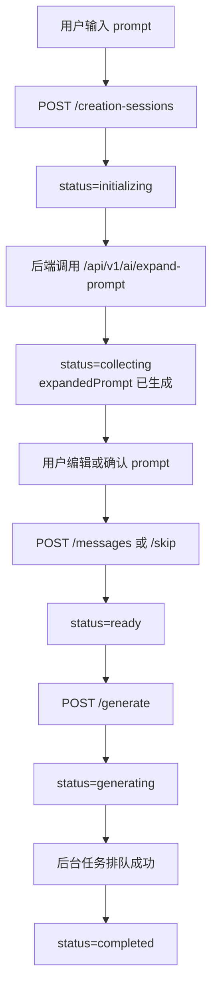

# 前端 Creation Session 适配开发文档

> 最后更新：2026-04-16
> 状态：Ready for implementation
> 适用仓库：`gamevallies-frontend`
> 文档定位：当前运行中后端契约的前端落地说明

## 1. 文档结论

当前 `creation-session` 已经不是“多轮槽位追问”主流程，而是下面这条三阶段链路：

1. 用户输入一句话或一段描述。
2. 后端异步扩写成可编辑的游戏生成提示词。
3. 用户确认或修改提示词后，再启动后台生成。

这意味着前端必须从“回答问题”模式切换为“编辑并确认整段 prompt”模式。

本次改造最重要的三个事实：

1. `POST /creation-sessions` 创建后先返回 `initializing`，前端不能再假设立刻进入可操作态。
2. `POST /creation-sessions/:id/messages` 现在表示“提交编辑后的完整 prompt 并确认”，不是聊天回复。
3. `POST /creation-sessions/:id/skip` 现在表示“按当前 expandedPrompt 原样确认”，不是“跳过当前问题”。

如果产品侧要在第二阶段提供“直接生成”按钮，前端当前需要自行串联两步：

1. 未修改 prompt：`skip -> generate`
2. 已修改 prompt：`messages -> generate`

当前后端没有单独的 `confirm-and-generate` 接口。

## 2. 后端真实契约

以下代码是当前前端适配的 source of truth：

- 控制器入口：[game.controller.ts](../../packages/game-service/src/game/game.controller.ts)
- 会话主逻辑：[creation-session.service.ts](../../packages/game-service/src/game/creation-session.service.ts)
- 会话类型定义：[creation-session.types.ts](../../packages/game-service/src/game/types/creation-session.types.ts)
- DTO 定义：[creation-session.dto.ts](../../packages/game-service/src/game/dto/creation-session.dto.ts)
- 状态常量：[creation-session.constants.ts](../../packages/game-service/src/game/creation-session.constants.ts)
- 回归测试：[creation-session.service.spec.ts](../../packages/game-service/test/creation-session.service.spec.ts)

前端不要再以旧文档中的“slot 补齐问答”假设作为实现依据。

## 3. 当前会话流程



对应的后端行为：

1. 创建 session 时立即落库为 `initializing`，并异步开始 prompt expansion。
2. expansion 成功后，session 进入 `collecting`，并返回：
   - `expandedPrompt`
   - `currentQuestion`，但其语义只是“请确认或修改提示词”
   - `readyToGenerate=false`
3. 用户确认后，session 进入 `ready`。
4. 只有 `ready` 状态才能调用 `/generate`。

## 4. 前端必须使用的接口

| 接口 | 前端语义 | 必做改动 |
| --- | --- | --- |
| `POST /api/v1/games/creation-sessions` | 创建会话 | 接受 `initializing` 返回态 |
| `GET /api/v1/games/creation-sessions/active` | 恢复活动会话 | 页面进入时优先调用 |
| `GET /api/v1/games/creation-sessions/:sessionId` | 获取最新 snapshot | 409、刷新、重连恢复时使用 |
| `GET /api/v1/games/creation-sessions/:sessionId/events` | SSE 实时更新 | `snapshot` 为真相，`delta/done` 只做体验增强 |
| `POST /api/v1/games/creation-sessions/:sessionId/messages` | 提交编辑后的完整 prompt 并确认 | 语义已变化 |
| `POST /api/v1/games/creation-sessions/:sessionId/skip` | 直接确认当前 expanded prompt | 语义已变化 |
| `POST /api/v1/games/creation-sessions/:sessionId/generate` | 启动生成 | 仅 `ready` 可调用 |
| `POST /api/v1/games/creation-sessions/:sessionId/abandon` | 放弃会话 | 保留 |

### 4.1 `POST /creation-sessions`

请求体仍然使用：

```json
{
  "prompt": "做一个办公室摸鱼躲老板的小游戏",
  "title": "Slack Hero",
  "orientation": "portrait",
  "generationTier": "standard",
  "entryMode": "create"
}
```

前端需要接受新的初始化行为：

```json
{
  "success": true,
  "data": {
    "id": "session-123",
    "status": "initializing",
    "expandedPrompt": null,
    "readyToGenerate": false
  }
}
```

### 4.2 `POST /messages`

请求体中的 `content` 必须是完整的、最终确认的 prompt 文本：

```json
{
  "content": "Game Type: Funny stealth comedy\nCore Mechanic: Tap to swap between working and slacking states...",
  "revision": 2
}
```

不要再把它当作“回答当前问题”的一句话输入接口。

### 4.3 `POST /skip`

这个接口现在等价于：

1. 接受当前 `expandedPrompt`
2. 不做编辑
3. 将 session 直接推进到 `ready`

前端按钮文案必须同步成“直接使用当前提示词”或“确认当前版本”。

### 4.4 `POST /generate`

调用前置条件：

1. `status === "ready"`
2. 持有最新 `revision`

如果用户在 `collecting` 阶段点击“直接生成”，前端需要先完成确认动作，再调用 `/generate`。

## 5. Snapshot 字段使用原则

前端状态以 `CreationSessionSnapshot` 为核心。

### 5.1 必须真正使用的字段

| 字段 | 用途 |
| --- | --- |
| `id` | 会话主键 |
| `status` | 页面状态机主驱动 |
| `entryMode` | 区分 `create / fork / iterate` |
| `initialPrompt` | 首次输入展示或回退 |
| `expandedPrompt` | 第二阶段编辑器默认值 |
| `revision` | 并发保护，所有写请求都要带 |
| `readyToGenerate` | 生成按钮可用性辅助字段 |
| `conversation` | 会话历史展示 |
| `metadata.initError` | 初始化失败提示 |
| `generatedGameId` / `generationTaskId` | 跳转结果页或任务页 |

### 5.2 可降级处理的兼容字段

以下字段目前不再是新流程主驱动，前端可以不重点渲染：

| 字段 | 建议 |
| --- | --- |
| `slotState` | 不再驱动主 UI |
| `missingRequired` | 不再驱动追问流程 |
| `currentQuestion` | 仅可作为确认提示文案辅助 |
| `planDraft` | 可暂不展示 |
| `confidenceSummary` | 可暂不展示 |
| `questionStrategy` | 可暂不展示 |

## 6. 前端状态机

页面逻辑必须从“问题驱动”改成“状态驱动”。

### 6.1 状态说明

| 状态 | 页面行为 | 用户可操作 |
| --- | --- | --- |
| `initializing` | 显示 AI 正在扩写 prompt 的 loading | 不可编辑，不可生成 |
| `collecting` | 展示 `expandedPrompt` 编辑器 | 可编辑、确认、直接生成、放弃 |
| `ready` | 展示已确认 prompt | 可生成，也可继续编辑并再次确认 |
| `generating` | 展示提交中/跳转中状态 | 不可重复提交 |
| `completed` | 会话已完成职责 | 跳任务页或结果页 |
| `abandoned` | 会话已失效或失败 | 展示重试 |
| `failed` | 兼容失败态 | 展示重试 |

### 6.2 页面切换规则

1. `initializing -> collecting`
   由 SSE `snapshot` 或主动轮询/重查触发。
2. `collecting -> ready`
   由 `messages` 或 `skip` 成功后触发。
3. `ready -> generating`
   由 `generate` 成功 claim 后触发。
4. `generating -> completed`
   由后端任务成功入队后触发。

## 7. 开发任务拆分

## 7.1 API / service 层

目标：让前端服务层暴露与后端新语义一致的方法。

开发项：

1. 保留现有 7 个接口封装，但重写方法注释和调用语义。
2. `appendCreationSessionMessage(sessionId, content, revision)` 的 `content` 改为“完整 prompt”。
3. `skipCreationSessionQuestion(sessionId, revision)` 的说明改为“confirm current prompt as-is”。
4. 新增前端组合 helper：
   - `confirmEditedPrompt(sessionId, prompt, revision)`
   - `confirmCurrentPrompt(sessionId, revision)`
   - `confirmAndGenerate(session, editedPrompt?)`
5. 所有写请求都必须自动附带 `revision`。

建议 helper 逻辑：

```ts
async function confirmAndGenerate(session: CreationSessionSnapshot, editedPrompt?: string) {
  const latest = editedPrompt && editedPrompt.trim() !== (session.expandedPrompt || "").trim()
    ? await appendCreationSessionMessage(session.id, editedPrompt.trim(), session.revision)
    : await skipCreationSessionQuestion(session.id, session.revision);

  return generateFromCreationSession(latest.id, { revision: latest.revision });
}
```

## 7.2 类型 / store 层

目标：保证前端本地状态与后端 snapshot 一致。

开发项：

1. 以后端 `CreationSessionSnapshot` 为基准更新前端类型。
2. 将 `expandedPrompt` 纳入 store 主状态。
3. 将 `revision` 纳入 store 主状态，并在每次收到新 snapshot 时覆盖。
4. 不再使用 `currentQuestion` 作为页面主驱动。
5. store 中新增派生状态：
   - `isInitializing`
   - `isAwaitingPromptConfirmation`
   - `canGenerate`
   - `canEditPrompt`
6. 收到 409 时自动执行：
   - `GET /creation-sessions/:id`
   - 用返回 snapshot 覆盖本地状态
   - 向用户提示“会话已更新，请基于最新版本继续操作”

## 7.3 创建页 UI

目标：把页面从“问答对话框”改成“prompt 编辑确认页”。

开发项：

1. 输入首条想法后，提交创建会话。
2. `initializing` 阶段展示：
   - loading 动画
   - 文案：“正在整理并扩写你的游戏想法”
3. `collecting` 阶段展示：
   - `expandedPrompt` 大文本框
   - “确认提示词”
   - “直接使用当前提示词”
   - “直接生成”
   - “放弃”
4. `ready` 阶段展示：
   - 只读或可编辑 prompt
   - “开始生成”
   - 可选“返回修改”
5. `currentQuestion.prompt` 如果存在，只作为页面顶部辅助说明，不要再把它渲染成单独问答输入框。

建议按钮文案：

| 旧文案 | 新文案 |
| --- | --- |
| 回答问题 | 确认并保存提示词 |
| 跳过问题 | 直接使用当前提示词 |
| 继续追问 | 修改提示词 |
| 生成 | 开始生成 |

## 7.4 Active Session 恢复

目标：页面刷新或中断后能恢复会话。

开发项：

1. 创建页初始化时先调用 `GET /creation-sessions/active`。
2. 如果返回：
   - `initializing`：继续显示 loading
   - `collecting`：恢复编辑器
   - `ready`：恢复待生成页
3. 如果没有 active session，再展示空白创建页。

## 7.5 SSE 接入

目标：减少轮询延迟，保证第二阶段自动切换。

前端必须监听：

1. `bootstrap`
2. `snapshot`
3. `delta`
4. `done`
5. `error`

使用原则：

1. `snapshot` 是唯一真相。
2. `delta` / `done` 只用于增强体验，比如显示“AI 已整理好一版提示词”。
3. `error` 需要落到页面错误态。
4. SSE 中断后，至少执行一次 `GET /creation-sessions/:id` 做状态回补。

## 7.6 Fork / Iterate 入口

目标：统一走 creation-session，而不是绕开确认阶段直接生成。

开发项：

1. `fork` 入口改为先创建 `entryMode="fork"` 的 creation-session。
2. `iterate` 入口改为先创建 `entryMode="iterate"` 的 creation-session。
3. 若有源游戏上下文，传 `sourceGameId`。
4. 第二阶段仍然复用同一套 prompt 编辑/确认 UI。

如果本次排期有限，建议先完成 `create` 入口，`fork / iterate` 作为下一阶段跟进。

## 8. 交互与异常处理要求

前端至少覆盖以下异常分支：

1. `initializing` 超时或 expansion 失败。
   - 使用 `metadata.initError`
   - 提供“重新开始”
2. revision 冲突。
   - 自动拉最新 snapshot
   - 不要直接覆盖用户输入
3. `generate` 失败回滚到 `ready`。
   - 展示错误提示
   - 保留确认后的 prompt
4. 会话被 `abandoned`。
   - 提示当前会话已失效
   - 提供重新创建入口

## 9. 验收标准

P0 验收必须通过以下场景：

1. 用户输入一句话后，页面进入 `initializing`，2 到 5 秒内自动切到 `collecting`。
2. `collecting` 阶段可看到 `expandedPrompt`，并能编辑。
3. 编辑后点击确认，session 进入 `ready`。
4. 不编辑直接点击“直接生成”，前端能自动完成 `skip -> generate`。
5. 编辑后点击“直接生成”，前端能自动完成 `messages -> generate`。
6. 刷新页面后，可通过 `active` 恢复到正确状态。
7. revision 过期时不会重复提交旧数据，而是刷新最新 snapshot。
8. expansion 失败时页面能正确展示错误，而不是卡死在 loading。

## 10. 推荐实施顺序

建议按下面顺序开发：

1. 更新类型定义与 API 封装。
2. 完成 create 页面状态机改造。
3. 接入 active session 恢复。
4. 接入 SSE snapshot 驱动。
5. 补 409 / initError / rollback 等异常流程。
6. 再改造 fork / iterate 入口。

## 11. 对应后端测试依据

以下测试已经验证了当前契约，前端开发可据此理解语义：

1. 创建后先 `initializing`，再进入待确认 `collecting`：
   [creation-session.service.spec.ts](../../packages/game-service/test/creation-session.service.spec.ts)
2. `messages` 表示确认编辑后的 prompt：
   [creation-session.service.spec.ts](../../packages/game-service/test/creation-session.service.spec.ts)
3. `skip` 表示按当前 expanded prompt 确认：
   [creation-session.service.spec.ts](../../packages/game-service/test/creation-session.service.spec.ts)

## 12. 本文档与旧方案的关系

本文档覆盖并替代旧版“多轮槽位追问”前端适配假设。

旧假设包括：

1. 前端围绕 `slotState / missingRequired / currentQuestion` 驱动主流程。
2. `messages` 表示用户回答当前问题。
3. `skip` 表示跳过一个槽位问题。
4. 第二阶段仍然是问答，而不是整段 prompt 编辑确认。

这些假设已经不再符合当前后端实现。
