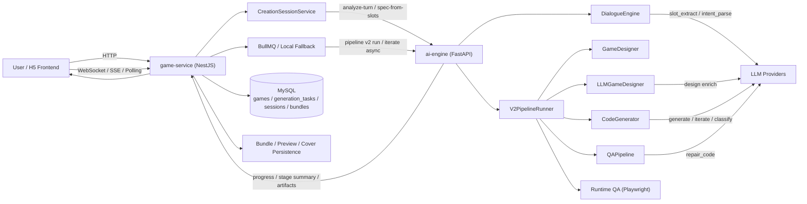
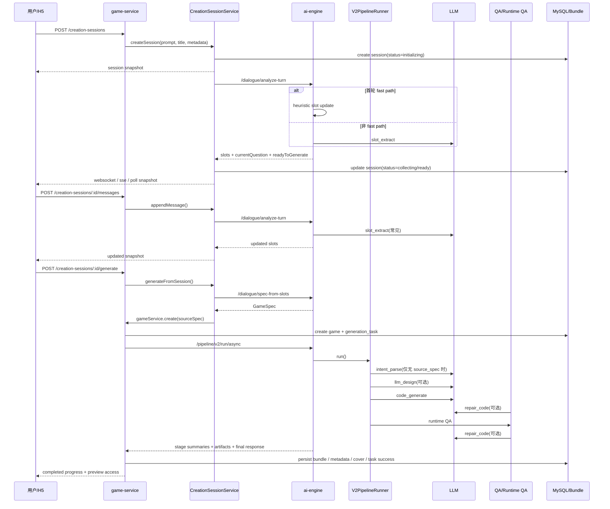
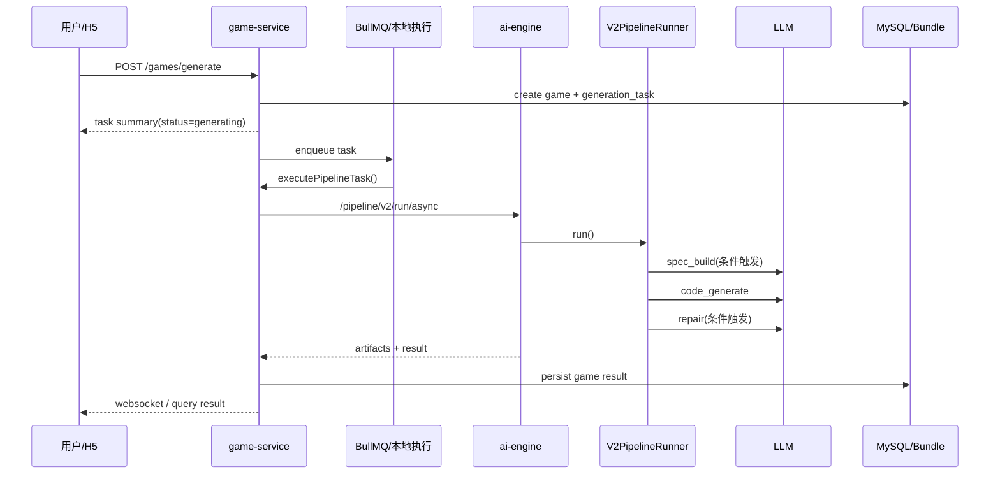
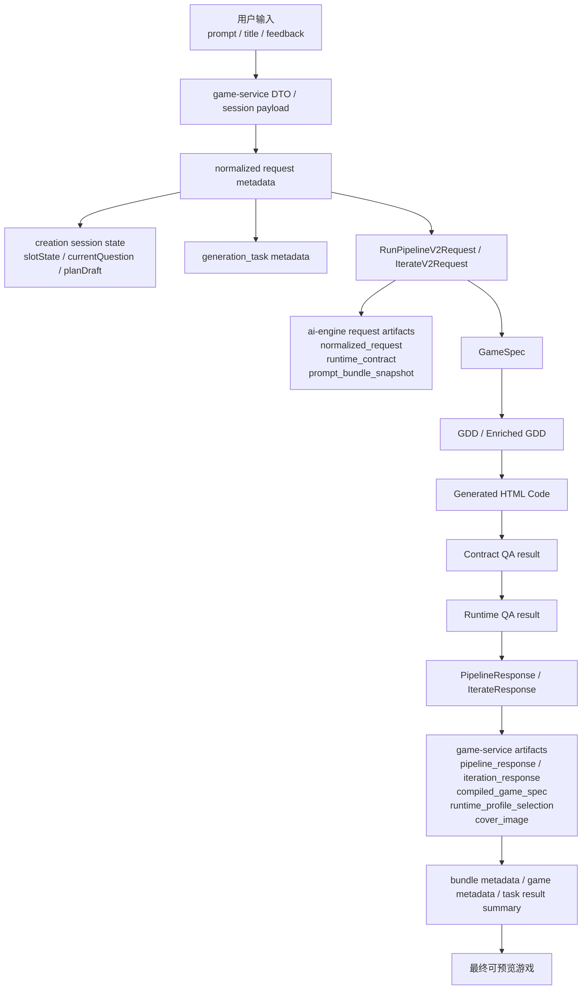

# GameVallies 游戏生成链路架构分析

> 生成日期：2026-04-04  
> 分析范围：`game-service`、`ai-engine`、BullMQ、本地任务状态、artifact 回传、QA/Runtime QA 全链路  
> 目标：梳理当前“创建/迭代”链路每一步的输入、调用函数、是否调用 LLM、输出，并系统分析现存问题与优化方向

---

## 1. 结论摘要

当前游戏生成并不是一条单链路，而是：

1. 两个用户入口
2. 一个共享的后台生成主干
3. 一套强同步的 QA/修复链路

两个入口分别是：

1. `POST /api/v1/games/generate`
2. `creation-session` 对话式创建链路

它们最终都会汇入 `gameService.create()`，再进入 ai-engine 的 `V2 pipeline`。  
当前架构的核心问题不在单个 bug，而在于：

1. 生成链路过长，且多个关键阶段串行阻塞
2. LLM 生成、QA 检查、自动修复强耦合
3. `game-service` 与 `ai-engine` 之间存在明显状态分裂
4. Runtime QA 位于主关键路径，直接限制延迟与并发
5. Prompt、runtime contract、checker 三方语义尚未完全对齐

---

## 2. 总体架构图

---

## 3. 入口与汇合点

| 入口 | 对外 API | 主要职责 | 是否直接触发 LLM | 汇合点 |
|---|---|---|---|---|
| 直接创建 | `POST /api/v1/games/generate` | 直接创建 game 与 task，启动后台生成 | 否 | `GameService.create()` |
| 对话式创建 | `POST /api/v1/games/creation-sessions` + `messages/skip/generate` | 先采集 slots，再生成 spec，再启动后台生成 | `analyze-turn` 可能调用 LLM；`spec-from-slots` 不调用 | `GameService.create()` |
| 游戏迭代 | `POST /api/v1/games/:id/iterate` | 基于已有 bundle + feedback 生成新版本 | 是 | `executeIterationTask()` -> ai-engine v2 iterate |

---

## 4. 创建链路分步说明

### 4.1 直接创建链路

| 步骤 | 输入 | 主要函数 | 是否调用 LLM | 输出 |
|---|---|---|---|---|
| 1 | `CreateGameDto` | `GameController.generateGame()` | 否 | 调用 `gameService.create()` |
| 2 | `description/title/orientation/generationTier/...` | `GameService.create()` | 否 | 新建 `game`、`generation_task` |
| 3 | 同上 | `buildPromptBundleSnapshot()`、`buildDefaultRuntimeContract()` | 否 | `promptBundleSnapshot`、`runtimeContract` |
| 4 | `taskId` | `generationQueueService.enqueueJob()` | 否 | 入队或 fallback 本地执行 |
| 5 | 本地 task metadata | `executePipelineTask()` | 否 | 构造 V2 payload |
| 6 | V2 payload | `requestUpstreamAsyncTask()` -> `/api/v1/ai/pipeline/v2/run/async` | 否 | ai-engine `task_id` |
| 7 | `RunPipelineV2Request` | `_run_pipeline_v2_internal()` | 否 | 初始化 task memory，回传 request artifacts |
| 8 | `raw_user_input` 或 `source_spec` | `V2PipelineRunner._build_create_spec()` | 有条件 | `GameSpec` |
| 9 | `GameSpec` | `_select_runtime_profile()` | 否 | `runtime_profile` |
| 10 | `GameSpec + base_contract` | `_compose_runtime_contract()` | 否 | `GameRuntimeContract` |
| 11 | `GameSpec` | `_build_gdd()` -> `GameDesigner.design()` | 否 | `GDD` |
| 12 | `spec + gdd + contract` | `LLMGameDesigner.design()` | 有条件 | enriched GDD |
| 13 | `spec + gdd + contract + prompt bundle` | `CodeGenerator.generate()` | 是 | 首版 `html_code` |
| 14 | `html_code + contract` | `_run_contract_and_runtime_flow()` | 部分调用 | contract 通过的代码 |
| 15 | `html_code` | `run_runtime_qa()` | 否 | runtime QA 报告 |
| 16 | runtime 失败时的 `errors` | `qa_pipeline.repair_code()` | 是 | 修复后的代码 |
| 17 | 最终代码 | `qa_pipeline.check()`、`code_reviewer.review()` | review 有条件 | final response |
| 18 | `RunPipelineResponse` | `_relay_artifact_to_game_service()` | 否 | `pipeline_response/spec/profile/cover` artifacts |
| 19 | `responseData` | `completePipelineTask()` | 否 | 持久化 bundle，game 变为 `draft` |

### 4.2 对话式创建链路

对话式创建在进入 `GameService.create()` 之前，多了一个“会话采集层”。

| 步骤 | 输入 | 主要函数 | 是否调用 LLM | 输出 |
|---|---|---|---|---|
| 1 | `prompt/title/orientation/generationTier` | `CreationSessionService.createSession()` | 否 | `status=initializing` 的 session |
| 2 | `AnalyzeTurnRequestPayload` | `_finalizeSessionInit()` -> `analyzeTurn()` | 可能 | 首轮 `slots/currentQuestion/planDraft` |
| 3 | 用户回答 / 跳过 | `appendMessage()` / `skipCurrentQuestion()` | 可能 | 更新后的 session snapshot |
| 4 | 当前 slots | `specFromSlots()` -> `/api/v1/ai/dialogue/spec-from-slots` | 否 | 确定性的 `GameSpec` |
| 5 | `spec + prompt + title + metadata` | `generateFromSession()` | 否 | 调用 `gameService.create()` |
| 6 | 后续步骤 | 与直接创建链路步骤 2-19 相同 | 同上 | 同上 |

### 4.3 对话式创建的关键特点

1. `createSession()` 本身只做快速落库，不同步等待 AI
2. 首轮 `analyze-turn` 已有 fast path，命中时不走 LLM
3. `spec-from-slots` 目前是确定性组装，不再走 LLM
4. 对话式链路和直接创建链路在 `GameService.create()` 处汇合

---

## 5. 迭代链路分步说明

| 步骤 | 输入 | 主要函数 | 是否调用 LLM | 输出 |
|---|---|---|---|---|
| 1 | `gameId + feedback` | `POST /api/v1/games/:id/iterate` | 否 | 进入 `GameService.iterate()` |
| 2 | 当前 live bundle、历史 metadata | `GameService.iterate()` | 否 | 新建 iteration task，固化源码快照 |
| 3 | `taskId` | BullMQ 或本地 fallback | 否 | 开始后台执行 |
| 4 | `feedback + current_code + source_spec + source_bundle_context` | `executeIterationTask()` | 否 | 构造 iterate V2 payload |
| 5 | 同上 | `/api/v1/ai/pipeline/v2/iterate/async` | 否 | ai-engine async task |
| 6 | `IterateV2Request` | `_run_iteration_v2_internal()` | 否 | request artifacts、task memory |
| 7 | `feedback/current_code/source_bundle_context` | `_build_iteration_spec()` | 是 | 迭代后的 `GameSpec` |
| 8 | `feedback` | `CodeGenerator.iterate()` | 是 | `iteration_type` + 新代码 |
| 9 | 新代码 | contract QA / runtime QA / repair | 部分调用 | 通过 QA 的版本 |
| 10 | `IterateResponse` | `completeIterationTask()` | 否 | 新 bundle 持久化 |

---

## 6. 关键时序图

### 6.1 对话式创建到完成生成

### 6.2 直接创建链路

---

## 7. 数据流程图

### 7.1 主要持久化对象

| 对象 | 所在服务 | 作用 |
|---|---|---|
| `game_creation_session` | game-service | 存放对话式创建会话状态 |
| `game` | game-service | 游戏主记录 |
| `generation_task` | game-service | 生成/迭代任务状态 |
| `bundle` | game-service | 最终 HTML 版本与 metadata |
| `generation_task_artifact` | game-service | ai-engine 回传的请求快照、response、cover、failure artifacts |
| ai-engine async task memory | ai-engine | 上游任务运行态与上下文 |

---

## 8. 每一步的 LLM 触点总表

| 阶段 | 触发条件 | step_key / 形式 | 作用 |
|---|---|---|---|
| creation-session analyze-turn | 非首轮或 fast path 未命中 | `dialogue.slot_extract` | 从对话里抽 slots |
| 直接创建 spec_build | 未提供 `source_spec` | `intent_parse` | 把 description 解析成 `GameSpec` |
| 迭代 spec_build | 常规都会触发 | `intent_parse` | 从 `feedback + current_code context` 重新生成 spec |
| llm design pass | `ENABLE_LLM_DESIGN_PASS=true` | `llm_design.enrich` | 扩展 GDD 创意细节 |
| create generate | 固定 | `code_generate` | 生成 HTML/JS/CSS |
| iterate classify | 固定 | `iterate.classify` | 判断是 param adjust 还是 element change |
| iterate rewrite | 非纯参数调整 | `_llm_iterate` | 生成迭代后的代码 |
| contract repair | contract QA 失败 | `repair_code` | 定向修复代码 |
| runtime repair | runtime QA 失败 | `repair_code` | 定向修复启动/渲染/运行问题 |
| code review | 条件触发 | `review` | 最终审查 |

---

## 9. 现存系统性问题

### 9.1 链路过长且关键路径过重

一次创建在最坏情况下会经过：

1. 对话解析
2. spec build
3. runtime profile 选择
4. contract compose
5. GDD 构建
6. LLM design
7. code generate
8. contract QA
9. contract repair
10. regenerate
11. runtime QA
12. runtime repair
13. final check
14. review
15. artifact 回传
16. bundle 持久化

问题：

1. 阶段太多，且大多串行
2. 中间任何一步波动都会把整体延迟放大
3. 首次成功率不够高时，后续 repair/regenerate 会继续放大成本

### 9.2 两条创建入口语义不同

`creation-session` 与直接 `generate` 的 spec 形成机制不一致：

1. `creation-session -> spec-from-slots` 是确定性组装
2. `generate -> _build_create_spec` 在无 `source_spec` 时依赖 `intent_parse` LLM

问题：

1. 同样的用户意图，从不同入口生成的 spec 可能不同
2. QA、contract、prompt 的输入基线不统一
3. 很难稳定比较两个入口的质量差异

### 9.3 QA 同时承担“检查”和“发布门禁”

目前 contract QA 与 runtime QA 的角色过重：

1. 既负责发现问题
2. 又直接决定本次生成是否失败
3. 还承担触发 repair/regenerate 的调度职责

问题：

1. checker 误判会直接变成用户失败
2. QA 基础设施抖动也会变成业务失败
3. “可玩但不满足 checker 预期”的代码会被误杀

### 9.4 修复机制过度依赖二次 LLM

当前修复路径本质是：

1. 先生成
2. QA 找错
3. 重新让 LLM 理解错误再补代码

问题：

1. token 消耗高
2. 时延高
3. 修复结果有随机性
4. 可能引入新的问题

### 9.5 Runtime QA 位于主关键路径

Runtime QA 需要：

1. 浏览器环境
2. 页面加载
3. 动画循环
4. 交互事件
5. canvas/DOM 检测

问题：

1. 成本远高于静态检查
2. 对环境和并发敏感
3. 一旦超时或 infra unavailable，会直接拖垮吞吐

### 9.6 状态分裂严重

当前任务状态分布在：

1. `game`
2. `generation_task`
3. `creation_session`
4. BullMQ job
5. ai-engine async task
6. artifacts
7. stage summary

问题：

1. 需要大量 reconcile
2. 容易出现“上游成功、本地下游未落库”或反之
3. 问题排查成本高

### 9.7 写放大和跨服务回传过重

ai-engine 在运行前后会多次回传：

1. `normalized_request`
2. `runtime_contract`
3. `prompt_bundle_snapshot`
4. `compiled_game_spec`
5. `runtime_profile_selection`
6. `pipeline_response / iteration_response`
7. `cover_image`
8. failure artifacts

问题：

1. 网络和数据库写放大明显
2. 单任务成本不只是 LLM，而是“LLM + 多次 HTTP + 多次 DB”
3. 高并发时更容易卡在基础设施层

### 9.8 生成器、contract、checker 语义仍未完全对齐

当前系统中至少有三套“可玩”的定义：

1. prompt 里的要求
2. runtime contract 的硬性约束
3. checker 的识别逻辑

问题：

1. 生成器写出的玩法未必能被 checker 正确识别
2. runtime contract 的细则可能没有被 prompt 强化到足够一致
3. 修复器也可能修向 checker，而不是修向真正体验

### 9.9 当前扩展能力仍有限

虽然已引入 BullMQ，但现状仍偏“单编排器”：

1. `game-service` 仍负责编排与回写
2. 任务执行与结果落地强绑定
3. 真正的多实例 worker 隔离仍不充分

问题：

1. 扩展上限仍受 `game-service` 和 runtime QA 影响
2. 无法彻底把重任务从主服务中抽离

---

## 10. 优化建议

### 10.1 P0：缩短首条可用路径

建议：

1. 把“用户首次拿到可玩结果”与“完整 QA 完成”解耦
2. 对 `standard` 档先返回 contract pass 的版本
3. Runtime QA 改成异步补验或抽样补验

收益：

1. 直接降低首屏等待时间
2. 降低关键路径长度
3. 显著改善并发吞吐

### 10.2 P0：统一创建入口的 spec 形成机制

建议：

1. 所有创建入口最终都显式归一成同一份 `NormalizedIntentSpec`
2. `creation-session` 与直接 `generate` 都先产出统一中间层，再进入 V2
3. 不再让不同入口走不同的 spec 形成逻辑

收益：

1. 行为一致
2. 可测试性提升
3. QA 与生成器更容易对齐

### 10.3 P1：把“创意生成”和“运行保障”拆层

建议：

1. 第一层输出 typed spec
2. 第二层输出稳定骨架与 runtime skeleton
3. 第三层只让 LLM 填玩法、数值、内容和表现

收益：

1. 降低模型直接写错 HTML/JS 主结构的概率
2. 很多 runtime 启动类问题可以在骨架层直接规避
3. 修复可以变成局部 patch，而不是整段重写

### 10.4 P1：QA 分层，不再全部作为硬阻断

建议：

1. 静态 contract 基线继续保留为硬门
2. runtime QA 改成按 tier 分级处理
3. `standard` 档允许 warning 级 soft-fail
4. 只有 `showcase` 档维持重 QA 强约束

收益：

1. 降低误杀率
2. 降低对 runtime QA 机器资源的依赖
3. 更符合不同档位的产品目标

### 10.5 P1：减少 repair 轮次，增加 deterministic fix 覆盖率

建议：

1. 把常见错误前移到静态修复器
2. 例如 RAF callback 未定义、restart 入口识别、canvas bootstrap 模板等
3. 只在 deterministic fix 无法解决时再触发 LLM repair

收益：

1. 降 token
2. 降时延
3. 降随机性

### 10.6 P1：压缩 artifact 与 stage summary 写放大

建议：

1. 把 request artifacts 合并成单个 compact artifact
2. 阶段 summary 只保留关键节点
3. 大 JSON 只在失败或抽样时全量保存

收益：

1. 降低跨服务回传压力
2. 降低数据库写压力
3. 提高高并发稳定性

### 10.7 P2：彻底拆分执行层

建议：

1. `game-service` 只做接入、鉴权、编排、查询
2. 创建/迭代执行交给独立 worker 服务
3. Runtime QA 独立成专用 worker 池
4. ai-engine 与 runtime QA 分别做弹性扩缩

收益：

1. 主服务更轻
2. 并发上限更高
3. 故障域隔离更清晰

### 10.8 P2：建立统一 typed contract

建议：

1. prompt、generator、runtime contract、checker 共用同一份 typed gameplay contract
2. contract 中明确哪些是 hard rule，哪些是 soft preference
3. checker 只检查 typed contract，不再做过多语义猜测

收益：

1. 降低误判
2. 降低 prompt 与 checker 偏差
3. 修复路径更可控

---

## 11. 推荐改造顺序

### 第一阶段

1. 统一 spec 中间层
2. Runtime QA 从主链路解耦
3. 减少 artifact/stage 写放大

### 第二阶段

1. 骨架化生成
2. QA 分层治理
3. deterministic fix 前移

### 第三阶段

1. 独立 worker 化
2. runtime QA 专池化
3. typed contract 全链路收敛

---

## 12. 核心判断

当前架构的主要瓶颈不是某个函数写错，而是“生成、检查、修复、回传、持久化”被耦合进了一条过长、过重、过于同步的关键路径。  
如果继续只做 case-by-case 修补，能修掉个别失败，但很难从根上解决：

1. 首轮慢
2. token 大
3. 玩法保守
4. 并发差
5. 稳定性波动

真正有效的方向应当是：

1. 缩短主路径
2. 统一中间层
3. 降低 QA 阻断面
4. 把重执行和重检查从主服务中拆出去
