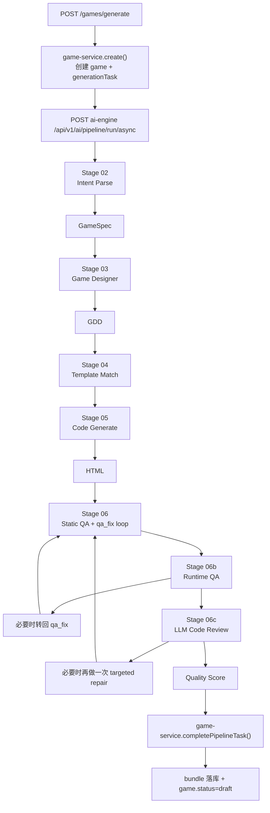

# 游戏生成逻辑复核与梳理

最后更新：2026-03-24

本文档基于当前仓库里的真实代码实现复核，不以设计稿为准。重点回答 4 件事：

- 默认创建游戏主链路到底怎么跑
- 每一步具体用了什么 prompt
- 上一步输出如何进入下一步输入
- `qa_fix` 和 `game-service <-> ai-engine` 接口真实是怎么工作的

## 1. 复核结论

本次复核后，原梳理的主干判断是对的，但有 4 个需要补正的点，现已并入本文：

1. `qa_fix` 不是“QA 失败就直接用一个 prompt 修代码”这么简单。
   它会先做一轮确定性修复，再根据错误类型选择 `prompt.qa_fix` 或 `prompt.qa_fix_fast`，并带有重复单问题熔断、代码哈希未变化提前停止等控制逻辑。

2. `game-service` 发往 `ai-engine` 的实际 payload 里带了 `region`。
   但当前 `RunPipelineRequest` / `IterateRequest` 的 Pydantic 模型并没有声明这个字段，所以“代码层的真实 HTTP 请求”和“ai-engine 的 typed request contract”之间有一个细小偏差。默认行为主要仍靠 `game-service` 选择不同 ai-engine base URL 来区分 region。

3. 现有文档里缺少一份完整的跨服务 API 契约。
   当前默认主链路实际依赖的不只是 `/pipeline/run/async`，还包括 `/tasks/{id}` 轮询、`/tasks/{id}/cancel` 取消，以及 ai-engine 反向调用 game-service 的进度/LLM 日志/任务活动回传接口。

4. Prompt 清单里漏了 `prompt.qa_fix_fast`。
   这是当前 `qa_fix` 快速修复分支真实会走到的 prompt key。

结论可以先压缩成一句话：

`description -> Slot JSON -> GameSpec -> GDD -> HTML -> 静态 QA/Auto Fix -> Runtime QA -> Code Review -> 质量分 -> game-service 落库`

## 2. 作用边界

- `game-service`
  - 创建 `game`
  - 创建/维护 `generationTask`
  - 选择 ai-engine 上游地址
  - 发起异步生成或异步迭代
  - 轮询上游任务结果
  - 接收 ai-engine 的内部回调
  - 持久化 bundle / game / task

- `ai-engine`
  - 执行真正的多阶段生成
  - 调 LLM
  - 跑静态 QA / 运行时 QA / code review
  - 产出最终 HTML、`gameSpec`、质量分和元数据

## 3. Prompt 来源与路由

### 3.1 Prompt 文本从哪里来

大部分 prompt 都先走 `packages/ai-engine/src/engine/prompt_store.py`：

1. 优先从 MySQL `system_configs` 读取 `prompt.*`
2. 取不到时回退到代码里的默认模板常量

当前主链路相关 prompt key：

- `prompt.intent_parse_system`
- `prompt.slot_json_repair_system`
- `prompt.slot_extraction_system`
- `prompt.dialogue_system`
- `prompt.code_gen_system`
- `prompt.game_design_template`
- `prompt.platform_standard`
- `prompt.iterate_classify`
- `prompt.param_adjust`
- `prompt.element_change`
- `prompt.mechanic_change`
- `prompt.qa_fix`
- `prompt.qa_fix_fast`

### 3.2 Prompt 怎么真正发给模型

统一由 `packages/ai-engine/src/services/llm_client.py` 的 `LLMClient.complete()` 发出。

每次调用都会携带这些控制信息：

- `system`
- `messages`
- `max_tokens`
- `step_key`
- `stage`
- `prefer_fast`

这里要区分两个概念：

- `prompt` 是给模型看的文本
- `step_key` 是给 `LLM Gateway` 做 provider/model 路由、日志归档、任务活动回传用的标识

### 3.3 LLM 调用日志如何回传

`packages/ai-engine/src/services/llm_gateway.py` 会基于 `step_key` 选路，并把调用活动回传给 `game-service`：

- `/api/v1/internal/generation/llm-call-log`
- `/api/v1/internal/generation/task-activity`

因此，同样一段 prompt，在不同 `step_key` 下也可能走不同 provider / model。

## 4. 默认创建游戏主链路

### 4.1 总体时序



### 4.2 默认主链路阶段表

| 阶段 | 模块 | 是否用 prompt | 输入 | 输出 | 如何流到下一步 |
| --- | --- | --- | --- | --- | --- |
| 请求入口 | `game-service.create()` | 否 | `title + description + region...` | `game + generationTask` | 发起 ai-engine async task |
| Stage 02 | `DialogueEngine.parse_description_to_spec()` | 是 | `description` | `GameSpec` | 交给 `GameDesigner.design()` |
| Stage 03 | `GameDesigner.design()` | 否 | `GameSpec` | `GDD` | 与 `GameSpec` 一起交给代码生成 |
| Stage 04 | `_stage_match_template()` | 否 | `GameSpec` | `TemplateMatchResult(path='llm')` | 告诉后续走全量 LLM 生成 |
| Stage 05 | `CodeGenerator._llm_generate()` | 是 | `GameSpec + GDD + 原始描述` | `HTML` | 进入 QA |
| Stage 06 | `QAPipeline.run_with_auto_fix()` | 首轮检查否，修复时是 | `HTML + GameSpec` | `QAResult` | 成功后进入 Runtime QA |
| Stage 06b | `_repair_runtime_failures()` | 运行时检查否，修复时是 | `HTML` | `RuntimeQAResult` | 运行时问题会转成 `QACheckError` 再回 QA 修复 |
| Stage 06c | `_run_code_review()` | 是 | `HTML preview` | `LLMReviewResult` | 明显不完整则再触发一次修复，否则只参与评分 |
| 完成 | `completePipelineTask()` | 否 | 最终 HTML + 元数据 | bundle / game / task 更新 | 前端可查询、可预览 |

## 5. 每一步如何使用 prompt，输出又如何进入下一步

### 5.1 入口层：`game-service -> ai-engine`

默认入口是 `packages/game-service/src/game/game.controller.ts` 的 `POST /games/generate`。

`game-service.create()` 主要做这些事：

1. 创建 `game`
2. 创建 `generationTask`
3. 把 `game.status` 设为 `generating`
4. 选择目标 ai-engine base URL
5. 调 ai-engine 的 `/api/v1/ai/pipeline/run/async`
6. 绑定 `upstreamTaskId`
7. 轮询 `/api/v1/ai/tasks/{task_id}` 直到终态
8. 成功后落 bundle，失败后落失败状态

当前真实 HTTP payload 会发送：

- `game_id`
- `description`
- `user_id`
- `platform`
- `region`
- `timeout_s`
- `task_id`

但 ai-engine 的 `RunPipelineRequest` 真实声明只有：

- `game_id`
- `description`
- `user_id`
- `platform`
- `timeout_s`
- `task_id`

所以默认主链路的正式输入仍然只是 `description`，不是 `spec`。

### 5.2 Stage 02：Intent Parse

代码位置：

- `packages/ai-engine/src/engine/dialogue_engine.py`
  - `parse_description_to_spec()`
  - `_extract_slot_payload_with_repair()`
  - `_build_game_spec()`

使用的 prompt：

- 主 prompt：`prompt.intent_parse_system`
- 修复 prompt：`prompt.slot_json_repair_system`

输入：

- `system = prompt.intent_parse_system`
- `messages = [{"role": "user", "content": description}]`
- `step_key = "intent_parse"`
- `stage = "intent_parsing"`

期望模型输出：

- 只包含 slot 的 JSON
- 核心字段有 `game_type / core_mechanic / theme / input_method / win_condition / difficulty / visual_style / audio_style / special_rules / reference_game`

然后代码会做：

1. 先尝试直接解析模型输出
2. 如果不是合法 slot JSON，就把
   - `Source user request`
   - `Raw parser output`
   重新喂给 `prompt.slot_json_repair_system`
3. 得到标准 slot payload 后，构造成 `SlotState`
4. 再构造成 `GameSpec`

传给下一步的不是原始 JSON，而是 `GameSpec`。

### 5.3 Stage 03：Game Designer

代码位置：

- `packages/ai-engine/src/engine/game_designer.py`

这一步不调用 LLM，不使用 prompt。

输入：

- Stage 02 产出的 `GameSpec`

输出：

- `GDD`

这一步会把偏抽象的意图压缩成更可落代码的参数，比如：

- `canvas`
- `numerics`
- `collision`
- `ui_layout`
- `input_map`
- `state_machine`
- `raw_description`

其中 `raw_description` 会组合：

- `source_description`
- `intent_summary`
- `special_rules`
- `reference_game`

下一步吃的是 `GameSpec + GDD`，不是只吃自然语言。

### 5.4 Stage 04：Template Match

代码位置：

- `packages/ai-engine/src/engine/pipeline_orchestrator.py`
  - `_stage_match_template()`

当前真实行为很简单：

- 不做模板检索
- 直接返回 `TemplateMatchResult(path="llm")`

所以这一步没有 prompt，也不会改写前面产出的 `GameSpec / GDD`，只是告诉 Stage 05 必须走 full LLM generation。

### 5.5 Stage 05：Code Generate

代码位置：

- `packages/ai-engine/src/engine/code_generator.py`
  - `_llm_generate()`
  - `_build_game_design_prompt_values()`
  - `_build_critical_intent_block()`

使用的 prompt：

- `prompt.code_gen_system`
- `prompt.game_design_template`
- `prompt.platform_standard`

真实 prompt 组装方式不是“一句需求 -> 一次生成”，而是四段拼接：

1. 原始用户请求
2. `prompt.game_design_template` 填充后的结构化 GDD
3. critical intent block
4. `prompt.platform_standard`

调用控制参数：

- `step_key = "code_generate.full"`
- `stage = "code_generating"`

输出：

- 单个完整 HTML 文档

产物会先经过 `_extract_html()` 清洗，再进入 Stage 06。

### 5.6 Stage 06：Static QA + Auto Fix

代码位置：

- `packages/ai-engine/src/engine/qa_pipeline.py`
  - `check()`
  - `run_with_auto_fix()`
  - `repair_code()`
  - `_fix_with_llm()`

第一次静态 QA 不用 prompt，纯规则。

规则检查 6 大类：

- L1 Syntax
- L2 Security
- L3 Startup
- L4 Playability
- L5 Performance
- L6 Content Safety

如果失败，才进入 `qa_fix` 修复链路。详细逻辑见第 6 节。

### 5.7 Stage 06b：Runtime QA

代码位置：

- `packages/ai-engine/src/engine/runtime_qa.py`
- `packages/ai-engine/src/engine/pipeline_orchestrator.py`
  - `_repair_runtime_failures()`

这一步本身不用 prompt。

它会运行 Playwright，收集：

- `js_errors`
- `canvas_renders`
- `registered_input_handlers`
- `direct_input_handlers`
- `fps`
- `game_over_reached`

如果发现运行时错误，编排器会把这些问题转成 `QACheckError`，然后重新调用同一套 `qa_fix` 修复。

流转关系：

`HTML -> RuntimeQAResult -> runtime errors -> qa_fix -> repaired HTML -> 再回静态 QA`

### 5.8 Stage 06c：LLM Code Review

代码位置：

- `packages/ai-engine/src/engine/code_reviewer.py`
- `packages/ai-engine/src/engine/pipeline_orchestrator.py`
  - `_run_code_review()`

使用的 prompt：

- `REVIEW_SYSTEM`
- `REVIEW_PROMPT`

这一步不走 `prompt_store`，是代码内置 prompt。

输入不是完整原始需求，而是代码预览 `code_preview`。

输出是结构化 review JSON，核心字段有：

- `is_complete_game`
- `has_real_gameplay`
- `difficulty_balanced`
- `fun_score`
- `issues`

输出流向分两种：

1. 如果 reviewer 认为“明显不完整”
   - 把 issue 转成 `QACheckError`
   - 调 `qa_pipeline.repair_code()`
   - 再跑一次 `run_with_auto_fix()`
   - 再重新 review 一次

2. 如果只是一般问题
   - 不再修代码
   - 只参与最终 `quality_score`

### 5.9 最终落库

代码位置：

- `packages/game-service/src/game/game.service.ts`
  - `completePipelineTask()`
  - `persistGeneratedGameResult()`

`game-service` 从 ai-engine 最终拿到：

- `html_code`
- `game_spec`
- `strategy`
- `qa_passed`
- `qa_retries`
- `generation_time_ms`
- `code_size_bytes`
- `quality_score`
- `quality_breakdown`

然后会：

1. 校验 HTML 至少具备可持久化结构
2. 保存 bundle
3. 更新 `game.status = draft`
4. 更新 `gameType / qualityScore / version`
5. 标记 generation task 成功

bundle metadata 会保存关键复盘信息：

- `strategy`
- `qaPassed`
- `qaRetries`
- `gameSpec`
- `genTimeMs`
- `codeSizeBytes`
- `qualityScore`
- `qualityBreakdown`
- `generationTaskId`

## 6. `qa_fix` 执行逻辑

这一节单独展开，因为这是现有文档里最容易被讲扁的部分。

### 6.1 `qa_fix` 不是什么

它不是简单的：

`QA failed -> 用一个 prompt 重写整页 HTML`

### 6.2 `qa_fix` 的真实执行顺序

真实顺序是：

1. `run_with_auto_fix()` 先对代码做 `_apply_deterministic_repairs()`
2. 然后执行 `check()`
3. 如果通过，直接返回
4. 如果失败且 LLM 不可用，直接停止
5. 如果失败且 LLM 可用，计算当前错误签名
6. 根据错误类型判断是否适合 fast fix
7. 如果出现“同一个单问题连续重复”，会逐步升级为 full fix；连续太多次会触发 circuit breaker 停止重试
8. 调 `repair_code()`
9. `repair_code()` 会再次先做一轮 `_apply_deterministic_repairs()`
10. 再由 `_fix_with_llm()` 真正发起 LLM 修复
11. LLM 返回后再跑一轮 `_apply_deterministic_repairs()`
12. 比较代码哈希；如果本轮修复前后 hash 没变化，提前停止
13. 否则继续下一轮 QA
14. 直到通过或到达最大重试次数

### 6.3 确定性修复具体做什么

`_apply_deterministic_repairs()` 会做一些纯代码层清洗，不依赖模型：

- 去掉 ```html 代码围栏
- 截取从 `<!DOCTYPE html>` / `<html` 开始的正文
- 截取到最后一个 `</html>`
- 自动补 `<!DOCTYPE html>`
- 如果没有 `<html>`，包装成完整文档
- 自动补 `<head>`
- 自动补 `charset`
- 自动补 `viewport`
- 自动补 `<body>`
- 自动补丢失的 `</script>`
- 自动补 `</body>` 和 `</html>`

所以 `qa_fix` 的第一层其实是“结构清洗”，不是 LLM。

### 6.4 什么时候走 `prompt.qa_fix_fast`

`QAPipeline._should_use_fast_fix()` 会在少量、已知类型问题下走 fast fix。

当前典型触发关键词包括：

- `no user input handlers`
- `game-over state never set to true`
- `localStorage`
- `sessionStorage`
- `blank screen`
- `canvas never rendered`
- `runtime js error`

此时会用：

- prompt key: `prompt.qa_fix_fast`
- fallback 模板：`FAST_FIX_PROMPT`
- `prefer_fast = True`

否则走：

- prompt key: `prompt.qa_fix`
- fallback 模板：`FIX_PROMPT`

### 6.5 `qa_fix` prompt 真实输入

无论 fast 还是 full，核心输入都不是重新描述游戏玩法，而是聚焦修复信息：

- `error_list`
- `game_type`
- `code`
- `fix_round`
- `max_fix_rounds`
- `targeted_instructions`（fast fix 时尤其重要）

调用控制参数固定为：

- `step_key = "qa_fix"`
- `stage = "qa_checking"`

### 6.6 `qa_fix` 的提前停止条件

当前实现有两个明显的“别无限修”的控制：

1. 重复单问题熔断
   - 同一个单错误连续重复多轮时，如果还是 fast-fix 型问题，会提前停止

2. 代码哈希未变化提前停止
   - 本轮修复前后代码 hash 相同，说明模型没有真正改动，直接停

### 6.7 `qa_fix` 会在哪些入口被复用

`qa_fix` 不只用于 Stage 06 的静态 QA 失败，还会被这两处复用：

1. Runtime QA 失败
   - `_repair_runtime_failures()` 把运行时问题转成 `QACheckError`
   - 先调一次 `repair_code()`
   - 再用 `run_with_auto_fix(max_retries=1)` 重新校验

2. Code Review 发现“明显不完整”
   - `_run_code_review()` 把 reviewer issue 转成 `QACheckError`
   - 先调一次 `repair_code()`
   - 再用 `run_with_auto_fix()` 做一次 targeted repair pass

所以更准确的抽象应该是：

`HTML -> 问题列表(QA/Runtime/Review) -> deterministic repairs -> qa_fix prompt -> deterministic repairs -> re-check`

## 7. `game-service` 和 `ai-engine` 之间的 API 接口

这里按“谁调用谁”来拆。

### 7.1 `game-service -> ai-engine`

| 方法 | URL | 用途 | 当前是否在默认主链路使用 | 鉴权 |
| --- | --- | --- | --- | --- |
| `POST` | `/api/v1/ai/expand-prompt` | 短描述扩写 | 否，独立能力 | 无 |
| `POST` | `/api/v1/ai/pipeline/run/async` | 默认创建游戏 | 是 | 无 |
| `GET` | `/api/v1/ai/tasks/{task_id}` | 轮询异步任务状态 | 是 | 无 |
| `POST` | `/api/v1/ai/tasks/{task_id}/cancel` | 取消上游任务 | 是 | 无 |
| `POST` | `/api/v1/ai/pipeline/iterate/async` | 游戏迭代 | 否，不是默认 create 主链路，但在 iterate 主链路中使用 | 无 |
| `POST` | `/api/v1/ai/llm-gateway/refresh` | 刷新 ai-engine LLM provider 配置 | 否，管理接口 | `x-admin-token` |
| `POST` | `/api/v1/ai/llm-gateway/providers/{providerId}/test` | 测试 provider | 否，管理接口 | `x-admin-token` |

#### `POST /api/v1/ai/pipeline/run/async`

当前实际请求体：

```json
{
  "game_id": "game_xxx",
  "description": "user prompt",
  "user_id": "user_xxx",
  "platform": "wechat_webview",
  "region": "cn_shanghai",
  "timeout_s": 1200,
  "task_id": "task_xxx"
}
```

当前 ai-engine `RunPipelineRequest` 正式声明：

```json
{
  "game_id": "string",
  "description": "string",
  "user_id": "string",
  "platform": "wechat_webview",
  "timeout_s": 600,
  "task_id": "optional"
}
```

响应是 `AsyncTaskHandleResponse`，核心字段：

```json
{
  "task_id": "string",
  "task_type": "pipeline_run",
  "status": "queued|running|succeeded|failed|canceled",
  "game_id": "string",
  "user_id": "string",
  "timeout_s": 1200,
  "ws_channel": "game:game_xxx",
  "poll_url": "/api/v1/ai/tasks/{task_id}",
  "cancel_url": "/api/v1/ai/tasks/{task_id}/cancel"
}
```

#### `GET /api/v1/ai/tasks/{task_id}`

响应是 `AsyncTaskResponse`，关键字段：

- `status`
- `progress`
- `error`
- `result`

`game-service` 会一直轮询到终态。

#### `POST /api/v1/ai/pipeline/iterate/async`

当前实际请求体：

```json
{
  "game_id": "game_xxx",
  "feedback": "把角色移动速度调快一点",
  "user_id": "user_xxx",
  "conversation": [],
  "current_code": "<!DOCTYPE html>...",
  "region": "cn_shanghai",
  "timeout_s": 1200,
  "task_id": "task_xxx"
}
```

当前 ai-engine `IterateRequest` 正式声明：

- `game_id`
- `feedback`
- `user_id`
- `conversation`
- `current_code`
- `timeout_s`
- `task_id`

### 7.2 `ai-engine -> game-service`

这些是 ai-engine 的内部回调接口，都在 `game-service` 的 `InternalGenerationController` 中：

| 方法 | URL | 用途 | 鉴权 |
| --- | --- | --- | --- |
| `POST` | `/api/v1/internal/generation/progress` | 回传阶段进度 | `x-admin-token` |
| `POST` | `/api/v1/internal/generation/llm-call-log` | 回传每次 LLM 调用日志 | `x-admin-token` |
| `POST` | `/api/v1/internal/generation/task-activity` | 回传 step 级活动/心跳/完成/失败 | `x-admin-token` |

#### `POST /api/v1/internal/generation/progress`

典型 body：

```json
{
  "taskId": "task_xxx",
  "gameId": "game_xxx",
  "userId": "user_xxx",
  "stage": "code_generating",
  "percentage": 60,
  "message": "生成游戏代码",
  "details": {}
}
```

用途：

- 更新 `generationTask`
- 通过 WebSocket 推送前端

注意：

- ai-engine 在 `_relay_progress_to_game_service()` 里对 `stage == "completed"` 的进度不会再回传给 game-service

#### `POST /api/v1/internal/generation/llm-call-log`

典型 body 字段：

- `taskId`
- `gameId`
- `userId`
- `stage`
- `stepKey`
- `providerId`
- `providerName`
- `providerType`
- `region`
- `model`
- `requestTimeoutS`
- `connectTimeoutS`
- `latencyMs`
- `httpStatus`
- `success`
- `upstreamRequestId`
- `errorCode`
- `errorMessage`
- `errorBodyExcerpt`
- `configVersion`
- `routeSnapshot`

用途：

- 持久化 `llmCallLog`
- 让 task 复盘时能看到每次真实模型调用

#### `POST /api/v1/internal/generation/task-activity`

典型 body：

```json
{
  "taskId": "task_xxx",
  "gameId": "game_xxx",
  "userId": "user_xxx",
  "stage": "qa_checking",
  "stepKey": "qa_fix",
  "message": "qa_fix 正在调用 provider",
  "percentage": 80,
  "details": {}
}
```

用途：

- 记录 step 级活动
- 通过 WebSocket 推给前端更细粒度的状态

### 7.3 当前默认 create 主链路真实依赖的接口集合

默认 `POST /games/generate` 真正会用到的是：

1. `POST /api/v1/ai/pipeline/run/async`
2. `GET /api/v1/ai/tasks/{task_id}`
3. 失败/取消场景下 `POST /api/v1/ai/tasks/{task_id}/cancel`
4. ai-engine 回调 `POST /api/v1/internal/generation/progress`
5. ai-engine 回调 `POST /api/v1/internal/generation/llm-call-log`
6. ai-engine 回调 `POST /api/v1/internal/generation/task-activity`

## 8. 非默认但相关的三条支线

### 8.1 对话补槽链路

相关接口：

- `POST /api/v1/ai/dialogue/chat`
- `GET /api/v1/ai/dialogue/session/{session_id}`

每轮通常有两次 prompt：

1. `dialogue.slot_extract`
   - prompt key: `prompt.slot_extraction_system`
   - 输入：完整对话历史
   - 输出：slot JSON

2. `dialogue.reply`
   - prompt key: `prompt.dialogue_system`
   - 输入：完整对话历史 + 当前 slot summary + missing slots
   - 输出：一句追问/确认

当前对话完成后虽然能得到 `ready_to_generate=true`，也可以把 session slots 转成 `GameSpec`，但默认 create 主链路并不会直接接这个 `GameSpec`。

### 8.2 Prompt 扩写链路

相关接口：

- `POST /games/expand-prompt`
- `POST /api/v1/ai/expand-prompt`

作用：

- 把短描述扩成更细的中文游戏设计文本

这条链路是独立工具，不会自动插入默认 `/games/generate` 之前。

### 8.3 迭代链路

相关接口：

- `POST /games/:id/iterate`
- `POST /api/v1/ai/pipeline/iterate/async`

输入：

- `feedback`
- `conversation`
- `current_code`

Prompt 使用顺序：

1. `prompt.iterate_classify`
   - `step_key = "iterate.classify"`
   - 先判断属于 `param_adjust / element_change / mechanic_change / major_overhaul`

2. 如果是简单参数修改
   - 先尝试 `_param_adjust()` 本地正则修改
   - 成功则直接返回，不走 LLM

3. 如果本地改不动，或属于复杂修改
   - 走 `prompt.param_adjust` / `prompt.element_change` / `prompt.mechanic_change`
   - 最终输出新 HTML

4. 然后继续走同一套：
   - `qa_fix`
   - Runtime QA
   - Code Review
   - bundle version 落库

## 9. 当前实现和设计稿之间还没打通的地方

### 9.1 `intent_parser.py` 不是默认主路径

仓库里有 `packages/ai-engine/src/engine/intent_parser.py`，但当前默认主链路实际没有引用它。

默认 Stage 02 真正使用的是：

- `DialogueEngine.parse_description_to_spec()`

### 9.2 `spec` 直通还没落地

设计文档里已经规划过“对话完成后直接把结构化 `spec` 送入 pipeline，跳过重新 intent parse”，但当前真实代码还没完全接通：

- `RunPipelineRequest` 还没有 `spec`
- 默认 `game-service.create()` 也没有调用 dialogue session 结果

所以默认创建仍然会在 ai-engine 内部重新做一次 intent parse。

## 10. 复盘时应该重点看哪些产物

如果要复盘一局游戏是怎么生成出来的，最关键的链路产物是：

1. 原始 `description`
2. Stage 02 产出的 `gameSpec`
3. Stage 03 产出的 `GDD`
4. 代码生成后的初版 HTML
5. `qa_fix` 的错误列表和修复轮次
6. Runtime QA 结果
7. Code Review 结果
8. 最终 bundle metadata
9. `llmCallLog` 和 `generationTaskEvent`

## 11. 当前主链路一句话总结

当前默认“创建游戏”并不是“用户描述 -> 直接写代码”，也不是“先对话补槽 -> 直接把 spec 喂给生成器”。

当前现网更接近这条链路：

`description -> LLM 抽 slots -> GameSpec -> 规则设计出 GDD -> LLM 生成 HTML -> 规则 QA + qa_fix -> Runtime QA -> LLM Code Review -> 质量评分 -> game-service 持久化`
