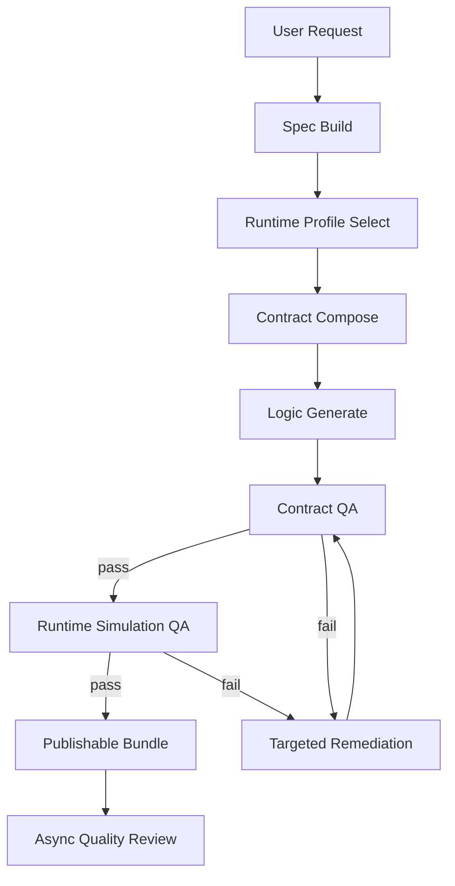

# Game Generation Runtime Rearchitecture

最后更新：2026-03-24

本文档定义“游戏生成主链路”的架构级重构方案，目标不是继续在现有链路上增加补丁，而是从运行时契约、Prompt 分层、Pipeline 重组、日志与产物留存四个层面，系统性降低失败率、缩短耗时并提升排障效率。

## 1. 背景与问题

当前主链路的核心模式是：

`用户描述 -> LLM 生成整页 HTML -> 静态 QA -> runtime QA -> LLM 修复 -> 再次 QA`

这套模式已经连续暴露出几个结构性问题：

- 生成边界过宽：模型同时负责运行时框架、输入、状态机、布局、玩法逻辑，失败面太大。
- QA 过度后置：很多问题本应由“运行时契约”预防，却在生成完成后才被启发式检测。
- 修复代价过高：一旦 QA 失败，默认走整页重写或大范围修补，耗时高且容易引入新错误。
- Prompt 容易漂移：代码默认 prompt、DB prompt、后台可编辑 prompt 同时存在，职责边界不清。
- 日志噪音过多：重复 progress、llm_call、heartbeat、retry note 堆在一起，关键结论难以快速判断。

本次重构的原则是：

- 用架构约束替代启发式猜测
- 用契约验证替代事后补锅
- 用定向修复替代整页重写
- 用结构化产物留存替代刷屏式日志

## 2. 重构目标

### 2.1 正确性目标

- 生成结果必须满足统一的 `Game Runtime Contract`
- `create / iterate / fork` 三条链路共享同一套生成内核
- 移动端可玩性不再依赖 Prompt 暗示，而是由运行时骨架和 contract 共同保证
- QA 失败原因必须可归类、可复现、可追踪

### 2.2 效率目标

- 降低整页 LLM 修复次数
- 缩短 `qa_checking` 阶段耗时
- 降低重复失败的无效重试
- 将非阻塞型质量评估从主发布链路中剥离

### 2.3 可观测性目标

- 用户侧只看到少量高价值状态节点
- 运维侧能快速看到每次任务的结论、失败点、原始输入和原始输出
- 每次生成都能追溯使用的 prompt bundle、runtime profile、contract 检查结果和修复 diff

## 3. 当前架构问题复盘

### 3.1 Prompt 问题

当前 prompt 系统存在以下问题：

- `intent_parse / dialogue / code generation / qa_fix` 的 prompt 既有代码默认值，又可被 DB 覆盖。
- Prompt key 是平铺的，缺少版本化概念，无法稳定复现“某个任务到底用了哪一版 prompt 组合”。
- `code_gen_system` 和 `game_design_template` 承担了过多职责，既描述运行时规则，又描述玩法，又描述 UI。
- 修复 prompt 与生成 prompt 没有共享统一的运行时契约定义，导致“生成按一套规则写，修复按另一套规则改”。

### 3.2 Pipeline 问题

当前 pipeline 虽然已经裁掉模板与 mock 主路径，但仍有几个结构性缺陷：

- Stage 04 “template matching” 逻辑上已退化为固定走 LLM，仍保留伪阶段和伪语义。
- Stage 05 直接让模型生成整页完整 HTML，生成自由度过大。
- Stage 06 QA 既做静态检查，又做自动修复，又做运行时失败转回静态修复，职责耦合。
- Runtime QA 目前承担了“验证输入是否存在”的职责，但它看到的是最终页面行为，而不是结构化运行时 contract。
- `code_review` 作为质量加分项，却仍阻塞主发布链路，放大总体耗时。

### 3.3 日志问题

当前异步任务链路同时使用：

- `generation_task_events`
- `llm_call_logs`
- Nest / Python logger

导致问题：

- 任务 timeline 冗余，单次任务会出现大量重复“任务开始执行”“调用开始”“heartbeat”“retry note”
- 用户态与后台态没有明确分层
- 原始 prompt / 原始输出 / 修复前后差异并没有统一落盘，只能从零散日志中拼
- 出现问题时，通常只能看到最后一句错误，难以判断是生成失败、修复失败，还是 contract 本身不满足

## 4. 新架构总览

重构后的主链路从“自由 HTML 生成链”改为“Spec 驱动 + Contract 骨架 + 定向修复”的受控生成链。



### 4.1 核心变化

- 底层运行时框架不再由模型自由发挥，而由系统提供统一骨架。
- LLM 的主要工作从“生成整套页面”转为“填充玩法逻辑、参数、实体和 UI 文案”。
- QA 先验证 contract，再验证 runtime behavior。
- 修复只针对 contract 违约项做 patch，不默认做整页重写。
- Quality review 从主发布路径中剥离，变成异步附加评估。

## 5. Game Runtime Contract

`Game Runtime Contract` 是本次重构的核心。它定义“什么样的生成结果才算可发布的游戏”。

### 5.1 Contract 组成

每个游戏在生成前先被编译成一个 contract：

```json
{
  "runtimeProfile": "portrait_arcade",
  "inputContract": {
    "requiredModes": ["pointer", "touch"],
    "allowMouseFallback": true,
    "target": "canvas_or_document"
  },
  "stateContract": {
    "requiredStates": ["boot", "ready", "playing", "game_over"],
    "restartable": true
  },
  "renderContract": {
    "requiresCanvas2D": true,
    "mustRenderWithinMs": 1500
  },
  "mobileLayoutContract": {
    "orientation": "portrait_first",
    "uiScaleMode": "short_edge",
    "fontClamp": {
      "hudMin": 14,
      "hudMax": 20,
      "titleMin": 28,
      "titleMax": 36
    }
  },
  "safetyContract": {
    "forbiddenApis": [
      "localStorage",
      "sessionStorage",
      "fetch",
      "XMLHttpRequest",
      "WebSocket",
      "eval",
      "Function"
    ]
  }
}
```

### 5.2 Contract 分层

- `core contract`
  - 所有游戏都必须满足
  - 如 canvas、输入、状态机、终局、重开、安全 API
- `profile contract`
  - 由 runtime profile 决定
  - 如拼图网格、跑酷轨道、top-down 运动模式
- `experience contract`
  - 由业务策略决定
  - 如教育类 UI 强调提示、儿童类字体更大但仍需 clamp

### 5.3 Contract 的作用

- 生成前：用于约束 prompt
- 生成中：用于拼接运行时骨架
- QA 中：用于结构化校验
- 修复时：用于生成定向 patch
- 日志中：作为每次失败的“判定依据快照”

## 6. Runtime Profile 设计

当前的 Stage 04 不再保留 “template matching” 语义，改为 `runtime profile select`。

### 6.1 推荐的 Profile

- `portrait_arcade`
  - 适合躲避、接物、点击、反应类
- `lane_runner`
  - 适合跑酷、纵向移动、轨道切换
- `grid_puzzle`
  - 适合消除、翻牌、拼图、棋盘类
- `topdown_action`
  - 适合射击、追逐、操作角色移动
- `tap_timing`
  - 适合节奏、单点时机控制

### 6.2 Profile 内容

每个 profile 提供：

- 运行时骨架模块列表
- 默认输入模型
- 默认 viewport/layout 策略
- 默认 UI 组件
- 默认 QA contract 扩展
- 对应的 few-shot 示例

### 6.3 选择逻辑

Profile 由 `GameSpec` 决定，不再靠模糊模板置信度。

- `game_type`
- `core_mechanic`
- `input_method`
- `entities`
- `win_condition`

如果无法可靠分类，则回退到 `portrait_arcade`，但 contract 依然严格校验。

## 7. Prompt Bundle 设计

### 7.1 目标

Prompt 需要从“散落的若干字符串”升级为“可版本化、可追踪、可分层”的 bundle。

### 7.2 Prompt Bundle 结构

每次任务会记录：

```json
{
  "bundleId": "runtime-v1",
  "bundleVersion": 3,
  "resolvedAt": "2026-03-24T12:00:00Z",
  "layers": {
    "lockedContract": "...",
    "productPolicy": "...",
    "profileFewShot": "...",
    "repairPlaybook": "..."
  }
}
```

### 7.3 三层设计

#### A. Locked Contract Layer

代码内置，不允许后台随意编辑。

职责：

- 输出格式
- canvas/runtime/input/state/mobile/safety 契约
- 不可妥协的系统规则

#### B. Product Policy Layer

后台可配置。

职责：

- 品牌语气
- 教育/休闲/益智偏好
- 风格偏好
- 产品运营策略

#### C. Profile Few-shot Layer

按 `runtimeProfile` 提供。

职责：

- 小规模范例
- 结构提醒
- 典型实体与状态组织方式

### 7.4 新 Prompt Key 规划

建议从平铺 key 过渡为以下结构：

- `bundle.runtime.locked_contract`
- `bundle.runtime.profile.portrait_arcade`
- `bundle.runtime.profile.grid_puzzle`
- `bundle.product.intent_parse`
- `bundle.product.spec_enrich`
- `bundle.product.logic_generate`
- `bundle.product.ui_copy_generate`
- `bundle.repair.input_contract`
- `bundle.repair.terminal_state`
- `bundle.repair.mobile_layout`
- `bundle.repair.forbidden_api`

### 7.5 Prompt 使用原则

- `intent_parse` 不再直接产出最终生成 prompt，只负责抽象 `GameSpec`
- `logic_generate` 不再拿原始用户长文本作为主输入，而是以 `GameSpec + Contract + Profile` 为主
- `repair` prompt 一次只处理一种 error family
- 所有 prompt 最终都必须落入 `PromptBundleSnapshot`，便于复盘

## 8. 新 Pipeline 设计

### 8.1 新阶段定义

#### Stage 1: Request Normalize

输入：

- 用户原始描述
- 可选的已有 `GameSpec`
- 可选的 `ForkIntent`
- 可选的 `IterationDelta`

输出：

- 归一化请求对象

#### Stage 2: Spec Build

职责：

- 从用户描述、已有 spec 或 fork 基础 spec 中构建结构化 `GameSpec`
- 生成 `SpecDelta`
- 进行 schema-level normalization

#### Stage 3: Runtime Profile Select

职责：

- 根据 `GameSpec` 选择 `runtimeProfile`
- 给出 profile-specific contract

#### Stage 4: Contract Compose

职责：

- 合成 `GameRuntimeContract`
- 合成 Prompt Bundle Snapshot

#### Stage 5: Logic Generate

职责：

- 在统一骨架下生成：
  - gameplay logic
  - entities
  - parameter tables
  - UI 文案
- 输出不再是“完全自由 HTML”，而是：
  - `logic module`
  - `ui copy`
  - `config`
  - `assembled html`

#### Stage 6: Contract QA

职责：

- 静态验证 contract 是否满足
- 输出结构化 violation 列表

#### Stage 7: Targeted Remediation

职责：

- 仅针对 violation family 做 patch
- 默认最多两轮
- 如果错误签名不变则熔断

#### Stage 8: Runtime Simulation QA

职责：

- 受控交互仿真
- 验证输入实际生效
- 验证状态转移与渲染变化

#### Stage 9: Publishable Bundle

职责：

- 产出 bundle
- 返回 `gameSpec`
- 记录 artifact 与结论日志

#### Stage 10: Async Quality Review

职责：

- 质量评分
- 代码风格审查
- 高级建议

这一步不再阻塞主发布。

### 8.2 create / iterate / fork 统一方式

#### create

`UserDescription -> GameSpec -> RuntimeProfile -> Contract -> Generate`

#### iterate

`ExistingGameSpec + IterationIntent -> SpecDelta -> MergedSpec -> Generate`

#### fork

`SourceGameSpec + ForkIntent -> ForkSpec -> Generate`

统一点：

- 不直接对旧 HTML 做大范围自由编辑
- 先修改 spec，再生成受控结果

### 8.3 是否需要深度重构

需要。

原因不是“代码太乱”，而是当前 pipeline 的核心职责划分就不合理：

- 生成责任过宽
- QA 责任过晚
- 修复责任过重
- 日志责任过碎

因此建议：

- 保留现有 HTTP / async task 外壳
- 深度重构 ai-engine 内部生成内核
- 渐进迁移，而不是在旧链路上继续加 patch

## 9. QA 体系重构

### 9.1 Contract QA 取代一部分启发式规则

旧模式：

- 正则猜输入
- 正则猜终局
- 正则猜 canvas 绘制

新模式：

- 检查 contract-required module 是否存在
- 检查输入适配层是否接线
- 检查状态机是否具备 required states
- 检查 restart path 是否存在

### 9.2 Runtime Simulation QA 只做有限验证

运行时只验证：

- 是否有真实输入注册
- 输入后是否产生状态变化
- 是否发生画面变化
- 是否能从失败态回到 ready / playing

不再让 runtime QA 去承担“猜玩法完整性”的职责。

### 9.3 定向修复

错误族拆分为：

- `input_contract_missing`
- `terminal_state_missing`
- `mobile_layout_violation`
- `forbidden_api_violation`
- `render_contract_missing`
- `runtime_state_transition_missing`

每一类错误有独立 patch path。

规则：

- 单类错误优先 `fast patch`
- 多类错误走 `structural patch`
- 连续两轮错误签名不变则停止修复

### 9.4 退出主链路的项目

以下内容不再阻塞发布：

- 风格类 code review
- 高级质量评分
- 一般性代码洁净建议

它们转入异步质量报告。

## 10. 日志与 Artifact 重构

### 10.1 设计原则

- timeline 只保留关键结论，不刷中间噪音
- 原始输入输出单独留存为 artifact
- 同一事实只记录一次

### 10.2 新的 Timeline 事件

建议把 `generation_task_events` 收敛为：

- `TASK_CREATED`
- `SPEC_READY`
- `PROFILE_SELECTED`
- `CONTRACT_READY`
- `GENERATION_READY`
- `CONTRACT_QA_FAILED`
- `REMEDIATION_APPLIED`
- `RUNTIME_QA_FAILED`
- `TASK_SUCCEEDED`
- `TASK_FAILED`

不再默认写入：

- 每次 LLM 调用开始 note
- heartbeat
- 每次 retry 的重复 progress
- 同一阶段多次“任务开始执行”

### 10.3 LLM 调用日志收敛

`llm_call_logs` 继续保留，但不再映射成大量 timeline note。

建议只保留：

- `taskId`
- `stage`
- `stepKey`
- `provider`
- `model`
- `latencyMs`
- `success`
- `errorCode`
- `requestArtifactId`
- `responseArtifactId`

### 10.4 Generation Artifact

新增 `generation_artifacts` 表或等价存储：

- `id`
- `taskId`
- `gameId`
- `artifactType`
- `contentType`
- `storageType`
- `payload`
- `createdAt`

建议的 artifactType：

- `raw_user_input`
- `normalized_request`
- `resolved_game_spec`
- `runtime_profile`
- `runtime_contract`
- `prompt_bundle_snapshot`
- `llm_request`
- `llm_response`
- `assembled_html_initial`
- `assembled_html_repaired`
- `contract_qa_report`
- `runtime_qa_report`
- `repair_diff`
- `final_publish_bundle`

### 10.5 用户可见日志 vs 运维日志

用户可见：

- 少量中文关键节点
- 最终失败结论

后台运维：

- 结构化结论
- artifact 入口
- failure family
- prompt bundle version
- runtime profile

开发排障：

- 原始输入输出
- patch diff
- QA report 细节

## 11. 数据模型建议

### 11.1 新增字段

建议在 `generation_tasks` 增加：

- `prompt_bundle_id`
- `prompt_bundle_version`
- `runtime_profile`
- `contract_version`
- `failure_family`
- `primary_artifact_id`

### 11.2 新增表

建议新增：

- `generation_artifacts`
- `prompt_bundles`
- `runtime_profile_catalog`

### 11.3 兼容策略

旧任务继续使用原日志表。

新任务：

- 仍写 `generation_task_events`
- 但只写结论型事件
- 详细内容改写入 artifact

## 12. 分阶段实施方案

### Phase 0: 可观测性先行

目标：

- 不改生成核心逻辑
- 先把 prompt bundle versioning、artifact、日志收敛加上

交付：

- `generation_artifacts`
- `prompt_bundle_snapshot`
- timeline 事件压缩
- llm_call_logs 与 timeline 解耦

### Phase 1: Runtime Contract 落地

目标：

- 引入 `GameRuntimeContract`
- Stage 04 改成 `runtime profile select`
- 合同式 QA 落地

交付：

- contract compiler
- runtime profile catalog
- contract QA v1

### Phase 2: 定向修复替代整页修复

目标：

- 将 `qa_fix` 拆成按 failure family 定向 patch

交付：

- `repair.input_contract`
- `repair.terminal_state`
- `repair.mobile_layout`
- `repair.forbidden_api`

### Phase 3: create / iterate / fork 统一 Spec-first

目标：

- 统一三条链路的生成内核
- iterate / fork 不再直接在旧 HTML 上做大范围自由改写

### Phase 4: 异步质量评估

目标：

- 把 code review / quality score 从主链路中剥离

## 13. 风险与迁移策略

### 13.1 风险

- 运行时骨架收紧后，早期可能暴露更多“玩法不适配 profile”的问题
- iterate / fork 迁移到 spec-first 需要补更多旧数据兼容逻辑
- artifact 存储会增加数据库或对象存储成本

### 13.2 迁移策略

- 保留旧 pipeline，新增 `pipeline_version=v2`
- 按 region 或按用户灰度
- 先对新创建游戏启用，iterate / fork 后续切换
- 所有新任务写入 prompt bundle version，确保可回放

## 14. 决策点

进入实施前需要确认以下策略：

- 是否接受引入统一运行时骨架，限制模型自由生成底层框架
- 是否接受 code review/quality score 从主发布路径退出
- artifact 是否先落 MySQL JSON，再迁移对象存储
- iterate / fork 是否允许短期兼容“旧 HTML patch”，还是直接切 spec-first

## 15. 推荐结论

推荐直接启动本方案，而不是继续在旧架构上做局部修补。

原因：

- 当前问题已经重复出现，且集中暴露在相同结构缺陷上
- 继续 patch 只会让 prompt、QA、runtime、日志相互耦合得更重
- 重构方案可以把失败率、耗时、排障效率三个问题一起解决

下一步建议不是直接写代码，而是继续把本方案落细到：

- 数据表与字段契约
- Prompt Bundle 结构定义
- Runtime Contract Schema
- 各阶段输入输出 DTO
- Timeline 与 Artifact API

## 16. 数据表与字段契约

本节把上一节的高层建议收敛到可直接实施的表结构草案。

### 16.1 `generation_tasks` 增量字段

建议新增字段：

| 字段 | 类型 | 含义 |
| --- | --- | --- |
| `pipeline_version` | `VARCHAR(16)` | 当前任务使用的 pipeline 版本，如 `v1` / `v2` |
| `prompt_bundle_id` | `VARCHAR(64)` | 使用的 prompt bundle 标识 |
| `prompt_bundle_version` | `INT` | 解析后的 bundle 版本 |
| `runtime_profile` | `VARCHAR(64)` | 如 `portrait_arcade` / `grid_puzzle` |
| `contract_version` | `VARCHAR(32)` | 运行时契约 schema 版本 |
| `failure_family` | `VARCHAR(64)` | 如 `input_contract_missing` |
| `primary_artifact_id` | `VARCHAR(36)` | 指向最终结果或失败报告的主 artifact |

建议索引：

- `(pipeline_version, status, updated_at)`
- `(runtime_profile, status, created_at)`
- `(failure_family, created_at)`

### 16.2 `generation_artifacts`

用途：替代刷屏式日志，结构化保存原始输入输出和关键中间产物。

建议表结构：

| 字段 | 类型 | 说明 |
| --- | --- | --- |
| `id` | `VARCHAR(36)` | 主键 |
| `task_id` | `VARCHAR(36)` | 关联任务 |
| `game_id` | `VARCHAR(36)` | 关联游戏 |
| `user_id` | `VARCHAR(36)` | 关联用户 |
| `artifact_type` | `VARCHAR(64)` | 见下方枚举 |
| `content_type` | `VARCHAR(64)` | 如 `application/json` / `text/html` |
| `storage_type` | `VARCHAR(32)` | `inline_json` / `inline_text` / `object_storage` |
| `payload_json` | `JSON NULL` | 小体积结构化内容 |
| `payload_text` | `LONGTEXT NULL` | 小体积文本 |
| `payload_url` | `VARCHAR(512) NULL` | 对象存储地址 |
| `sha256` | `VARCHAR(64) NULL` | 内容哈希 |
| `metadata` | `JSON NULL` | 补充元信息 |
| `created_at` | `DATETIME(3)` | 创建时间 |

建议 `artifact_type` 枚举：

- `raw_user_input`
- `normalized_request`
- `resolved_game_spec`
- `runtime_profile`
- `runtime_contract`
- `prompt_bundle_snapshot`
- `llm_request`
- `llm_response`
- `assembled_html_initial`
- `assembled_html_repaired`
- `contract_qa_report`
- `runtime_qa_report`
- `repair_diff`
- `publish_bundle`
- `quality_review_report`

建议索引：

- `(task_id, artifact_type, created_at)`
- `(game_id, artifact_type, created_at)`

### 16.3 `prompt_bundles`

用途：把 prompt 从“零散 key”升级为“版本化 bundle”。

建议表结构：

| 字段 | 类型 | 说明 |
| --- | --- | --- |
| `id` | `VARCHAR(64)` | bundle 标识，如 `runtime-v1` |
| `version` | `INT` | bundle 版本 |
| `status` | `VARCHAR(16)` | `draft` / `active` / `archived` |
| `product_policy` | `LONGTEXT` | 产品策略层 |
| `locked_contract_override` | `LONGTEXT NULL` | 一般留空，仅允许极少数环境覆盖 |
| `repair_playbook` | `LONGTEXT` | 修复策略层 |
| `profile_overrides` | `JSON` | profile 级覆盖 |
| `metadata` | `JSON NULL` | 备注、作者、变更说明 |
| `created_at` | `DATETIME(3)` | 创建时间 |
| `updated_at` | `DATETIME(3)` | 更新时间 |

唯一约束：

- `(id, version)`

激活约束：

- 同一 `id` 只允许一个 `status=active`

### 16.4 `runtime_profile_catalog`

用途：管理受控运行时 profile。

建议表结构：

| 字段 | 类型 | 说明 |
| --- | --- | --- |
| `id` | `VARCHAR(64)` | 如 `portrait_arcade` |
| `display_name` | `VARCHAR(128)` | 展示名 |
| `enabled` | `BOOLEAN` | 是否启用 |
| `skeleton_version` | `VARCHAR(32)` | 对应 runtime skeleton 版本 |
| `contract_schema` | `JSON` | profile 扩展 contract |
| `few_shot_prompt` | `LONGTEXT NULL` | 示例层 |
| `metadata` | `JSON NULL` | 说明、适用 game_type 等 |
| `created_at` | `DATETIME(3)` | 创建时间 |
| `updated_at` | `DATETIME(3)` | 更新时间 |

### 16.5 Phase 0 的最小落地策略

为了降低首期改造风险，建议：

- `generation_artifacts` 先用 MySQL `JSON + LONGTEXT`
- 不先引入对象存储
- `prompt_bundles` 与 `runtime_profile_catalog` 先由后台管理
- `generation_tasks` 增量字段先全部可空，灰度写入

## 17. Runtime Contract Schema

### 17.1 顶层结构

建议使用统一 schema：

```json
{
  "schemaVersion": "v1",
  "runtimeProfile": "portrait_arcade",
  "platform": "wechat_webview",
  "canvas": {
    "api": "canvas2d",
    "required": true,
    "portraitFirst": true,
    "targetFps": 60
  },
  "input": {
    "requiredModes": ["pointer", "touch"],
    "allowMouseFallback": true,
    "handlerTargets": ["canvas", "document", "window"],
    "mustAffectGameplay": true
  },
  "states": {
    "required": ["boot", "ready", "playing", "game_over"],
    "restartable": true
  },
  "mobileLayout": {
    "uiScaleMode": "short_edge",
    "lockLandscape": false,
    "letterboxWideViewport": true,
    "fontClamp": {
      "hud": [14, 20],
      "title": [28, 36],
      "body": [16, 22]
    }
  },
  "safety": {
    "forbiddenApis": ["localStorage", "sessionStorage", "fetch", "XMLHttpRequest", "WebSocket", "eval", "Function"]
  },
  "gameplay": {
    "mustHavePlayerEntity": true,
    "mustHaveLoseCondition": true,
    "mustHaveScoreOrProgress": true
  }
}
```

### 17.2 Python DTO 草案

建议在 `packages/ai-engine/src/api/models.py` 中新增：

- `FontClamp`
- `CanvasContract`
- `InputContract`
- `StateContract`
- `MobileLayoutContract`
- `SafetyContract`
- `GameplayContract`
- `GameRuntimeContract`

用途：

- Prompt 组装输入
- Contract QA 输入
- Artifact 存储
- Runtime QA 判定

### 17.3 TS DTO 草案

建议在 `packages/game-service/src/game/dto/` 中新增：

- `game-runtime-contract.dto.ts`
- `generation-artifact.dto.ts`
- `prompt-bundle.dto.ts`

目的是让后台、任务详情、管理页面使用同一套结构化类型。

### 17.4 Contract Compiler 输出

`contract compiler` 的输出不应只是最终 JSON，还应包含：

```json
{
  "contract": { "...": "..." },
  "derivedFrom": {
    "gameType": "runner",
    "inputMethod": "tap",
    "runtimeProfile": "lane_runner"
  },
  "decisionNotes": [
    "Selected lane_runner because game_type=runner",
    "Enabled touch + pointer because platform=wechat_webview"
  ]
}
```

`decisionNotes` 不面向用户展示，但非常适合后台排障。

## 18. Prompt Bundle 契约

### 18.1 Bundle 解析顺序

建议统一解析顺序：

1. `locked contract layer`
2. `product policy layer`
3. `runtime profile few-shot`
4. `repair playbook`

解析结果写入 `prompt_bundle_snapshot` artifact。

### 18.2 Snapshot 结构

```json
{
  "bundleId": "runtime-v1",
  "bundleVersion": 3,
  "resolvedKeys": {
    "lockedContract": "bundle.runtime.locked_contract",
    "productIntentParse": "bundle.product.intent_parse",
    "logicGenerate": "bundle.product.logic_generate",
    "repairInput": "bundle.repair.input_contract",
    "profilePrompt": "bundle.runtime.profile.portrait_arcade"
  },
  "resolvedText": {
    "lockedContract": "...",
    "productPolicy": "...",
    "profileFewShot": "...",
    "repairPlaybook": "..."
  }
}
```

### 18.3 旧 Prompt Key 兼容

为了平滑迁移，首期保留旧 key 到新 bundle 的映射：

| 旧 key | 新职责 |
| --- | --- |
| `prompt.intent_parse_system` | `bundle.product.intent_parse` |
| `prompt.code_gen_system` | `bundle.runtime.locked_contract` + `bundle.product.logic_generate` |
| `prompt.game_design_template` | 逐步拆解进 `spec_enrich` 和 `logic_generate` |
| `prompt.qa_fix` | `bundle.repair.*` |
| `prompt.qa_fix_fast` | `bundle.repair.*` |

### 18.4 Prompt 组装规则

`logic_generate` 的最终 prompt 不应再是自由拼接的长文本，而应是：

1. `Locked Contract`
2. `Resolved Runtime Profile`
3. `Resolved GameSpec`
4. `Targeted Gameplay Goal`
5. `Profile Few-shot`

这样可以避免业务描述把 contract 冲掉。

## 19. Pipeline v2 阶段输入输出契约

### 19.1 外部请求 DTO

建议新增 `RunPipelineV2Request`：

```json
{
  "gameId": "uuid",
  "userId": "uuid",
  "pipelineVersion": "v2",
  "mode": "create",
  "sourceDescription": "string",
  "existingGameSpec": null,
  "iterationIntent": null,
  "forkIntent": null,
  "platform": "wechat_webview",
  "region": "cn_shanghai",
  "timeoutS": 1200
}
```

其中：

- `mode`: `create | iterate | fork`
- `existingGameSpec`: `iterate/fork` 时可选
- `iterationIntent`: 仅 `iterate`
- `forkIntent`: 仅 `fork`

### 19.2 阶段产物 DTO

建议定义统一的 stage payload：

```json
{
  "stage": "spec_build",
  "status": "succeeded",
  "summary": "Resolved mobile runner spec",
  "artifactIds": ["..."],
  "output": {
    "gameSpec": { "...": "..." }
  }
}
```

每个阶段都输出：

- `summary`
- `artifactIds`
- `output`

这样 timeline 可以只存摘要，细节去 artifact。

### 19.3 v2 响应 DTO

建议最终响应：

```json
{
  "gameId": "uuid",
  "pipelineVersion": "v2",
  "htmlCode": "<!doctype html>...",
  "gameSpec": { "...": "..." },
  "runtimeProfile": "portrait_arcade",
  "contractVersion": "v1",
  "promptBundleId": "runtime-v1",
  "promptBundleVersion": 3,
  "qaPassed": true,
  "failureFamily": null,
  "artifactRefs": {
    "primary": "artifact_uuid",
    "contract": "artifact_uuid",
    "runtimeQa": "artifact_uuid"
  }
}
```

### 19.4 iterate / fork 的输入差异

#### iterate

```json
{
  "mode": "iterate",
  "existingGameSpec": { "...": "..." },
  "iterationIntent": {
    "rawFeedback": "把障碍物变少一点，字体小一点",
    "classifiedType": "param_adjust"
  }
}
```

#### fork

```json
{
  "mode": "fork",
  "existingGameSpec": { "...": "..." },
  "forkIntent": {
    "rawPrompt": "改成海底主题，更适合小朋友",
    "allowedQuestionCount": 2
  }
}
```

核心原则：

- 先改 spec
- 再走同一套 v2 pipeline

## 20. 内部 API 契约

### 20.1 `game-service -> ai-engine`

保留异步外壳，但新增 v2 endpoint：

- `POST /api/v1/ai/pipeline-v2/run/async`
- `POST /api/v1/ai/pipeline-v2/iterate/async`
- `POST /api/v1/ai/pipeline-v2/fork/async`

也可以折叠成一个：

- `POST /api/v1/ai/pipeline-v2/run/async`

由 `mode` 区分。

### 20.2 `ai-engine -> game-service`

建议逐步简化现有三类回传：

现有：

- `/internal/generation/progress`
- `/internal/generation/task-activity`
- `/internal/generation/llm-call-log`

建议新增：

- `/internal/generation/stage-summary`
- `/internal/generation/artifact`
- `/internal/generation/task-failure`

#### `stage-summary`

请求：

```json
{
  "taskId": "uuid",
  "gameId": "uuid",
  "userId": "uuid",
  "stage": "contract_qa",
  "status": "failed",
  "summary": "Missing input contract",
  "failureFamily": "input_contract_missing",
  "artifactIds": ["artifact_uuid"]
}
```

#### `artifact`

请求：

```json
{
  "taskId": "uuid",
  "gameId": "uuid",
  "userId": "uuid",
  "artifactType": "runtime_qa_report",
  "contentType": "application/json",
  "storageType": "inline_json",
  "payload": { "...": "..." },
  "sha256": "..."
}
```

#### `task-failure`

请求：

```json
{
  "taskId": "uuid",
  "gameId": "uuid",
  "userId": "uuid",
  "failedStage": "runtime_qa",
  "failureFamily": "input_contract_missing",
  "errorMessage": "Runtime QA found no effective gameplay input handlers",
  "primaryArtifactId": "artifact_uuid"
}
```

### 20.3 为什么要拆

这样拆的好处是：

- task timeline 只记结论
- 原始内容进入 artifact
- game-service 不需要再把每一次 llm note 映射成用户可见 progress

## 21. 新日志契约

### 21.1 用户态日志

用户态只保留：

- `理解需求`
- `整理游戏方案`
- `生成游戏逻辑`
- `检查游戏可玩性`
- `修复关键问题`
- `生成完成`
- `生成失败`

用户侧不再感知：

- LLM provider
- retry 次数细节
- 单次 heartbeat
- QA 子阶段名

### 21.2 后台态日志

后台每个任务只展示以下关键结论：

| 时间 | 阶段 | 结论 | 失败族 | artifact |
| --- | --- | --- | --- | --- |
| 10:00:01 | spec_build | succeeded | - | 查看 |
| 10:00:08 | contract_qa | failed | input_contract_missing | 查看 |
| 10:00:15 | remediation | applied | input_contract_missing | 查看 |

### 21.3 开发态日志

Python / Nest logger 只保留：

- 阶段开始
- 阶段结束
- 阶段失败
- 关键路由决策
- 非预期异常

禁止继续大量打印：

- 同一请求每次 llm start/completed heartbeat
- 同一任务多次“任务开始执行”
- 同类错误在一轮任务中重复刷屏

### 21.4 `llm_call_logs` 的保留原则

`llm_call_logs` 继续保留为低层审计日志，但：

- 不再自动转成 `generation_task_events.note`
- 不再默认出现在用户态任务流
- 只在后台“高级诊断”面板展示

## 22. 推荐的首批实施范围

建议第一批只做不会打断主功能、但能为后续重构铺路的部分。

### Batch A

- 新增 `generation_artifacts`
- `generation_tasks` 增量字段
- `prompt_bundle_snapshot` 落盘
- timeline 事件压缩

### Batch B

- 引入 `runtime_profile_catalog`
- 实现 `contract compiler`
- Stage 04 改名并改义为 `runtime_profile_select`

### Batch C

- Contract QA v1
- `failure_family` 分类
- 定向 `repair.input_contract`
- 定向 `repair.terminal_state`

### Batch D

- `pipeline_version=v2`
- `create` 优先接入 v2
- `iterate/fork` 延后切换

## 23. 建议的立即下一步

如果进入实现阶段，我建议按下面顺序继续细化文档与任务：

1. 先补数据库 DDL 草案和 Prisma / bootstrap 兼容策略
2. 再补 `GameRuntimeContract` 与 `PromptBundleSnapshot` 的 TS/Python DTO
3. 然后补 `pipeline-v2` 的 async API 契约
4. 最后再拆成代码任务清单

这样做的好处是，后续一旦开始写代码，就不会再回到“边修 bug 边猜架构”的旧节奏。

## 24. 实施任务拆解总览

本节把方案拆成 5 条并行工作流：

- `Track A`：数据层与 schema/bootstrap
- `Track B`：ai-engine v2 内核
- `Track C`：game-service 编排与任务回传
- `Track D`：后台管理与诊断可视化
- `Track E`：灰度、迁移、回滚与测试

建议原则：

- 先做 `Track A + C` 的可观测性铺垫
- 再做 `Track B` 的 contract/profile 主体
- 后做 `Track D + E` 的运维与灰度补齐

## 25. 详细任务清单

以下任务编号建议直接作为后续实施的工作项编号。

### 25.1 Track A：数据层与 Schema / Bootstrap

#### T01. 为 `generation_tasks` 增加 v2 相关字段

目标：

- 支持 `pipeline_version / prompt_bundle_id / runtime_profile / failure_family / primary_artifact_id`

建议文件：

- [game-schema-bootstrap.service.ts](d:/Project/gamevallies/gamevallies-backend/packages/game-service/src/game/game-schema-bootstrap.service.ts)
- [schema.prisma](d:/Project/gamevallies/gamevallies-backend/prisma/schema.prisma)

验收标准：

- 新字段创建成功
- 旧数据不受影响
- `game-service` 可读写新字段

依赖：

- 无

#### T02. 新增 `generation_artifacts` 表

目标：

- 承接 prompt snapshot、contract、LLM 请求响应、QA 报告与 diff

建议文件：

- [game-schema-bootstrap.service.ts](d:/Project/gamevallies/gamevallies-backend/packages/game-service/src/game/game-schema-bootstrap.service.ts)
- [schema.prisma](d:/Project/gamevallies/gamevallies-backend/prisma/schema.prisma)

验收标准：

- 支持 `inline_json` 和 `inline_text`
- 通过 `taskId + artifactType` 可查询

依赖：

- T01

#### T03. 新增 `prompt_bundles` 表

目标：

- 管理版本化 prompt bundle

建议文件：

- [game-schema-bootstrap.service.ts](d:/Project/gamevallies/gamevallies-backend/packages/game-service/src/game/game-schema-bootstrap.service.ts)
- [schema.prisma](d:/Project/gamevallies/gamevallies-backend/prisma/schema.prisma)

验收标准：

- 支持 `active/draft/archived`
- 同一 bundle 只有一个 active 版本

依赖：

- 无

#### T04. 新增 `runtime_profile_catalog` 表

目标：

- 管理 `portrait_arcade / grid_puzzle / lane_runner / topdown_action / tap_timing`

建议文件：

- [game-schema-bootstrap.service.ts](d:/Project/gamevallies/gamevallies-backend/packages/game-service/src/game/game-schema-bootstrap.service.ts)
- [schema.prisma](d:/Project/gamevallies/gamevallies-backend/prisma/schema.prisma)

验收标准：

- 至少 5 个 profile 有默认种子数据
- 支持 profile contract schema 与 few-shot prompt

依赖：

- T03 可并行，但推荐一起做

#### T05. 新增 `generation_artifact` 数据访问层

目标：

- 在 `game-service` 内统一保存与读取 artifact

建议文件：

- `packages/game-service/src/game/generation-artifact.service.ts`
- `packages/game-service/src/game/dto/generation-artifact.dto.ts`

验收标准：

- 支持创建 artifact
- 支持按任务查询 artifact 列表
- 支持按 `artifactType` 查询最新 artifact

依赖：

- T02

### 25.2 Track B：ai-engine v2 内核

#### T06. 增加 `GameRuntimeContract` 相关 Pydantic 模型

目标：

- 为 v2 pipeline 提供结构化 contract DTO

建议文件：

- [models.py](d:/Project/gamevallies/gamevallies-backend/packages/ai-engine/src/api/models.py)

验收标准：

- 模型可序列化为 artifact
- `contract compiler` 和 QA 可复用同一 DTO

依赖：

- 无

#### T07. 实现 `runtime_profile_selector`

目标：

- 把旧的 Stage 04 改成 profile 选择器

建议文件：

- `packages/ai-engine/src/engine/runtime_profile_selector.py`
- [pipeline_orchestrator.py](d:/Project/gamevallies/gamevallies-backend/packages/ai-engine/src/engine/pipeline_orchestrator.py)

验收标准：

- 对常见 `game_type` 稳定输出 profile
- 回退逻辑明确且可记录 `decisionNotes`

依赖：

- T04

#### T08. 实现 `contract_compiler`

目标：

- 由 `GameSpec + runtimeProfile + platform` 生成 `GameRuntimeContract`

建议文件：

- `packages/ai-engine/src/engine/contract_compiler.py`
- [models.py](d:/Project/gamevallies/gamevallies-backend/packages/ai-engine/src/api/models.py)

验收标准：

- 生成 `contract + derivedFrom + decisionNotes`
- 产物可直接落 artifact

依赖：

- T06
- T07

#### T09. 实现 `prompt bundle resolver`

目标：

- 替代当前平铺 prompt key 读取方式

建议文件：

- [prompt_store.py](d:/Project/gamevallies/gamevallies-backend/packages/ai-engine/src/engine/prompt_store.py)
- 新增 `packages/ai-engine/src/engine/prompt_bundle_resolver.py`

验收标准：

- 能根据 `bundleId + version + runtimeProfile` 解析 snapshot
- 保留旧 key fallback

依赖：

- T03
- T04

#### T10. 拆分 `logic_generate` 与 `repair` prompt 入口

目标：

- 让生成与修复使用不同职责的 prompt 组合

建议文件：

- [code_generator.py](d:/Project/gamevallies/gamevallies-backend/packages/ai-engine/src/engine/code_generator.py)
- [qa_pipeline.py](d:/Project/gamevallies/gamevallies-backend/packages/ai-engine/src/engine/qa_pipeline.py)

验收标准：

- `logic_generate` 只消费 `GameSpec + Contract + Profile`
- repair 只消费单一 `failure_family`

依赖：

- T08
- T09

#### T11. 引入 `pipeline-v2` orchestrator

目标：

- 新增 v2 生成编排器，先不删除 v1

建议文件：

- 新增 `packages/ai-engine/src/engine/pipeline_orchestrator_v2.py`
- `packages/ai-engine/src/api/endpoints/generate.py`

验收标准：

- 支持 `mode=create`
- 支持结构化 stage output
- 支持 artifact 上报

依赖：

- T06-T10

#### T12. 实现 `contract_qa_v1`

目标：

- 用 contract 校验替代一部分启发式正则

建议文件：

- 新增 `packages/ai-engine/src/engine/contract_qa.py`
- [qa_pipeline.py](d:/Project/gamevallies/gamevallies-backend/packages/ai-engine/src/engine/qa_pipeline.py)

验收标准：

- 能输出 `failure_family`
- 能针对输入、状态、移动端布局给出结构化 violation

依赖：

- T08

#### T13. 实现定向修复器 `repair.input_contract` / `repair.terminal_state`

目标：

- 替代当前默认整页 `qa_fix`

建议文件：

- [qa_pipeline.py](d:/Project/gamevallies/gamevallies-backend/packages/ai-engine/src/engine/qa_pipeline.py)
- 新增 `packages/ai-engine/src/engine/repair_strategies.py`

验收标准：

- 单类错误优先 fast patch
- 连续两轮错误签名不变时熔断

依赖：

- T10
- T12

#### T14. 重构 runtime QA，使其消费 contract

目标：

- 让 runtime QA 只验证 contract behavior，不再做泛化猜测

建议文件：

- [runtime_qa.py](d:/Project/gamevallies/gamevallies-backend/packages/ai-engine/src/engine/runtime_qa.py)
- [quality_scorer.py](d:/Project/gamevallies/gamevallies-backend/packages/ai-engine/src/engine/quality_scorer.py)

验收标准：

- 输入后能验证状态变化 / 画面变化 / restart
- 输出结构化 `runtime_qa_report`

依赖：

- T08
- T12

#### T15. 将 `code_review / quality_score` 移出主发布路径

目标：

- 降低主链路耗时

建议文件：

- [pipeline_orchestrator.py](d:/Project/gamevallies/gamevallies-backend/packages/ai-engine/src/engine/pipeline_orchestrator.py)
- `packages/ai-engine/src/engine/pipeline_orchestrator_v2.py`

验收标准：

- 发布成功不再依赖 review 完成
- review 报告以 artifact 形式异步落盘

依赖：

- T11

### 25.3 Track C：game-service 编排与任务回传

#### T16. 扩展 `GenerationTaskService` 支持 artifact 与 stage summary

目标：

- 让 task timeline 只保存结论

建议文件：

- [generation-task.service.ts](d:/Project/gamevallies/gamevallies-backend/packages/game-service/src/game/generation-task.service.ts)

验收标准：

- 支持 `recordStageSummary`
- 支持 `recordTaskFailure` 带 `failureFamily`
- 支持 artifact 主引用

依赖：

- T01
- T02
- T05

#### T17. 扩展内部回传接口

目标：

- 增加 `stage-summary / artifact / task-failure`

建议文件：

- [internal-generation.controller.ts](d:/Project/gamevallies/gamevallies-backend/packages/game-service/src/game/internal-generation.controller.ts)

验收标准：

- 新接口可鉴权
- 能正确写入 `generation_tasks / generation_artifacts`

依赖：

- T16

#### T18. 新增 `pipeline-v2` 上游调用与任务绑定

目标：

- `game-service` 可按 feature flag 调 ai-engine v2

建议文件：

- [game.service.ts](d:/Project/gamevallies/gamevallies-backend/packages/game-service/src/game/game.service.ts)
- [game.controller.ts](d:/Project/gamevallies/gamevallies-backend/packages/game-service/src/game/game.controller.ts)

验收标准：

- `create` 可灰度走 v2
- `pipelineVersion` 写入任务

依赖：

- T11
- T16

#### T19. 为 `iterate/fork` 增加 spec-first 兼容层

目标：

- 不立即删除旧链路，但要先把入口改成能传 `existingGameSpec / iterationIntent / forkIntent`

建议文件：

- [game.service.ts](d:/Project/gamevallies/gamevallies-backend/packages/game-service/src/game/game.service.ts)
- `packages/game-service/src/fork/fork.service.ts`

验收标准：

- v1/v2 可共存
- 旧游戏缺 spec 时有兼容 fallback

依赖：

- T11

#### T20. 收敛任务日志输出

目标：

- 减少重复 progress 和 note 刷屏

建议文件：

- [generation-task.service.ts](d:/Project/gamevallies/gamevallies-backend/packages/game-service/src/game/generation-task.service.ts)
- [internal-generation.controller.ts](d:/Project/gamevallies/gamevallies-backend/packages/game-service/src/game/internal-generation.controller.ts)

验收标准：

- 用户态 timeline 只保留关键结论
- `llm_call_logs` 不再自动映射为大量 note

依赖：

- T16
- T17

### 25.4 Track D：后台管理与诊断可视化

#### T21. 增加 artifact 浏览入口

目标：

- 后台任务详情页可查看 prompt snapshot、contract、QA report

建议文件：

- `packages/game-service/src/admin/admin.service.ts`
- `packages/game-service/src/admin/admin.controller.ts`
- `packages/game-service/src/admin/admin-panel.html`

验收标准：

- 后台能按任务列出 artifact
- 支持只读查看关键 artifact

依赖：

- T05
- T16

#### T22. 增加 Prompt Bundle 管理页

目标：

- 后台可查看 active bundle、版本、profile override

建议文件：

- `packages/game-service/src/admin/admin.service.ts`
- `packages/game-service/src/admin/admin.controller.ts`
- `packages/game-service/src/admin/admin-panel.html`

验收标准：

- 可查看 bundle 版本
- 可切 active 版本
- 有版本变更记录

依赖：

- T03

#### T23. 增加 Runtime Profile 管理页

目标：

- 后台可查看 profile、skeletonVersion、contract schema

建议文件：

- `packages/game-service/src/admin/admin.service.ts`
- `packages/game-service/src/admin/admin.controller.ts`
- `packages/game-service/src/admin/admin-panel.html`

验收标准：

- 可查看 profile 元信息
- 可启停 profile

依赖：

- T04

### 25.5 Track E：灰度、测试与回滚

#### T24. 增加 `pipeline_version` feature flag

目标：

- 支持按用户、按 region、按入口灰度

建议文件：

- [game.service.ts](d:/Project/gamevallies/gamevallies-backend/packages/game-service/src/game/game.service.ts)
- 配置与环境变量文档

验收标准：

- 可对新建游戏单独启用 v2
- 可快速回退到 v1

依赖：

- T18

#### T25. 补充 v2 单测与集成测试

目标：

- 保证新 contract/profile/repair 路径可回归

建议文件：

- `packages/ai-engine/tests/*`
- `packages/game-service/test/*`

验收标准：

- contract compiler 单测
- prompt bundle resolver 单测
- generation artifact 接口单测
- create v2 集成测试

依赖：

- T06-T20

#### T26. 补充线上验收脚本

目标：

- 形成标准 smoke test：
  - create 成功
  - preview 可打开
  - play 可玩
  - iterate 不下线已发布版本
  - fork 经补问后可成功生成

建议文件：

- `scripts/`
- `docs/testing/TEST_SUITE.md`

验收标准：

- 至少 5 组端到端样例可重复运行

依赖：

- T18
- T19

## 26. 任务依赖与执行顺序

### 26.1 强依赖顺序

必须先做：

1. `T01 T02 T03 T04`
2. `T05 T06`
3. `T07 T08 T09`
4. `T10 T11 T12`
5. `T16 T17 T18`

之后可并行：

- `T13 T14 T15`
- `T19 T20`
- `T21 T22 T23`
- `T24 T25 T26`

### 26.2 推荐执行批次

#### Milestone M1：可观测性落地

包含：

- `T01 T02 T03 T05 T16 T17 T20`

结果：

- 新任务有 artifact
- timeline 噪音明显减少
- prompt snapshot 可追踪

#### Milestone M2：受控生成基础设施

包含：

- `T04 T06 T07 T08 T09 T10`

结果：

- runtime profile 与 contract 可生成
- prompt bundle 可解析

#### Milestone M3：v2 create 链路

包含：

- `T11 T12 T13 T14 T18 T24`

结果：

- `create` 可灰度走 v2
- 输入 contract / 终局 contract 可定向修复

#### Milestone M4：完整业务迁移

包含：

- `T15 T19 T21 T22 T23 T25 T26`

结果：

- iterate / fork 接入
- 后台诊断完备
- 线上验证与回滚路径齐全

## 27. 每批验收口径

### 27.1 M1 验收

- 任务详情页能看到 `prompt_bundle_snapshot`
- 用户态 timeline 事件数明显下降
- 原始输入、原始输出、QA 报告至少有一份 artifact

### 27.2 M2 验收

- 任意 create 请求都能生成 `runtimeProfile + contract`
- contract compiler 的 `decisionNotes` 可在后台查看
- Prompt Bundle snapshot 可完整复现一次请求的 prompt 解析结果

### 27.3 M3 验收

- v2 create 成功率明显优于 v1 的同类样本
- `No user input handlers` 类失败要么消失，要么明确落为 `input_contract_missing`
- `qa_checking` 平均耗时显著低于现状

### 27.4 M4 验收

- iterate 不再直接对旧 HTML 做大范围自由编辑
- fork 支持 1 到 2 个补问后进入同一 v2 pipeline
- code review 不再阻塞用户看到可玩版本

## 28. 推荐的第一批代码实施范围

如果你接下来要我开始真正动代码，我建议第一批只做这些：

- `T01 T02 T03 T05`
- `T16 T17 T20`
- `T06`

原因：

- 风险最低
- 能最快把“日志过多、排障困难、prompt 不可追踪”先解决
- 为后续 v2 pipeline 提供必要地基

等这批落地并稳定后，再进入：

- `T04 T07 T08 T09 T10`

最后再开始：

- `T11 T12 T13 T14 T18`

## 29. 用户旅程硬约束补充

本节用于把“技术重构方案”补齐为“符合真实用户旅程的实施方案”。以下规则不是可选建议，而是 v2 设计的硬约束。

### 29.1 创建会话与 v2 Pipeline 必须合流

当前系统里，`fresh / fork` 会进入 creation session，而 `task / resume` 走恢复路径。该事实已经在创建页设计中明确存在，不允许在 v2 中重新发明第二套前置流程。

v2 规则：

- `fresh` 与 `fork` 必须经由 creation session 收集输入
- creation session 的输出必须直接转换为 `RunPipelineV2Request`
- `task` 与 `resume` 不创建新 session，而是恢复已有任务或已有草稿
- `creation session` 与 `pipeline task` 的关联必须是 1:1 的最终归属关系

实施影响：

- `pipeline-v2` 的外部入口不能只接受“裸 description”，还必须接受来自 creation session 的结构化快照
- `creation session` 需要记录 `pipelineVersion`
- `GET /creation-sessions/active` 与任务状态恢复必须复用同一套 reconcile 逻辑

### 29.2 额度、订阅、试玩权限必须进入 v2 状态机

当前真实业务规则是：

- 用户即使没有免费额度，也允许走完整个补问和生成流程
- 生成成功后，游戏可以存在，但作者可能需要解锁后才能玩
- 生成失败需要退款或回滚额度占用

v2 规则：

- `entitlement state` 不能留在旧逻辑里隐式处理，必须进入 v2 状态机
- `canPlay / requireSubscription / accessGrantSource / accessGrantSubscriptionId` 仍由 `game-service` 持有事实来源
- `pipeline-v2` 只负责产出生成结果，不直接判定 entitlement
- 任务成功写回时必须同时带上 entitlement snapshot
- 任务失败时必须明确是否触发 `refundConsumedGenerationAccess`

建议新增统一概念：

```json
{
  "entitlement": {
    "canPlay": false,
    "requireSubscription": true,
    "grantSource": "none",
    "refundOnFailure": false
  }
}
```

实施影响：

- `RunPipelineV2Request` 需要带上 entitlement snapshot
- `persistFailureState()` 和 `markSucceeded()` 的 v2 版本需要显式处理 entitlement
- creation session completed 快照里要继续返回 `canPlay / requireSubscription`

### 29.3 已发布游戏迭代时，旧版本必须持续在线

现有业务已经隐含要求：

- 作者对已发布游戏发起迭代时，线上旧版本不能下线
- 迭代失败时必须恢复到原状态
- 公开 preview 和作者态 play 不能因为后台编辑被打断

v2 规则：

- `published` 游戏进入迭代后，公开可玩的仍然是旧 bundle
- v2 任务完成前，新的 bundle 不覆盖 public latest bundle
- 迭代成功后再以“新版本切换”方式发布
- 迭代失败后必须保留旧版本 bundle 与公开状态

建议引入概念：

- `liveBundleVersion`
- `workingBundleVersion`
- `pendingPublishVersion`

实施影响：

- `publish bundle` 不应再等同于“覆盖 latest playable bundle”
- iterate 的成功路径需要显式切换 live version
- iterate 的失败路径必须保证 `published` 状态不丢失

### 29.4 公开预览、作者试玩、发布可见性必须拆开建模

当前真实链路里至少有三种查看路径：

- 公开 preview / index.html
- 作者态 `play`
- 发布后的公开可见性

这三者不能混成一个布尔值。

v2 规则：

- `preview visibility` 与 `author playable` 分开
- `published visibility` 与 `draft previewability` 分开
- `fork` 草稿默认仍可作者试玩，但不应自动公开 preview

建议新增统一可见性模型：

```json
{
  "visibilityModel": {
    "publicPreviewAllowed": false,
    "authorPlayAllowed": true,
    "publicIndexAllowed": false,
    "publishedVisibility": "private"
  }
}
```

实施影响：

- `assertPublicPreviewAllowed()` 的业务规则要文档化并迁入 v2
- `getPlayableHtml()` 的作者态限制要进入状态机定义
- `publish()` 对 fork 的自动切 public 逻辑要作为显式业务规则保留

### 29.5 任务取消、超时、后台结束任务必须有统一收口

当前用户旅程里存在：

- 用户取消任务
- 管理员结束任务
- 任务超时
- 上游失联，需要 reconcile

v2 规则：

- `task status`、`game status`、`creation session status` 必须联动
- `terminate / timeout / upstream cancel / admin stop` 要有统一 resolution 模型
- 读路径上的被动 reconcile 仍需要保留，不能完全依赖主动回写

建议统一 resolution：

```json
{
  "resolution": {
    "taskStatus": "canceled",
    "gameStatus": "draft",
    "sessionStatus": "abandoned",
    "reason": "terminated_by_admin"
  }
}
```

实施影响：

- 新内部接口除了 `stage-summary / artifact / task-failure`，还要支持 `task-resolution`
- `reconcileGenerationTask()` 的 v2 版必须能写回 session 与 artifact
- 后台结束任务后，用户刷新 creation session 或任务页应看到一致状态

### 29.6 Artifact 必须有容量与保留策略

如果所有 LLM 输入输出、HTML 和报告都直接塞进 MySQL，会把“日志问题”变成“存储和查询问题”。

v2 规则：

- artifact 必须区分冷热数据
- 必须定义大小上限、压缩策略、保留周期
- 不能默认让后台一次性加载全部大文本 artifact

建议首期策略：

- 20KB 以内 JSON 走 `payload_json`
- 200KB 以内文本走 `payload_text`
- 超过阈值时压缩后落对象存储或后续外置存储
- 仅保留最近 N 次失败任务的完整 LLM request/response
- 成功任务默认只保留 summary + contract + final bundle 引用

实施影响：

- `generation_artifacts` 需要增加 `sizeBytes / compression / expiresAt`
- 后台详情接口需要分页或按需拉取 artifact
- `llm_call_logs` 与 artifact 之间要有引用，而不是重复存两份大文本

## 30. 对实施计划的修正

基于上述用户旅程硬约束，原有任务清单需要补以下内容。

### 30.1 新增任务

#### T27. creation session 与 pipeline-v2 合流

目标：

- 让 `fresh / fork` 的补问式输入直接进入 v2 pipeline

建议文件：

- `docs/integration/DYNAMIC_CREATION_DIALOGUE_DESIGN.md`
- [game.service.ts](d:/Project/gamevallies/gamevallies-backend/packages/game-service/src/game/game.service.ts)
- creation session 相关 controller/service

验收标准：

- `fresh / fork` 不再形成第二套生成入口
- `task / resume` 与 session 恢复状态一致

依赖：

- T18

#### T28. entitlement 状态机接入 v2

目标：

- 把 `canPlay / requireSubscription / refund` 纳入 v2 完整状态机

建议文件：

- [game.service.ts](d:/Project/gamevallies/gamevallies-backend/packages/game-service/src/game/game.service.ts)
- `pipeline-v2` request/response DTO

验收标准：

- 无额度用户成功生成后状态正确
- 失败退款和取消退款行为与现网一致

依赖：

- T18

#### T29. live bundle / working bundle 切换模型

目标：

- 保证已发布游戏迭代时旧版本持续在线

建议文件：

- bundle service
- [game.service.ts](d:/Project/gamevallies/gamevallies-backend/packages/game-service/src/game/game.service.ts)

验收标准：

- published 游戏迭代期间 preview/play 不中断
- 失败后旧版本仍可玩

依赖：

- T19

#### T30. 公开预览与作者试玩权限模型

目标：

- 把 `preview / play / publish visibility` 文档化并纳入 v2

建议文件：

- [game.service.ts](d:/Project/gamevallies/gamevallies-backend/packages/game-service/src/game/game.service.ts)
- [game.controller.ts](d:/Project/gamevallies/gamevallies-backend/packages/game-service/src/game/game.controller.ts)

验收标准：

- preview 与 play 权限不再靠散落逻辑维持
- fork 草稿、draft 可试玩、published public 三类路径都稳定

依赖：

- T18

#### T31. 任务 resolution 与 reconcile v2

目标：

- 统一 cancel / timeout / admin stop / upstream fail 的收口

建议文件：

- [generation-task.service.ts](d:/Project/gamevallies/gamevallies-backend/packages/game-service/src/game/generation-task.service.ts)
- [internal-generation.controller.ts](d:/Project/gamevallies/gamevallies-backend/packages/game-service/src/game/internal-generation.controller.ts)
- [game.service.ts](d:/Project/gamevallies/gamevallies-backend/packages/game-service/src/game/game.service.ts)

验收标准：

- 任务、游戏、session 三者状态一致
- 被动 reconcile 仍能补收口

依赖：

- T16
- T17
- T27

#### T32. artifact 容量与保留策略

目标：

- 控制数据库负载并支持后台按需加载

建议文件：

- schema / bootstrap
- generation artifact service
- admin artifact query API

验收标准：

- 大文本 artifact 不再无限制直存
- 后台默认只加载摘要

依赖：

- T02
- T05

### 30.2 对里程碑的影响

`Milestone M1` 应增加：

- `T32`

`Milestone M3` 应增加：

- `T27`
- `T28`
- `T30`

`Milestone M4` 应增加：

- `T29`
- `T31`

### 30.3 对第一批实施范围的修正

在原建议基础上，第一批代码实施范围建议改为：

- `T01 T02 T03 T05`
- `T16 T17 T20`
- `T06`
- `T32`

原因：

- artifact 一旦不带容量策略，第一批就可能埋下性能隐患
- 先把日志与 artifact 正确落地，再做 v2 主链路更稳
