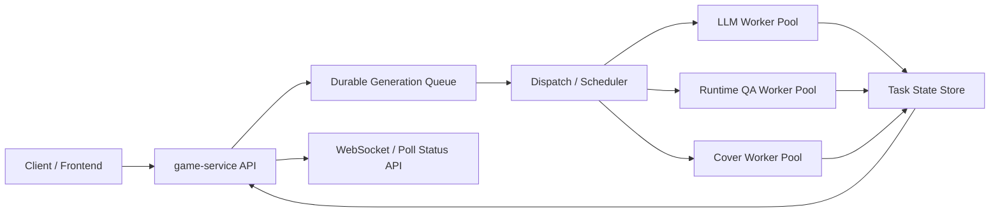

# Generation Concurrency Scaling Plan

Date: 2026-03-31

## 1. Goal

This document defines the concurrency and scalability plan for the GameVallies generation pipeline.

It answers one practical question:

- What happens if a large number of users submit generation, iteration, or fork tasks at the same time?

It also defines the target architecture required to support:

- high online user count
- bursty generation demand
- predictable task latency
- controlled degradation under overload
- durable task tracking and recovery

The plan is based on the current implementation in:

- `/d:/Project/gamevallies/gamevallies-backend/packages/game-service/src/game/game.service.ts`
- `/d:/Project/gamevallies/gamevallies-backend/packages/game-service/src/game/generation-task.service.ts`
- `/d:/Project/gamevallies/gamevallies-backend/packages/ai-engine/src/api/endpoints/generate.py`
- `/d:/Project/gamevallies/gamevallies-backend/packages/ai-engine/src/services/async_task_manager.py`
- `/d:/Project/gamevallies/gamevallies-backend/packages/ai-engine/src/engine/runtime_qa.py`
- `/d:/Project/gamevallies/gamevallies-backend/scripts/deploy.py`

## 2. Executive Summary

The current system supports concurrent task submission, but it is not yet a queue-based, capacity-governed generation platform.

Current behavior is best described as:

- async task initiation
- direct background execution
- in-memory upstream task tracking
- polling-based reconciliation
- cloud-function expansion with limited explicit capacity governance

This is sufficient for moderate traffic and operator-led scaling, but it is not sufficient for a 10,000-user simultaneous generation burst.

The main architectural gaps are:

- no durable generation queue
- no global concurrency budget
- no worker pool for expensive phases
- in-memory ai-engine task registry
- polling-heavy status propagation
- no overload admission control

Target direction:

- API only accepts and enqueues tasks
- worker fleet consumes tasks under explicit concurrency limits
- heavy phases have dedicated resource pools
- task state is durable
- overload is handled by queueing and admission control, not by best-effort uncontrolled spawning

## 3. What "10,000 users online" actually means

The system needs to distinguish between:

1. 10,000 users online and browsing
2. 10,000 users online and a small fraction generating
3. 10,000 users submitting generation at nearly the same time

These are very different load profiles.

### 3.1 Online browsing

This mainly stresses:

- frontend static delivery
- game metadata APIs
- preview/game HTML distribution
- caches and DB reads

This is not equivalent to generation pressure.

### 3.2 Simultaneous generation burst

This stresses:

- `game-service` task creation path
- ai-engine async entrypoints
- LLM provider quotas and rate limits
- runtime QA browser execution
- artifact relay
- task status reconciliation

This is the real scaling challenge.

## 4. Current Architecture

## 4.1 Submission path

Current create and iterate requests behave as follows:

1. `game-service` validates request and creates a local generation task row.
2. `game-service` returns quickly to the client.
3. `game-service` uses `setImmediate(...)` to start background execution.
4. Background execution calls ai-engine async endpoints.
5. ai-engine creates an in-memory async task entry.
6. ai-engine starts immediate background execution with `asyncio.create_task(...)`.
7. `game-service` waits for upstream task completion via polling.

Key implications:

- request handling is asynchronous from the client point of view
- execution is not queued
- background work starts immediately on both services

## 4.2 Task tracking

Current task tracking is split:

- durable local task state in `game-service`
- in-memory upstream task state in `ai-engine`

This creates an uneven durability model:

- local task survives process restart
- upstream task registry does not

## 4.3 Status propagation model

Current status propagation uses:

- direct event relay from ai-engine to game-service
- polling from game-service to ai-engine
- periodic sweep in game-service over active tasks

Important current defaults:

- active task sweep interval: `30000ms`
- upstream poll interval: `1500ms`

These values are reasonable for modest load, but expensive under burst concurrency.

## 4.4 Heavy execution phases

The heaviest phases are:

- full generation LLM call
- iterate full-html rewrite
- QA fix
- runtime QA
- cover capture

Runtime QA and cover capture are especially expensive because they launch Playwright Chromium sessions.

## 5. Current Bottlenecks

## 5.1 No central queue

Current ai-engine async execution starts immediately with `asyncio.create_task(...)`.

This means:

- every accepted task tries to execute right away
- there is no backpressure between acceptance and execution
- overload becomes "resource exhaustion" instead of "queue growth"

## 5.2 In-memory upstream task manager

`AsyncTaskManager` stores task snapshots in memory.

Current issues:

- no cross-instance durability
- poor resilience across restart or scale events
- no durable backlog
- `max_tasks=1000` only affects retained snapshots, not active execution concurrency

## 5.3 Polling amplification

`game-service` polls ai-engine while waiting for upstream completion.

At scale this creates amplification:

- if 10,000 active tasks poll every 1.5s, that is roughly 6,667 task-status requests per second
- these requests add load even when no useful progress happened

## 5.4 Runtime QA browser pressure

Current runtime QA and cover capture launch browser instances on demand.

At scale this creates hard bottlenecks:

- CPU exhaustion
- memory spikes
- process count explosion
- longer phase latency

This is a stronger bottleneck than ordinary CRUD or metadata APIs.

## 5.5 Provider-side quotas

Even if the application layer scales, generation remains bounded by:

- provider QPS
- provider token throughput
- model-specific output limits
- timeout behavior

Therefore "more app instances" alone is not enough.

## 5.6 Sweep lag in game-service

Current sweep model:

- every sweep only reconciles up to 50 active tasks
- sweep runs every 30s by default
- reconciliation is serial inside a loop

At thousands of active tasks this becomes a lagging state reconciler rather than a real-time controller.

## 6. What happens today during a 10,000-task burst

If 10,000 users submit generation at nearly the same time, current likely behavior is:

1. many requests get accepted and local tasks are created
2. background execution starts immediately in large volume
3. ai-engine event loops accumulate many live async tasks
4. LLM calls and runtime QA phases begin competing for resources
5. provider limits, timeouts, and resource contention increase
6. status reconciliation falls behind
7. error rates and long-tail latency grow sharply
8. recovery becomes slower because monitoring and sweeping also operate under load

In other words:

- the system may continue to function
- but it will not do so predictably or gracefully
- it does not currently provide controlled queueing behavior

## 7. Target Architecture

The target system should be queue-based and capacity-governed.

## 7.1 High-level model

Key properties:

- API accepts and enqueues
- workers consume according to explicit budgets
- task state is durable and queryable
- status updates are pushed or event-driven where possible

## 7.2 System roles

### API role

Handled by `game-service` and light ai-engine entrypoints.

Responsibilities:

- validate request
- create task record
- enqueue work
- return task handle
- serve status

### Scheduler role

Responsibilities:

- select next queued task
- enforce concurrency budgets
- route by task class and region
- dispatch to the correct worker type

### Worker roles

Separate workers should exist for:

- LLM generation
- iteration rewrite
- QA fix
- runtime QA
- cover capture

At minimum, runtime QA and cover capture should be separated from generic LLM workers.

## 8. Recommended Queue Model

## 8.1 Durable queue

Use a durable queue system, for example:

- Redis + BullMQ
- Kafka
- SQS-like service

Selection should be based on operational fit, but the required properties are:

- durable enqueue
- delayed retry support
- visibility into queued/running/failed tasks
- consumer concurrency control
- dead-letter support

## 8.2 Queue separation

Do not use a single undifferentiated queue.

Recommended queue classes:

- `generation.create`
- `generation.iterate`
- `generation.qa_fix`
- `generation.runtime_qa`
- `generation.cover_capture`

Optional:

- split by region
- split by `safe / standard / showcase`

## 8.3 Dead-letter behavior

Failed tasks should not disappear into opaque retry loops.

Use:

- bounded retries
- dead-letter queue
- failure family tagging
- operator replay tool

## 9. Concurrency Budget Model

## 9.1 Why explicit budgets are required

Current architecture lets tasks start as soon as they are accepted.

Target architecture must explicitly cap concurrency by phase.

Reason:

- different phases consume very different resources
- the expensive bottleneck is not uniform

## 9.2 Recommended budget types

Maintain separate budgets for:

- `llm_large_rewrite`
- `llm_small_analysis`
- `qa_fix`
- `runtime_qa`
- `cover_capture`

Example conceptual budgets:

- small analysis: high concurrency
- full generation / full iteration rewrite: medium concurrency
- runtime QA: low concurrency
- cover capture: low to medium concurrency

Exact numbers should be calibrated from production measurements.

## 9.3 Admission rule

Tasks should move from `queued` to `running` only if:

- worker capacity exists
- provider budget exists
- runtime QA budget exists when needed

Otherwise they stay queued.

This is the core change that turns overload into latency instead of failures.

## 10. Provider Capacity Governance

## 10.1 Treat providers as shared infrastructure

LLM providers must be treated as globally budgeted resources.

Need global controls for:

- requests per second
- concurrent in-flight calls
- tokens per minute
- model-specific output ceilings

## 10.2 Step-aware routing

Not every step should use the same provider class.

Recommended direction:

- short understanding/classification steps -> faster model
- full-html generate/iterate/qa_fix -> high-output provider
- complex reasoning only for selected steps, not whole pipeline

## 10.3 Budget-aware dispatch

Scheduler should reject or defer a worker dispatch if:

- provider output ceiling is clearly too low for the step
- provider token budget is already saturated
- fallback provider is unavailable

## 11. Runtime QA and Cover Capture Pools

## 11.1 Dedicated pools

Runtime QA and cover capture should not run as unrestricted on-demand browser launches.

They need:

- dedicated worker class
- bounded concurrency
- browser/page reuse where safe
- memory isolation

## 11.2 Pooling strategy

Recommended:

- a small pool of warm browser workers
- each worker handles one test at a time
- hard phase timeout
- recycle browser after N tasks or memory threshold

## 11.3 Fallback strategy

If runtime QA pool is saturated:

- keep task queued
- or skip non-critical cover capture
- but do not let browser launches explode without control

## 12. State Model and Task Durability

## 12.1 Current problem

Local and upstream state are split across:

- durable DB state
- in-memory ai-engine task state

Target should be:

- one durable source of truth for lifecycle
- worker-local transient state only for execution details

## 12.2 Recommended states

Recommended task lifecycle:

- `accepted`
- `queued`
- `dispatched`
- `running`
- `waiting_retry`
- `succeeded`
- `failed`
- `timed_out`
- `canceled`
- `dead_lettered`

For phase-level status:

- `spec_build`
- `logic_generate`
- `contract_qa`
- `runtime_simulation_qa`
- `cover_capture`
- `publishing`

## 12.3 Durable progress payload

Each task should durably store:

- current phase
- attempt count
- owning worker id
- started timestamp
- provider route snapshot
- last progress heartbeat
- current retry/backoff state

## 13. Status Propagation Redesign

## 13.1 Reduce polling

Current polling should be reduced substantially.

Preferred order:

1. event push / callback from worker to state store
2. websocket push from game-service to clients
3. polling only as fallback for client refresh

## 13.2 Background sweep role

Sweep should remain, but only as:

- zombie task detection
- stale worker recovery
- timeout enforcement

It should not be the primary state propagation mechanism.

## 13.3 Sweep scaling

If sweep remains:

- sweep in parallel batches
- process more than 50 when backlog is high
- use adaptive cadence
- avoid serial full task reconciliation under heavy load

## 14. Overload Handling Strategy

The system needs explicit overload behavior.

Recommended rules:

- hard reject when queue exceeds emergency threshold
- soft degrade when worker pools saturate
- disable low-priority features first

Suggested degradation order:

1. delay or skip cover capture
2. reduce runtime QA frequency for low-tier tasks
3. restrict `showcase`
4. reject new non-priority tasks with clear queue-full message

This is much safer than letting the whole system degrade uniformly.

## 15. Product-Level Capacity Modes

Introduce product-level scheduling classes:

- `priority`
- `standard`
- `background`

Possible mapping:

- paid or premium generation -> priority
- standard generation -> standard
- historical cover backfill -> background

This prevents maintenance workloads from stealing capacity from user creation.

## 16. Deployment and Capacity Configuration

## 16.1 Explicit instance policy

Deployment should explicitly manage:

- `min_instance`
- `max_instance`
- reserved frozen instances
- CPU
- memory
- request timeout

This should be configured separately for:

- `game-service`
- ai-engine API
- ai-engine worker
- runtime QA worker

## 16.2 Separate services

The current single ai-engine deployment should be split into:

- `ai-engine-api`
- `ai-engine-worker-llm`
- `ai-engine-worker-runtime`
- optional `ai-engine-worker-cover`

This allows independent scaling.

## 16.3 Capacity planning inputs

Capacity should be based on:

- average task duration by phase
- p95 and p99 phase duration
- average provider token usage by step
- runtime QA memory footprint
- peak queue growth rate

## 17. Observability Requirements

To operate at scale, the system must expose:

- queue depth by queue
- task age percentiles
- dispatch wait time
- run time by phase
- timeout rate
- provider error rate
- runtime QA saturation
- cover capture saturation
- worker concurrency utilization

Dashboards should answer:

- Are we accepting too much work?
- Which phase is the bottleneck?
- Is queueing healthy or pathological?
- Are we provider-bound or CPU-bound?

## 18. Suggested Phased Migration

## P0: Safety and visibility

Goals:

- improve observability
- add explicit overload metrics
- add worker/phase instrumentation
- add configurable concurrency ceilings in code paths where possible

Deliverables:

- queue-depth-compatible task metrics
- phase-specific in-flight counters
- provider budget monitoring
- runtime QA in-flight monitoring

## P1: Durable queue and scheduler

Goals:

- move from immediate background execution to durable enqueue
- add scheduler and dispatch rules

Deliverables:

- enqueue on create/iterate
- scheduler service
- durable retry model
- dead-letter handling

## P2: Worker separation

Goals:

- split ai-engine execution roles
- isolate runtime QA and cover capture

Deliverables:

- llm worker
- runtime QA worker
- optional cover worker
- explicit pool limits

## P3: Poll reduction and push-based state

Goals:

- remove high-frequency upstream polling as the primary mechanism

Deliverables:

- worker-to-state-store push
- websocket-first updates
- sweep as fallback only

## P4: Product-aware prioritization

Goals:

- schedule by business priority
- protect interactive user flows under maintenance and backfill load

Deliverables:

- task priority classes
- showcase throttling
- background job isolation

## 19. Recommended Immediate Actions

The most important next actions are:

1. Introduce a durable queue between submission and execution.
2. Stop immediate unlimited task start in ai-engine.
3. Add explicit phase concurrency budgets.
4. Separate runtime QA from ordinary generation workers.
5. Reduce status polling dependence.
6. Make ai-engine task state durable.

These six changes are the minimum architectural shift required to make the platform behave predictably under large concurrent demand.

## 20. Practical Target

The recommended short-to-medium-term target is not:

- 10,000 simultaneous active generation executions

It is:

- 10,000 online users
- 100 to 300 simultaneously running generation workloads
- 1,000+ generation requests safely queued without system collapse

This is realistic, operationally manageable, and compatible with provider limitations.

## 21. Conclusion

Current generation tasks are async, but they are not truly queue-governed.

That means the system can accept concurrent work, but under heavy burst load it degrades through uncontrolled execution pressure rather than controlled queue growth.

To support large-scale concurrent generation safely, the platform must evolve from:

- async background tasks

to:

- durable queue
- scheduled dispatch
- bounded worker pools
- explicit provider budgets
- durable task state
- event-driven progress propagation

This is the architectural foundation required for reliable generation at scale.
