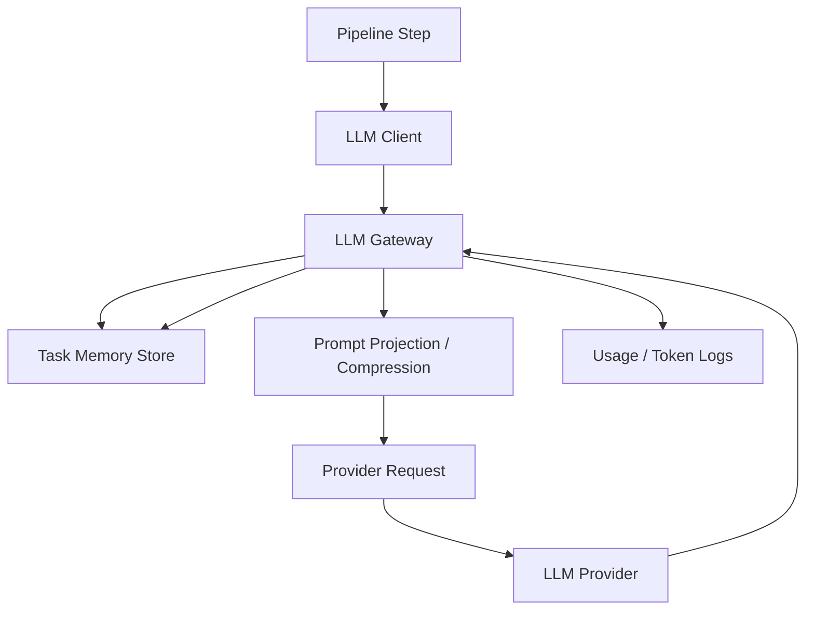

# LLM Gateway 与任务级上下文优化方案

更新时间：2026-03-28  
适用范围：`packages/ai-engine`、`packages/game-service`、LLM 网关路由与任务日志链路

## 1. 背景

当前游戏生成链路已经接入了按 step 路由的 LLM 网关，但 token 与上下文管理仍然是“两套逻辑并存”：

- 调用点自己传 `max_tokens`
- 网关 provider 又有自己的 `maxTokens`
- `contextWindow` 目前主要作为路由元数据存在，没有在发送前做统一准入
- 一次任务中的多次 LLM 调用互相独立，只有代码层显式拼接进去的内容会被“带到下一步”

这导致几个问题：

- 输出 token 不是“只按网关限制”，而是“步骤预算 + 网关上限”的双重约束
- 输入上下文没有统一硬限制，容易出现某些步骤 prompt 越来越大
- “任务级共享上下文”目前不存在，只有“任务内多次无状态请求”
- QA 修复、迭代改写、代码生成等重步骤都在重复传很多上下文，但又没有统一压缩策略

## 2. 本次优化目标

按产品目标，本次设计要落到以下两条硬原则：

1. 输入、输出 token 的硬限制只由 LLM 网关决定
2. 一次任务共享一个任务级 LLM 上下文，并且任务结束后能彻底清空

同时要保证：

- 不依赖 provider 原生会话能力
- 不要求所有步骤使用同一份“原始长对话全文”
- 不让上下文随着任务推进无限膨胀
- 兼容 create / iterate / qa_fix / dialogue 等不同调用类型

## 3. 关键结论

### 3.1 “只按网关限制”可以实现

可以实现，但前提是：

- 网关必须成为唯一的 token/context 决策点
- provider 必须配置完整的能力元数据
- 业务步骤不再传硬性的 `max_tokens`，最多只能传“软目标”或“输出规模 hint”

### 3.2 “一次任务共享一个 LLM 上下文”可以实现

可以实现，但推荐实现为：

- 应用层任务级共享 memory
- 不是 provider 侧原生 session

原因很简单：

- 你们当前走的是 `chat/completions` 类无状态接口
- 当前接入的 provider 并没有为这条链路提供稳定的服务端 session 语义
- 真正可控、可清理、可审计的做法，是在应用层维护 `task_memory`

### 3.3 “一次调用完清空上下文”也可以实现

可以，但要区分两层：

- provider 侧：当前本来就是无状态，请求结束天然不会记住上一轮
- 应用侧：任务 memory 可以在调用后、阶段后、任务结束后按策略清空

推荐默认策略：

- 单次调用后不清
- 同一任务共享 task memory
- 任务成功 / 失败 / 取消 / 超时后立即清空

## 4. 现状问题拆解

## 4.1 输出 token 现状

当前真实行为不是“只按网关限制”，而是：

```text
effective_max_tokens = min(step_requested_max_tokens, provider.maxTokens)
```

也就是：

- `code_generate.full`、`iterate.*`、`qa_fix.*` 都会先由业务代码决定一个预算
- 再被网关 provider 的 `maxTokens` 二次裁剪

这会带来两个直接问题：

- 某些 provider 明明支持更高输出，步骤自己先把预算压死了
- 同一 provider 下，不同步骤的预算语义不统一

## 4.2 输入上下文现状

当前没有统一的“发送前上下文准入算法”。

也就是说：

- 系统不会在调用前统一计算 `input_tokens + reserved_output_tokens <= contextWindow`
- 只有个别步骤自己做内容裁剪，例如：
  - `code_review` 只截代码头尾
  - `dialogue` / `iterate` 只保留最近几轮 history
  - `qa_fix` 用当前代码大小粗估输出预算

这不是统一上下文治理。

## 4.3 上下文现状

当前一次任务不是一个共享 LLM 上下文。

真实情况是：

- 每次 HTTP 调用都是一个独立上下文
- 一次任务里会发起多次 LLM 调用
- 后续步骤若想继承前面信息，只能靠代码重新把摘要、代码、contract 等内容拼进 prompt

因此当前只有“任务级 request-scoped log context”，没有“任务级 model memory”。

## 5. 目标架构

目标架构分为两层：

1. `LLM Gateway Hard Limits`
2. `Task Memory Shared Context`

示意如下：



## 6. 设计原则

### 6.1 网关是唯一硬限制来源

业务步骤不再直接控制：

- 输出 max tokens
- 输入上下文最大长度

业务步骤只允许传：

- `response_size_hint`
- `priority`
- `compression_policy`
- `must_include_blocks`

真正的硬约束全部收敛到网关：

- `provider.maxTokens`
- `provider.contextWindow`
- `gateway.safetyMargin`

### 6.2 任务共享的是 memory，不是原始长对话

不建议把整个任务的所有 prompt、所有代码、所有响应全文一路堆到下一步。

正确做法是共享结构化 memory，例如：

- `task_meta`
- `spec_summary`
- `runtime_profile_summary`
- `contract_summary`
- `source_context_summary`
- `latest_code_summary`
- `latest_code_artifact_ref`
- `latest_qa_findings`
- `repair_history_summary`
- `decision_log`

### 6.3 provider 侧保持无状态

短期不要依赖 provider 原生 session。

原因：

- 当前 provider 能力不统一
- 多 provider fallback 会破坏 session 一致性
- 运维排障、重放、清理都会更难

## 7. 网关统一 token / context 方案

## 7.1 Provider 能力元数据

所有可用 provider 必须配置：

- `maxTokens`
- `contextWindow`
- `tokenizerFamily`
- `strictAdmission`

建议在 `llm_gateway_providers.extra_config` 中补齐：

```json
{
  "maxTokens": 16384,
  "contextWindow": 128000,
  "tokenizerFamily": "openai_cl100k_compatible",
  "strictAdmission": true,
  "safetyMarginTokens": 2048
}
```

如果某 provider 缺少 `maxTokens` 或 `contextWindow`：

- 不允许加入严格路由
- 只能处于 `warn_only` 模式
- 不允许承接 create / iterate / qa_fix 这类重步骤

这意味着当前像 `Deepseek-cn-上海` 这类 `null / null` 配置，需要先补齐能力元数据，才能进入严格治理模式。

## 7.2 新的调用接口

现有：

```python
complete(max_tokens=12288, ...)
```

目标改成：

```python
complete(
    response_size_hint="large",
    context_scope="task",
    compression_policy="code_generation",
    ...
)
```

说明：

- 业务不再传硬 `max_tokens`
- 网关根据 provider 元数据决定最终 `max_tokens`
- hint 只影响压缩顺序和结果预期，不是硬上限

## 7.3 网关统一输出上限

最终输出上限规则：

```text
actual_output_max_tokens = provider.maxTokens
```

如果未来确实需要“步骤低于 provider 上限”的行为，也不要再叫 `max_tokens`，统一改成：

- `response_size_hint=small|medium|large`

但硬上限仍然只认网关。

## 7.4 网关统一输入准入

网关在发送前必须统一做：

```text
reserved_output_tokens = provider.maxTokens
safety_margin_tokens = provider.safetyMarginTokens or max(1024, contextWindow * 5%)
allowed_input_tokens = contextWindow - reserved_output_tokens - safety_margin_tokens
```

然后计算本次请求的输入 token：

```text
input_estimate_tokens = tokenize(system + messages + injected_task_memory)
```

准入规则：

- 若 `input_estimate_tokens <= allowed_input_tokens`，直接发送
- 若超限，执行统一压缩
- 压缩后仍超限，则拒绝并返回结构化错误

## 7.5 压缩策略

网关不应该做“瞎截断”，而要按 block 语义裁剪。

压缩顺序建议：

1. 删除可选解释性 block
2. 压缩历史对话
3. 将长代码替换为代码摘要 + artifact 引用
4. 只保留最近一次 QA findings
5. 对长 spec / source context 做摘要压缩
6. 仍超限则 fail-fast

不同步骤可配置不同策略：

- `intent_parse`
  - 优先保留标题、原始描述
  - 不带历史修复记录
- `code_generate.full`
  - 优先保留 spec、contract、runtime profile、prompt bundle
  - skeleton / enriched design 可降级
- `qa_fix`
  - 优先保留 error_list、当前代码、contract
  - 历史对话与旧修复记录优先裁掉
- `iterate.mechanic_change`
  - 优先保留当前代码、用户反馈、source spec summary
  - 对话 history 只保留最近必要片段

## 8. Token 统计算法

## 8.1 硬要求

如果要真正做到“只按网关限制”，就不能再依赖“字节数除以 3 / 4”的粗估作为硬门禁。

因此需要在网关里定义统一 tokenizer 体系：

- `openai_cl100k_compatible`
- `anthropic_approx`
- `sentencepiece_family_x`
- `provider_native_api`

## 8.2 统计优先级

建议顺序：

1. provider 官方 tokenizer API
2. 本地精确 tokenizer 适配器
3. 同族兼容 tokenizer
4. 仅在 `warn_only` 模式下允许近似估算

如果 provider 进入 `strictAdmission=true`：

- 不允许只靠字节近似
- 没有 tokenizer 适配器就不能承接严格路由

## 8.3 日志统计

发送后日志仍以 provider 返回 usage 为准：

- `input_tokens`
- `output_tokens`
- `total_tokens`

并新增：

- `estimated_input_tokens`
- `allowed_input_tokens`
- `reserved_output_tokens`
- `compression_applied`
- `compression_ratio`
- `admission_mode`

这样可以同时看：

- 发送前估算
- 发送后 provider 实际 usage

## 9. 任务级共享上下文方案

## 9.1 设计目标

让“一次任务共享一个上下文”成立，但不要求 provider 原生 session。

实现方式：

- 以 `task_id` 为 key 维护一份 `TaskLLMMemory`
- 每个步骤取这份 memory 的投影
- 每次响应后更新 memory

## 9.2 TaskLLMMemory 数据结构

建议结构：

```json
{
  "taskId": "uuid",
  "gameId": "uuid",
  "userId": "uuid",
  "providerPin": {
    "providerId": "uuid",
    "model": "MiniMax-M2.7",
    "region": "cn_shanghai"
  },
  "specSummary": {},
  "runtimeProfileSummary": {},
  "runtimeContractSummary": {},
  "sourceContextSummary": {},
  "latestCodeSummary": {},
  "latestCodeArtifactId": "artifact-id",
  "latestQaFindings": [],
  "repairHistory": [],
  "conversationSummary": [],
  "decisionLog": [],
  "updatedAt": "2026-03-28T00:00:00Z"
}
```

其中要特别区分：

- `summary`
- `full artifact ref`

不要把整份 HTML 一直存进 memory 正文。

## 9.3 每步的 memory 投影

每个步骤看到的不是整份 memory，而是自己的 projection。

例如：

### `intent_parse`

只投影：

- title
- raw_user_input
- source_context_summary

### `code_generate.full`

投影：

- spec_summary
- runtime_profile_summary
- contract_summary
- prompt_bundle_summary
- latest_decision_log

### `iterate.*`

投影：

- latest_code_summary
- source_spec_summary
- source_bundle_summary
- recent_conversation_summary
- latest_runtime_profile_summary

### `qa_fix.*`

投影：

- latest_code_summary
- latest_qa_findings
- latest_runtime_contract_summary
- recent_repair_history

## 9.4 Memory 写回规则

每次 LLM 调用成功后，不把完整原文直接堆进去，而是写回摘要：

- `intent_parse` 后写回 `specSummary`
- `code_generate.full` 后写回 `latestCodeSummary`
- `iterate.*` 后刷新 `latestCodeSummary`
- `qa_fix.*` 后写回 `repairHistory + latestCodeSummary + latestQaFindings`
- `code_review` 后写回 `reviewSummary`

摘要可以由：

- 规则化提取
- 轻量 summarizer
- 或固定 schema 投影生成

优先推荐规则化提取，减少额外 LLM 消耗。

## 10. Provider 绑定与 fallback 策略

如果要让“任务共享一个上下文”语义稳定，建议任务开始时 pin provider：

```text
task.providerPin = selected_provider_for_primary_generation
```

默认规则：

- 同一个任务尽量固定同一个 provider/model
- 非必要不在任务中途切 provider

fallback 策略：

- `intent_parse` 等轻步骤允许 fallback
- 一旦进入 `code_generate.full`，尽量 pin
- 若 provider 失效导致必须切换：
  - 保留 task memory
  - 记录 `provider_switch=true`
  - 重新投影 memory 到新 provider

这样做虽然不能保证 provider 内部“真正同一个 session”，但可以保证应用层语义连续。

## 11. 清空上下文能力

## 11.1 默认清理策略

任务级 memory 在以下时机删除：

- create 成功
- iterate 成功
- 任务失败
- 任务取消
- 任务超时

## 11.2 可选清理策略

可扩展 3 个开关：

- `clear_after_call`
- `clear_on_stage_change`
- `retain_on_failure_for_debug`

建议默认值：

```text
clear_after_call = false
clear_on_stage_change = false
retain_on_failure_for_debug = true (TTL 30 min)
```

失败时保留短 TTL 有利于排障；超时后自动清空，避免脏 memory 残留。

## 11.3 当前 provider 侧的“清空”

在当前架构里，provider 侧无需额外清空：

- 因为现在就是无状态请求
- 所谓“清空上下文”，本质上是删除应用层 `task_memory`

## 12. 分步骤改造建议

## Phase 0：能力补齐

目标：

- 补齐所有 provider 的 `maxTokens / contextWindow / tokenizerFamily`

必须先做：

- 把 `Deepseek-cn-上海` 的 `contextWindow`、`maxTokens` 配齐
- 未配置完整能力的 provider 不允许承接严格路由

## Phase 1：网关接管硬限制

改造点：

- `LLMClient.complete()` 不再要求业务传硬 `max_tokens`
- 调用点改传 `response_size_hint`
- 网关统一计算：
  - `actual_output_max_tokens`
  - `allowed_input_tokens`
  - `estimated_input_tokens`

落点：

- `packages/ai-engine/src/services/llm_client.py`
- `packages/ai-engine/src/services/llm_gateway.py`

## Phase 2：Task Memory

改造点：

- 新增 `TaskLLMMemoryStore`
- 使用 Redis 存 task memory
- 以 `task_id` 为主键

建议落点：

- `packages/ai-engine/src/services/task_memory.py`
- `packages/ai-engine/src/services/llm_gateway.py`
- `packages/ai-engine/src/api/endpoints/generate.py`

## Phase 3：步骤投影接入

改造点：

- `intent_parse`
- `code_generate.full`
- `iterate.*`
- `qa_fix.*`
- `code_review`

都改成：

- 读取 task memory projection
- 调用结束后回写摘要

## Phase 4：可观测性

新增日志字段：

- `task_context_version`
- `task_memory_size_bytes`
- `estimated_input_tokens`
- `allowed_input_tokens`
- `compression_applied`
- `compression_strategy`
- `provider_switch`

## 13. 风险与边界

### 13.1 不能把“共享上下文”理解成“所有历史全文都丢给模型”

否则会导致：

- prompt 爆炸
- 成本升高
- 截断风险上升
- provider 切换时行为不稳定

### 13.2 不能在 provider 能力不完整的情况下强行执行严格模式

如果 provider 没有：

- `maxTokens`
- `contextWindow`
- tokenizer 能力

就不能宣称“只按网关限制”。

### 13.3 代码全文不应该成为任务 memory 主体

完整 HTML 应该：

- 单独存 artifact
- memory 里只保留摘要和引用

## 14. 推荐决策

本方案建议按下面的最终口径推进：

1. 输出 token 硬限制只认网关 provider `maxTokens`
2. 输入上下文硬限制只认网关 provider `contextWindow`
3. 业务步骤不再传硬 `max_tokens`，只传响应规模 hint
4. 一次任务共享的是 `TaskLLMMemory`
5. 当前不依赖 provider 原生 session
6. 任务结束后删除 task memory，即视为“清空上下文”
7. 重步骤任务默认 pin provider/model，减少任务中途切 provider

## 15. 验收标准

达到以下标准，才算方案落地完成：

- 任一步骤都不再由业务层硬裁 `max_tokens`
- 发送前统一可计算：
  - `estimated_input_tokens`
  - `allowed_input_tokens`
  - `reserved_output_tokens`
- 所有 create / iterate / qa_fix 都能读取并更新同一个 `task_memory`
- 任务结束后 1 分钟内，memory 自动删除或进入短 TTL 清理
- `llm_call_logs` 能按 `task_id` 汇总出完整 token 消耗与压缩轨迹
- provider 缺少 `contextWindow/maxTokens` 时，无法进入严格路由

## 16. 结论

这次目标是可以实现的，但正确落法不是“让 provider 替我们记住整条任务”，而是：

- 网关统一做 token/context 硬约束
- 应用层维护任务级共享 memory
- 任务结束后删除 memory，完成“清空上下文”

这是当前多步骤 pipeline、多 provider 路由、可回放可审计场景下，最稳、最可控、也最容易彻底治理的一条路线。
