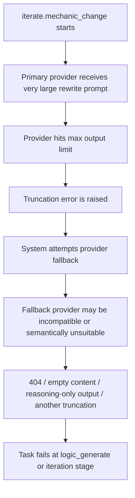

# LLM Output Truncation Architecture Plan

Date: 2026-03-31

## 1. Goal

This document explains the recurring "output length limit / truncated response" failures in the GameVallies generation pipeline.

It covers:

- background and incident context
- the current architecture and where truncation happens
- the actual root causes behind repeated online failures
- why token tuning alone is not a real fix
- the target architecture required to solve the problem structurally
- a phased implementation plan

This document is based on the current implementation in:

- `/d:/Project/gamevallies/gamevallies-backend/packages/ai-engine/src/engine/code_generator.py`
- `/d:/Project/gamevallies/gamevallies-backend/packages/ai-engine/src/engine/qa_pipeline.py`
- `/d:/Project/gamevallies/gamevallies-backend/packages/ai-engine/src/services/llm_client.py`
- `/d:/Project/gamevallies/gamevallies-backend/packages/ai-engine/src/services/llm_gateway.py`
- `/d:/Project/gamevallies/gamevallies-backend/packages/ai-engine/src/engine/runtime_qa.py`
- `/d:/Project/gamevallies/gamevallies-backend/packages/game-service/src/game/game.service.ts`

## 2. Executive Summary

The truncation problem is not primarily a "provider configuration" issue.

The deeper problem is that the current system still treats several high-complexity generation steps as:

- one request
- one model response
- one complete HTML document

This is acceptable for smaller outputs, but it becomes structurally unstable for:

- full code generation
- full HTML iteration rewrite
- large repair and syntax rebuild steps

As long as iteration and repair continue to depend on full-document rewrite, truncation risk will repeatedly return even if:

- a different model is selected
- max tokens are increased
- context window is larger
- fallback routing is improved

The long-term solution is:

- explicit provider capability governance
- strict route and fallback discipline
- patch-first iteration and repair
- structured document sections and stable patch anchors
- provider onboarding verification before a provider becomes routable

## 3. Background

Recent online incidents repeatedly showed failures like:

- `iterate.mechanic_change 调用 claude-opus-4-6-ai.zj 失败: OpenAI-compatible response hit the output length limit and may be truncated`
- older `deepseek-chat` failures at `8192`
- follow-up failures where a truncated provider call silently failed over to another enabled provider with incompatible endpoint or output behavior

These failures created three operational problems:

1. user-facing iteration failures and retries
2. confusing operator experience in the LLM gateway admin because the provider apparently "was not meant to be used"
3. repeated hotfixes at the route/model level without eliminating the underlying failure mode

## 4. Current Architecture

### 4.1 Current generation shape

The current major code-producing steps are still single-shot:

- `code_generate.full`
- `iterate.element_change`
- `iterate.mechanic_change`
- `iterate.param_adjust`
- parts of `qa_fix`

In the current system these steps generally ask the model to return:

- a complete HTML document
- with inline CSS
- inline JS
- updated gameplay logic
- updated UI state
- updated content/config

### 4.2 Current output contract

The implicit contract is:

1. build a large prompt
2. ask the model for the final document
3. extract HTML from the response
4. pass that full document into QA

This means the system currently couples:

- semantic reasoning
- code synthesis
- structural assembly
- delivery formatting

into one model response.

### 4.3 Current route behavior

The LLM gateway currently resolves providers by step route.

Historically, when provider failover was enabled, the system could also augment routed candidates with other enabled providers if they appeared to meet the output budget.

This caused an important failure mode:

- step route points to provider A
- provider A truncates
- the system silently fails over to provider B
- provider B may be enabled but not actually appropriate for this step

This behavior has now been hotfixed in code so routed steps only use explicit fallback providers, but the architectural lesson remains important.

## 5. Observed Failure Chain

The repeated online failure chain looked like this:



This chain shows that truncation is not only a token budgeting issue.

It is also:

- a route governance issue
- a provider suitability issue
- a task-shape issue

## 6. Root Causes

## 6.1 Full-document rewrite is too large for stable single-response output

This is the primary root cause.

`iterate.mechanic_change` often carries:

- current full code
- user feedback
- runtime contract
- source bundle context
- profile hints
- implementation budget

and then asks for a new complete HTML document.

This frequently pushes the model into the dangerous zone where:

- prompt is large
- requested output is also large
- output must remain syntactically complete

When truncation happens in this regime, the response is often unusable even if only a small tail section is missing.

## 6.2 Context window and output budget are not the same thing

Operators often reason with `contextWindow`, but the actual bottleneck for these incidents is usually `maxTokens`.

Important distinction:

- `contextWindow` controls total prompt + response capacity
- `maxTokens` controls maximum output tokens for a single response

A provider may support:

- `128K` context

while still only reliably returning:

- `8K`
- `16K`

of output.

This means "large context" does not solve "large final document output".

## 6.3 Provider capability is under-modeled

A provider being:

- enabled
- reachable
- OpenAI-compatible

does not mean it is suitable for:

- full HTML rewrite
- patch generation
- structured JSON extraction
- repair synthesis

Different providers have materially different behavior:

- some are good at short structured extraction
- some are good at direct final content
- some consume output budget in reasoning fields
- some require slightly different endpoint or payload shapes

The current system does not yet encode enough of that difference in a formal capability registry.

## 6.4 Route fallback discipline was too loose

The previous failover logic allowed unrelated enabled providers to become implicit fallbacks for routed steps.

This created operator confusion:

- admin believed a provider was "not on the route"
- but runtime still reached it indirectly

The code hotfix removed this behavior for routed steps, but the architectural takeaway is:

- route existence must imply route control
- only explicit fallback providers should be eligible

## 6.5 Provider onboarding lacks a strict compatibility gate

Today a provider can exist in the gateway and be enabled even if one or more of the following are still unclear:

- correct endpoint shape
- protocol compatibility
- content field behavior
- reasoning field behavior
- large-output suitability

This allows "enabled but unsafe" providers to enter production routing decisions.

## 6.6 Iteration and QA repair are still rewrite-first

This is the long-term structural problem.

Even if routing is perfect, the system still asks the model to do too much in one response during:

- mechanic change
- major iteration rewrite
- syntax rebuild

As long as that remains true, truncation will continue to be an intrinsic risk.

## 7. Why tuning tokens alone is not enough

The following actions help, but they do not solve the problem fully:

- increasing requested max tokens
- increasing provider max tokens
- switching to a larger context provider
- adding truncation retry
- adding provider fallback

These are tactical mitigations only.

They do not change the fact that the system still expects a single response to deliver a complete final document.

## 8. Design Principles For The Fix

The long-term architecture should follow these principles:

1. full-document rewrite should be exceptional, not default
2. routed steps should only use explicit fallback providers
3. provider suitability must be explicit and testable
4. iteration should prefer patch output over full file output
5. QA repair should preserve structure and repair locally first
6. operators must be able to understand why a provider can or cannot serve a step

## 9. Target Architecture

## 9.1 Step-provider capability registry

Introduce a formal capability model per provider.

Each provider should declare:

- `supports_short_json`
- `supports_dialogue`
- `supports_full_html_rewrite`
- `supports_patch_generation`
- `supports_qa_repair`
- `supports_reasoning_only`
- `max_output_tokens`
- `preferred_for_large_output`
- `protocol_family`
- `response_shape`

This registry should be used by the gateway before any provider becomes eligible for a step.

## 9.2 Explicit route and explicit fallback only

For any step with a configured route:

- use the primary provider
- use only explicit fallback providers
- never augment with unrelated enabled providers

This is now partially enforced in code and should remain a permanent invariant.

## 9.3 Provider onboarding verification

Before a provider can be marked routable for production, it should pass a verification suite:

- endpoint reachability
- protocol shape verification
- content extraction verification
- reasoning field behavior
- token clamp verification
- long-output smoke test

If it fails any required verification for a capability class, it should not be allowed on steps that require that capability.

## 9.4 Document structure markers

Generated HTML should preserve stable section markers such as:

- `<!-- SECTION:HTML_SHELL -->`
- `<!-- SECTION:HUD -->`
- `<!-- SECTION:STYLE -->`
- `<!-- SECTION:CONFIG -->`
- `<!-- SECTION:GAME_LOOP -->`
- `<!-- SECTION:INPUT -->`
- `<!-- SECTION:LEVEL_DATA -->`

This is still compatible with the single-file delivery constraint, but it creates reliable patch anchors.

## 9.5 Patch-first iteration

Iteration should move from:

- "return the whole rewritten HTML file"

to:

- "return a structured patch plan and localized code blocks"

Recommended patch protocol:

- section target
- operation type
- replacement content
- optional insertion anchor
- validation hints

Example conceptual patch payload:

```json
{
  "patches": [
    {
      "section": "INPUT",
      "operation": "replace_block",
      "anchor": "function bindInput()",
      "content": "..."
    },
    {
      "section": "LEVEL_DATA",
      "operation": "replace_section",
      "content": "..."
    }
  ]
}
```

The backend then:

1. applies the patch
2. rebuilds the full HTML locally
3. runs validation and QA

This reduces output size dramatically and makes truncation much less likely.

## 9.6 Patch-first QA repair

`qa_fix` should follow the same principle.

Default order should become:

1. deterministic local repair
2. section-scoped LLM patch repair
3. only if necessary, full-section rebuild
4. only in last-resort scenarios, full-document rebuild

## 9.7 Large-output step classification

Steps should be classified into output classes:

- `small_text`
- `small_json`
- `medium_structured`
- `large_patch`
- `full_document`

Then the gateway should reject obviously bad route/provider combinations before calling upstream.

Examples:

- `intent_parse` -> `small_json`
- `iterate.classify` -> `small_json`
- `dialogue.reply` -> `small_text`
- `iterate.mechanic_change` -> `large_patch`
- `qa_fix.syntax_structural` -> `large_patch` or `full_document` fallback only

## 10. Recommended Step Routing Strategy

### 10.1 Fast understanding steps

Suitable for:

- classification
- intent extraction
- short plan draft generation

Examples:

- `intent_parse`
- `iterate.classify`
- `dialogue.slot_extract`
- `dialogue.reply`

These steps can continue to use lower-latency providers.

### 10.2 Large-output synthesis steps

Suitable only for providers verified for large stable direct output.

Examples:

- `code_generate.full`
- `iterate.element_change`
- `iterate.mechanic_change`
- `iterate.param_adjust`
- selected `qa_fix` families

These steps must never route to providers that are:

- unverified for full final content
- reasoning-only biased
- endpoint-incompatible
- below required output ceiling

## 11. Operational Guardrails

## 11.1 Route-time hard rejection

If a step requires `large_patch` or `full_document`, the gateway should reject any candidate provider that:

- lacks required capability
- lacks verified compatibility
- is below required output ceiling

This should happen before the first upstream request.

## 11.2 Truncation policy by step class

For `small_text` and `small_json`:

- retry with a slightly larger budget
- optionally fallback

For `large_patch`:

- retry once with a larger budget
- then explicit fallback only

For `full_document`:

- prefer route-time rejection over doomed upstream call
- avoid multi-hop fallback chains
- emit clear provider capacity diagnostics

## 11.3 Better observability

Every LLM call log should clearly record:

- step key
- primary provider
- whether provider was primary or explicit fallback
- required output class
- requested output tokens
- effective output tokens
- provider max tokens
- provider capability class
- reason for rejection or failover

This makes operator debugging much easier.

## 12. Migration Plan

## P0: Already in progress / immediate hardening

- disable unsafe providers from production candidates
- remove implicit failover for routed steps
- use only explicit fallback providers for large iteration steps
- normalize provider base URLs where bare host form is unsafe

Expected result:

- no more "mystery provider" invocations
- no more route surprise due to enabled-but-unrelated providers

## P1: Provider capability governance

- add provider capability fields
- add provider verification suite
- block unsupported providers from large-output steps
- show capability status in admin

Expected result:

- providers cannot be enabled blindly
- operator intent matches runtime behavior

## P2: Structured section markers

- make code generation produce stable section markers
- define safe patch anchors
- validate anchor presence in QA

Expected result:

- iteration and repair can become section-local

## P3: Patch-first iteration

- change `iterate.*` to return structured patches instead of whole HTML
- add patch apply engine
- add patch validation and rollback

Expected result:

- large iteration output becomes much smaller
- truncation probability drops sharply

## P4: Patch-first QA repair

- change repair flow to local/section patch first
- keep full-document rebuild only as last resort

Expected result:

- fewer large repair calls
- less risk of syntax-loss or structure-loss after repair

## 13. Acceptance Criteria

The architecture can be considered successful when:

1. routed steps never invoke unrelated enabled providers
2. provider enablement does not imply production routability
3. large-output steps are rejected early if no suitable provider exists
4. `iterate.mechanic_change` and related steps no longer require full-document output by default
5. truncation incidents on iteration drop to near-zero for normal workloads
6. admin operators can explain exactly why a provider is or is not eligible for a step

## 14. Final Recommendation

The system should stop treating truncation as a token-tuning issue.

The real architectural shift required is:

- from "single-shot final document generation"
- to "capability-aware, patch-first generation and repair"

Short-term routing hardening is necessary and has already reduced current incident risk.

But the only durable fix is to redesign iteration and repair so that the model is no longer expected to emit the entire final game document every time.
